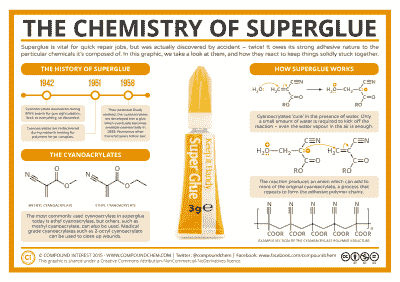
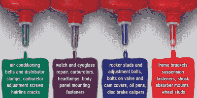
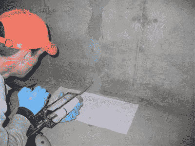

# 你可以使用的胶水:家庭商店的粘合剂

> 原文：<https://hackaday.com/2016/11/28/glues-you-can-use-adhesives-for-the-home-shop/>

不久前，我看了看家庭商店的[润滑剂，着眼于润滑背后的物理和化学。谈论如何保持零件运动让我想到了等式的另一面——把东西粘在一起背后的科学是什么？家庭商店有很多粘合剂的应用，所以了解它们的工作原理可能会有好处，这样你就可以选择合适的粘合剂。我们还将看看家庭商店里随处可见的几大类粘合剂。](http://hackaday.com/2016/05/17/beyond-wd-40-lubes-for-the-home-shop/)

## 粘性的科学

那么粘合剂到底是如何工作的呢？结果是那种“我们有一些想法，但是没有人确定”的事情。我们最大的线索来自于观察粘合剂的化学结构，像往常一样，从自然中寻找基本原理是有帮助的。从一些植物分泌的用来诱捕昆虫的粘液或乳胶，到被送到众所周知的胶水工厂的马的煮过的结缔组织，天然粘合剂都是某种大分子。皮胶的长蛋白质链，需要一点粘性的植物和动物分泌的多糖，甚至早期人类学会从沥青坑和松树中收集的碳氢链和萜烯树脂，以将斧头粘合到树干上——所有粘性物质都由长分子组成。

无论是天然的还是合成的，聚合物粘合剂都有很多相互作用的位置，也有很多与被粘物相互作用的位置。这些分子相互粘附的程度称为它们的 ~~*粘聚性*~~ 内聚性，而它们粘附到其他东西的程度称为它们的 ~~*内聚性*~~ 粘聚性。粘附性与分子因范德华相互作用而相互吸引有很大关系，范德华相互作用是分子之间基于其静电荷和极化力矩的总作用力。单个的力很弱，但是大分子提供了很多力作用的地方，有助于粘合和内聚。此外，大分子善于渗透到基底的孔隙中，通过将粘合剂机械锁定到基底上，极大地促进了粘合性能。

根据固化方式，粘合剂可以大致分为两大类。非反应性粘合剂通过非化学转化固化，例如溶剂蒸发或冷却。反应性粘合剂在固化过程中会发生某种化学变化，通常是聚合。反应性和非反应性粘合剂在使用前都需要防止固化，这样才有用。非反应性粘合剂非常容易管理——一个密封的容器来防止溶剂蒸发，或者将一根热胶保持在其熔点。不过，反应型粘合剂可能有点难以控制，可能会采取一些极端的措施，如将粘合剂制成两部分配方，直到混合后才会发生反应，或将光固化树脂保存在暗处。

现在我们对粘合剂的工作原理有了一点了解，让我们来看看你可能想要放在店里的几种胶水。

### 氰基丙烯酸酯胶

Click for larger image. Source: [Compound Interest](http://www.compoundchem.com/)

那些有一定历史的人会记得，当“疯狂胶水”在 70 年代初随着俗气的商业广告[出现在大众市场时，一滴胶水“足以让这个人悬浮在半空中”氰基丙烯酸酯胶已经走过了漫长的道路，虽然结果并不总是像宣传的那样，但 CA 胶是一个很好的工具。一种基于 2-氰基丙烯酸甲酯快速聚合的反应性粘合剂，聚合反应是用水催化的；甚至空气中的水蒸气也会起作用，这就是为什么一旦管子打开，CA 胶会很快脱落。即使是工厂密封管也只有一年左右的有效期，所以最好写上包装日期，轮换库存。不过，你可以把试管放在冰箱里来延长它的寿命，因为聚合反应会随着温度的降低而减慢。](https://www.youtube.com/watch?v=sZB7sO5ZoV8)

CA 胶对很多东西都有好处，但并不是每种材料都是好的基底。玻璃等非常光滑的表面不适合使用普通的 CA 胶。CA 胶的最佳基质是人体组织，手指和眼睑上的皮肤尤其脆弱。丙酮是你的朋友，至少对手指是这样；你应该去找医生看看你的眼睑。你还会想保持棉花和羊毛的 CA 胶；一些胶水的 MSDS 警告说，强烈的放热反应会导致自燃，但事实证明，这种情况通常不会发生。尽管如此，还是比燃烧安全。

一个巧妙的方法是用 CA 胶作为填充物，将它们与粉状基质混合。小苏打是一个典型的例子——混合物形成一种坚硬但可加工的材料，填充缝隙和裂缝。木工也将钙与细木屑混合，以填补单板和精致家具的缺陷。

### 螺纹锁

Loctite application guide. Source: [Henkel Adhesives](http://henkeladhesivesna.com/blog/common-projects-that-utilize-loctite-threadlockers/)

螺纹锁固剂通常不被认为是粘合剂，但它确实是一种将金属粘合在一起的粘合剂。螺纹锁固剂是类似于 CA 的单组分反应性粘合剂，但通常基于甲基丙烯酸酯单体。当暴露在紧固件螺纹深处的电化学活性和无氧环境中时，粘合剂固化。随着聚合，螺纹锁固剂进入金属内部和金属之间的缝隙，增加了松开连接所需的摩擦力。

螺纹锁固剂有不同的强度和不同的配方，用于填充磨损螺纹中的宽间隙或用于芯吸到预先组装的紧固件中。对于不锈钢等不太活泼的金属，或涂有镉或氧化物的紧固件，可能需要底漆来启动聚合反应。

### 环氧树脂

Structural epoxy for concrete repairs – stronger than the concrete itself. Source: [Texas Industrial Coatings](http://www.texasindustrialcoatings.com/epoxy-injection/services.html)

每个人都知道环氧树脂——它是一种将金属与金属或防水应用中的罐子部件粘合在一起的材料。环氧化物是顶点含氧的三原子环。键是高度紧张的，所以环氧化物是非常活泼的。含有环氧化物的树脂容易自身聚合形成交联结构，其性质与塑料非常相似。大多数环氧树脂是由树脂和硬化剂组成的两部分粘合剂，最常见的是双筒注射器，在应用前以正确的比例混合两种成分。

环氧树脂粘合剂可以被设计成执行几乎任何工作，有些被归类为结构粘合剂，用于将建筑物、船只和飞机等物体结合在一起。在电子产品中，我们经常看到环氧树脂，环氧树脂和玻璃纤维是 FR-4 电路板的主要成分。

### 用于 3D 打印的粘合剂

3D 打印机通常需要一点粘合剂来将打印物粘在床上。随着头发花白的 3D 打印老手们发誓说他们的方法是最好的，所有其他的都是次等的，在线论坛和当地黑客空间里的建议比比皆是。一个常见的建议是使用发胶，毕竟这只是一种空气固化的单组分气溶胶分配的头发粘合剂。这是可行的，但是这种方法有其缺点，并且不是没有风险。更安全的选择是普通的旧白胶或木胶，这是聚醋酸乙烯酯(PVA)粘合剂。PVA 是一种非反应性粘合剂，随着溶液中的水蒸发而固化。对于 3D 打印，将 PVA 的稀释溶液刷到打印机的加热床上，将 ABS 和 PLA 打印保持向下，直到床冷却，此时它们可以被撬开。

### 热熔粘合剂

最后，如果没有黑客和工匠们的首选胶水——热胶枪，任何关于商店粘合剂的讨论都是不完整的。热熔胶是一种通过冷却固化的非反应性热塑性粘合剂，非常适合临时粘合、电线管理、加固连接和一般灌封需求。大多数胶棒由乙烯-醋酸乙烯酯共聚物(EVA)组成，该共聚物在被分配后迅速固化。与其他非反应性胶水相比，热熔胶有一些优势，例如，它在固化时不会改变体积，因为它不会因蒸发而失去溶剂。当然，对于热敏性基材或将要经受高温的应用来说，它不是很好，但是对于许多简单的工作来说，它工作得很好。

## 结论

这就是我们对我们最喜爱的粘合剂的快速总结，但我们确信我们已经错过了一些特殊用途的宝石。有什么粘合剂是你离不开的吗？告诉我们你是如何摆脱困境的。