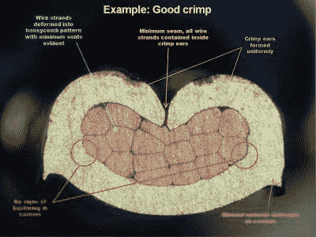
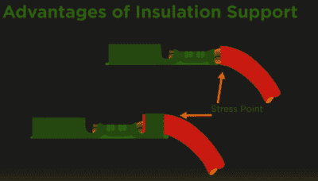

# 紧要关头的好:压接连接的物理学

> 原文：<https://hackaday.com/2017/02/09/good-in-a-pinch-the-physics-of-crimped-connections/>

我有一个朋友是一家大型国防承包商的电子组装技术人员。他是一个生产车间的家伙，对那些喜欢书本学习却连最简单的问题都解决不了的工程师们充满了敌意。他声称有一个组件没有通过质量控制，一群打着领带的家伙搞不明白。他侧身评估了一下情况，给出了他的两个字的诊断:“压接不良。”不可靠的连接器被重新加工，装配通过了，这让穿短袖衬衫的人很懊恼。

除了经验中的实物课有时胜过教育，我总是想知道“坏卷曲”的公告。一个压接器如此微妙地摆弄一个电路，会出什么问题，让工程师们感到困惑？我们怎么能依靠如此简单的技术来连接如此多的现代世界呢？卷曲连接内部到底发生了什么？

### 无焊是有道理的

我们倾向于认为焊接接头是电气连接之王。加热焊点并使熔化的焊料流入焊点的行为给成品带来了一种持久和优质的感觉。焊接基本上是早期商业电子行业唯一的展示。

但是焊接点有它们的问题，无论是在机电方面还是在生产方面——毕竟，一个装配工人只能这么快地把焊料吊起来。在 20 世纪 50 年代初，AMP 公司推出了第一个用于生产的压接接头，即 F-压接或开口筒设计。使用这种压接设计，AMP 销售了各种各样的连接器，这些连接器可以快速且可重复地应用于导体，并以焊接永远无法实现的方式将它们自己用于自动化制造方法。

### 挤压游戏

压接利用金属的特性来实现电连接和机械连接。用于压接连接器的金属，如铜、黄铜、铝或青铜，既有延展性又有延展性。金属的延展性是它在张力下可以变形的程度，而延展性是金属在压力下如何变形的量度。压接涉及在压接连接器和导线上施加巨大的压力，因此每个元件的延展性是压接质量的重要因素。但是延展性也起作用，因为连接器和电线在压接过程中都经历显著的拉伸。

Cross-section of a good F-crimp. Source: 

压接工具是高质量压接的关键部分。任何压接工具的业务端是模组。这通常是工具钢砧和锤，其具体配置由连接器类型决定。

对于 AMP 型 F-crimp，U 形连接器放置在砧座上，其腿朝上。一根适当剥皮的金属丝放在腿之间，锤子向下移动到铁砧上。锤子在电线束上引导连接器的腿，最终将它们向下折叠成聚集的电线束。

随着更多的压力施加到连接处，金属线股中的金属开始拉伸和流动。这将松开并赶走任何可能增加连接电阻的表面氧化物。压力越大，线束的变形越大，直到每股线束的圆形横截面消失，取而代之的是一堆扁平的线束，它们以蜂窝状的方式相互贴合。结果是线束和压接连接器之间的冷焊、气密连接。

大多数压接工具还通过将第二组支腿轻轻压接到电线的塑料绝缘上来消除应变。通常注意不要刺破或损坏绝缘材料；通常，这些应变消除卷曲只是牢牢地包裹绝缘层，并将弯曲力导入绝缘层，远离导线导体。第三组支腿也可以通过工具形成为圆形，以允许完成的终端插入塑料主体中。

压接连接的一个重要方面是检查它的能力，并确保一切按计划进行。卷曲的横截面显微照片是检验的金标准，但对产品有破坏性。幸运的是，一个关键参数可以揭示压接过程的一切，并且可以无损测量——压接高度。这可以用千分尺测量，并反映施加了多大的压力以及钢丝股是否被适当压缩。

正确执行的压接连接具有电气可靠性和机械强度，了解工具内部的情况是获得一致结果的第一步。如需更深入的压接实践指南，请参见[正确压接程序指南](http://hackaday.com/2015/04/07/how-to-properly-crimp-electronics-connectors/)。

 [https://www.youtube.com/embed/bAO9eCS65jw?version=3&rel=1&showsearch=0&showinfo=1&iv_load_policy=1&fs=1&hl=en-US&autohide=2&wmode=transparent](https://www.youtube.com/embed/bAO9eCS65jw?version=3&rel=1&showsearch=0&showinfo=1&iv_load_policy=1&fs=1&hl=en-US&autohide=2&wmode=transparent)

[横幅图片来源: [TE Connectivity](https://www.youtube.com/watch?v=bAO9eCS65jw)