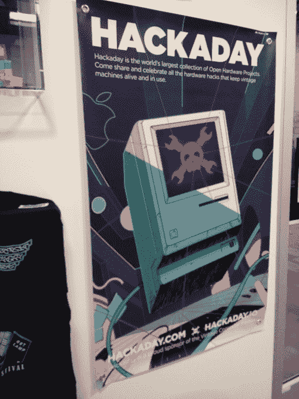
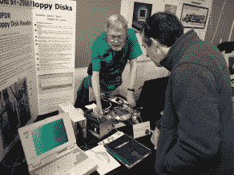
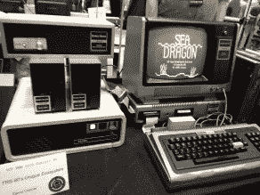
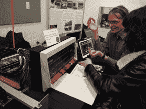
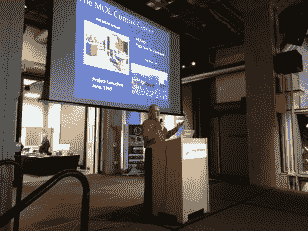
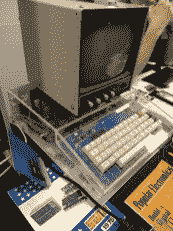
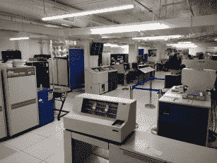
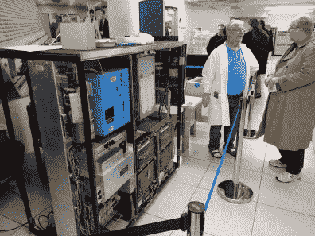
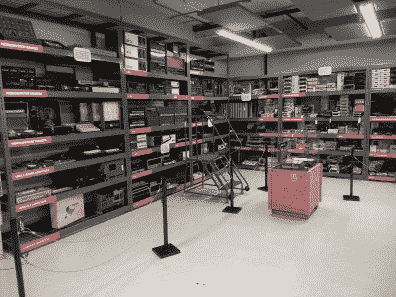

# 西雅图老式计算的伟大开端；VCF·PNW

> 原文：<https://hackaday.com/2018/02/17/great-beginnings-for-vintage-computing-in-seattle-vcf-pnw/>

对我妻子的推销很简单:“想去西雅图度周末吗？”这就是我上周末在首届太平洋西北老式计算机节上的结局，我很高兴我们驱车五个小时来到这座大城市去看看。毕竟，Hackaday 是 VCF 的赞助商，所以这似乎是一个很好的旅行借口。西雅图连续两天都是好天气，这只是锦上添花，因为我们可以在一个致力于保持计算机历史鲜活和可访问的伟大博物馆中，与复古计算机爱好者和他们最亲爱的旧硬件共度时光。

事实上，作为微软、亚马逊和其他数十家科技公司的所在地，西雅图一直被排除在外，而青睐新泽西的 VCF 东(T0)和山景城的 T2 VCF 西(T3 ),这看起来很奇怪，但从接待情况来看，VCF·PNW 将留在这里，并准备发展。此次展览有 20 家参展商，展示了从复活的 PDP-11 和 Altair 8800 控制面板到 TRS 80s，从 Model 1 到 CoCo 的所有产品。几乎每一类可合理运输的复古硬件都被展示出来，还有一些推动了便携性的极限，比如一个工作的 PDP-8 和一个巨大的 Symbolics 3640 LISP 工作站。

在某些时候，旁观者的数量是参展商的三倍，挤满了展览之间的过道，很难靠近聊天。几乎每个参展商都挤满了询问问题、在键盘上敲击命令或与硬件自拍的人。我只有机会与一些参展商交谈，比如大卫·库珀(David Cooper)展示了他在 TRS-80 生态系统中令人印象深刻的藏品。我的第一个程序被打成了一个模型 1，在我当地无线电室经理的宽容下，和我的儿子在一台从 20 世纪 70 年代起就没碰过的机器上玩海龙真是一种享受。

    David Wiens came down from Canada to talk about recovering data from old ST-2900 floppies.  David Cooper was kind enough to let me relive my glory days on his TRS-80\.  Joerg Hoppe came from Germany to show off BlinkenBone, which gives new life to the beautiful control panels of old.

VCF·PNW 还主持了一系列有趣的讲座，我只听了其中一个。保罗·劳顿(Paul Laughton)谈到了他对编程生涯的热情，从大型机到微型机，包括苹果公司的早期，他签了一份 13，000 美元的合同来开发苹果 DOS，在家酿计算机俱乐部遇见了他未来的妻子，与乔布斯和沃兹一起玩，并写了一本关于 Atari DOS 和 AtariBASIC 的书。他最终在罗技公司为第一批消费数码相机之一编写固件。Paul 现在是 VCF 韦斯特的家乡山景城计算机历史博物馆的讲解员，他利用业余时间编写和维护 BASIC！对于 Android 应用程序。

虽然演讲和展览是与会者来这里的目的，但我们不可能不去参观主办场地，即[活计算机:博物馆+实验室](http://www.livingcomputers.org/)。这个地方对任何级别的计算机感兴趣的人来说都是一个真正的享受。主楼层有许多面向儿童的展品:一个自动驾驶汽车模拟器，带你在斯普林菲尔德主街的 Krusty 汉堡店进行虚拟骑行；VR 和 AR 演示；和交互式机器人显示器。但上层有丰富的硬件资源:从最初的苹果到 Mac、Ataris、Osbornes、Commodores，甚至是 MITS 和 IMSAI 的机器。如果你在 1975 年到“伙计，你将得到一台戴尔！”之间的任何时候开始使用个人电脑几天后，他们很有可能会展出它。另外，在一个气候控制的计算机房里，有几十台小型机和一个漂亮的大铁显示器。

  Paul Laughton holds forth on a career built on passion and persistence.  Nothing says retro like perf board and a Plexiglas case.  The “Big Iron” collection is in a real climate-controlled room, and most of it still works.  Big Iron guide in period-correct costume.  This is the stuff the LC:M+L doesn’t display.

但是博物馆最好的部分是什么？几乎每一个展览都是可操作的，触摸是绝对被鼓励的。我们惊讶地看到，几乎每一个键盘都被某人占据，输入“你好，世界！”特定架构的等效物。很少有文物被锁在远离窥探的手指的地方，即使那些被标记为不可触摸的文物通常也足够容易接近，所以你可以近距离观看。这真的是一个很棒的博物馆，当你在这个地区时，值得一游。博物馆似乎受益于 VCF 的出席者——据说博物馆打破了之前由《我的世界》事件创下的出席记录。

总而言之，《VCF·PNW》取得了巨大的成功，这要归功于制作团队，尤其是制片人迈克·布鲁特曼。也感谢老式计算机联合会的 Rob 和 Evan 的热情款待，感谢 LC:M+L 的 Matisse 为我们准备了当天的凭证。希望 VCF·PNW 能留下来，2019 年的活动会更大。