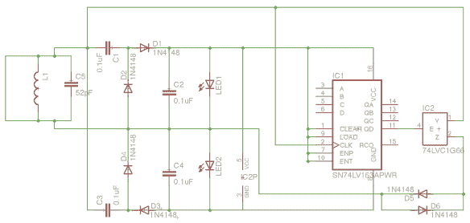
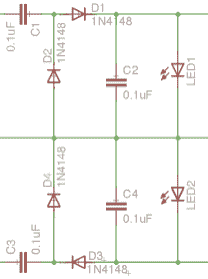

# GuardBunny 主动 RFID 保护开放硬件

> 原文：<https://hackaday.com/2016/02/18/guardbunny-active-rfid-protection-going-open-hardware/>

每个硬币都有两面。有些公司提供无线卡，你可以拿着它与读卡器接触一会儿，而不是用信用卡刷卡或使用芯片读卡器。这对你和任何人来说都是多么方便，他们可能会为了自己的使用而读取这些数据。RFID 护照也是如此，现在无处不在的商业和酒店门禁钥匙卡也是如此。我相信你可以选择不使用这些信用卡中的一张，但是人力资源部的 Gerald 不会给你一把金属钥匙——你只能带着那张 RFID 卡到处走。

有人偷偷阅读你的卡不太可能解开你的秘密。非接触式信用卡和键锁卡实际上是基于存储的密钥对来计算响应。但是你绝对可以通过你卡上唯一的 id 来追踪。路过一个开放阅读器的时候有没有被记录？而其他设备，如公共交通卡，可能会存储更多可以获取的信息。当你不使用这些信号时，想让它们静音并不完全是妄想。

所有这些的一个解决方案是保护你的钱包免受潜在的 RFID 盗版者的侵害。在这一点上，我敢肯定每个人都想到了锡纸名片盒。当然，这可能行得通，除非恶意读者非常强大。但有一种更有趣的方法来防止这种情况:一个名为 GuardBunny 的项目中的主动 RFID 加扰。这是一张卡片，你把它放在你想保护的东西旁边。它不是真正的 RFID——我一会儿就明白了——但它以同样的方式被激活，并在任何读卡器上吐出错误的比特。Kristin Paget 已经为 GuardBunny 工作了好几年了。最近，她用于主动开发的时间更少了，但是通过将版本 1 发布给其他人，她做了一件伟大的事情。在[她在 Shmoocon 2016](https://archive.org/details/Be_Free_Little_Guardbunny) 的演讲中，她介绍了设计，展示了其功能，并分享了一些进一步改进的建议。

### 模仿 13.56 MHz 的非接触式系统

RFID 是射频识别的总称。在这种情况下，我们谈论的是工作在 13.56 MHz 频段的任何系统，包括 NFC、MiFare、智能卡等。

GuardBunny 通过以与任何符合标准的标签相同的方式激活来防止未经授权的读取。它使用一个调谐天线，当暴露于 13.56 MHz 电磁波时，它会激活电源。这为一个 4 位计数器 IC 供电，其输出连接到一个调制器和限幅器电路。其结果是一个传输的信号，具有读者正在收听的规格，但携带的有效载荷却是乱码。只要这与你要保护的卡在同一条路径上，这种胡言乱语就会阻止读卡器从真正的非接触式卡获得适当的响应。

### 硬件设计

那个 4 位计数器是怎么回事？这一切都取决于这些非接触式读卡器的工作原理。这个概念的关键是标签不自带电池；它们由读者自己提供动力。因此，阅读器发射 13.56 MHz 信号，但返回的答案是副载波信号。当目标调制该子载波信号上的负载时，数据被传输。FC16 是该方案的名称，它将频率载波除以 16。因此，将 13.56 MHz 除以 16 得到 847.5 kHz 的副载波信号。4 位计数器用于进行除法运算，最高有效位驱动调制器电路向阅读器发回信号。

  Full Schematic  PSU Section of Schematic

也许对我来说最有趣的设计元素是电源。读取器产生的功率非常小，因此标签上的 PSU 需要尽可能高效。

右边是电源的布局，中间是地，左边是电容与天线的连接。地线上方和下方的对称性形成整流器；RFID 阅读器输出交流电，这两个组合电路将交流电整流为计数器 IC 所需的 DC。

二极管 D2 和 D4 补偿 D1 和 D3 的电压降。中间的两个储能电容(C2 和 C4)将这变成一个电压四倍器。没有这种补偿，电压将低于计数器的最小阈值。

最后，两个 led 充当电压保护。与读卡器的距离以及读卡器的功率输出对 PSU 推至 IC 的电压有很大影响。一旦电压达到一定水平，led 就会开启并开始消耗电流，以防止损坏计数器芯片。它们还有一个额外的优势，那就是发出附近有阅读器的信号。

### 传递火炬

Kristin 在这方面做得很好，她在演讲中的台上演示表明，GuardBunny 比现在市场上的其他几款主动 RFID 保护产品表现更好，如 [SignalVault](http://www.signal-vault.com/) 。SignalVault 将屏蔽和主动保护结合在一起，但为了获得最佳效果，您需要两个，在您保护的卡的两侧各一个。GuardBunny 在与它保护的卡的距离、与读卡器的距离方面有更好的保护，即使它不在真正的卡和读卡器之间，它也受到保护。信号库本身也是一个 RFID 标签，所以如果你担心被非接触式设备跟踪，这是另一个可以被秘密阅读器记录的 UID。GuardBunny 什么都不是，只是胡言乱语，因此无法被跟踪。

但是，所有这些主动保护方案的主要缺陷是与受保护的卡对齐。你可以将两张卡分开，但仍然可以得到保护，但只需将其中一张旋转一两度，或者移动它们，使它们不直接在另一张上面，天线就会异相，导致 GuardBunny 失去迷惑读者的能力。

Gerber view of GuardBunny shows the small hardware footprint

这是将 GuardBunny 作为开放硬件发布的部分动力。Kristin 已经把这个项目进行到这一步了，但是他希望其他人能够继续下去。上述对准问题可以通过设计更多的天线来解决。硬件占用空间非常小，因此采用占用空间更小的天线将允许每张卡使用多个天线。这些可以相加得到更大的功率，或者进行相位校正和组合，以提高效率。还有一些其他设计向量值得研究，如比 led 更好的电压保护解决方案(简单但功耗太大)和其他警报，如与手机的 BTLE 连接。

最终，真正的问题是 RFID 标签无法关闭。我们应该默认设计安全性，Kristin 确实提到需要像 SD 卡那样的滑锁，或者按下按钮，以便非接触式卡与读卡器配合工作。我同意，这是明智的做法。但我很高兴能在她的演讲中占有一席之地，并享受着这个简单设备背后的硬件设计。