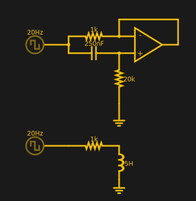
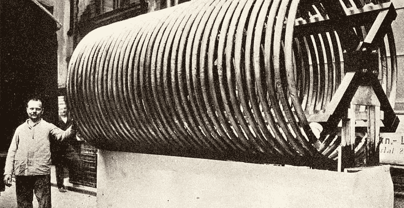
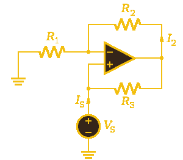

# 回转器:第五元素

> 原文：<https://hackaday.com/2017/07/06/gyrators-the-fifth-element/>

几年前，一种叫做忆阻器的新基本元件引起了轩然大波。虽然这不是第一次一个新的组件类型被理论化。1948 年，伯纳德·特勒根提出了回转器的设想。虽然你不能买一个作为组件，但你可以用其他组件构建一个。事实上，它们对于某些类型的设计是非常必要的。简而言之，回转器是一种双端器件，可以反转电气元件的电流-电压特性。因此，您可以使用回转器将电容转换为电感，反之亦然。

请记住，转换只是简单的电气属性。通常，电流在电容中领先电压，在电感中滞后电压，这就是回转器的变化。如果你用一个回转器和一个电容来制作一个虚拟电感，这个电感不会与另一个电感磁耦合，不管是真实的还是模拟的。没有磁场可以这么做。你也不会得到由反电动势引起的大电压尖峰，根据你的应用，它可能是正的，也可能是负的。但是，如果你需要一个笨拙的电感电路来获得相位响应，那么回转器可能就是你想要的。

## 魔法

 那么回转器是如何施展魔法的呢？考虑这个[电路模拟](http://tinyurl.com/y7hslj7s)。底部电路显示 5 H 电感的电压和电流。顶部电路显示了一个回转器等效电路，提供类似的电感。

在 DC，底部电路将看起来像一个 1kω电阻，以及电感器导线呈现的任何电阻(可能不会太大)。在某些非常高的频率下，电感的有效电阻会非常高，电路也可能是开路。在两者之间，电阻会随着频率而增加。

在查看顶部电路之前，不妨回顾一下“完美”运算放大器的一些分析技巧。我们可以想象运算放大器的输入是开路。无论一个端子上的电压是多少，输出都会尽一切努力使另一个端子上的电压相同。在实践中，这并不总是可能的，但对于我们这里的情况，假设它是可能的。

现在考虑回转器电路。在 DC，电容器将充满电，成为开路。由于运算放大器的正端理论上不消耗电流，因此该端将通过 20kω电阻处于地电位。这意味着运算放大器输出也为 0 V，因此 1kω电阻位于源极和地之间，就像电感电路一样。在非常高的频率下，电容将完全消失，输入电压将出现在正端。这意味着 1kω电阻两端的电压相同，实际上不在电路中。

现在让我们来考虑相移。当电容器接收到交流信号时，其电流会在电压上升之前上升。因此，在启动的瞬间，电阻两端的电压相同，因此没有电流。随着电容器两端的电压增加，正极和输出端的电压将降低，从而导致更多的电流流过。这与电容的电流-电压响应相反，与电感完全相同。因此，即使没有真正的数学知识，你也能感觉到这是为什么。

## 为什么？

我们使用的所有组件都不理想。当我们画原理图时，我们假装导线没有电阻，对电流处理没有限制，但实际上，它两者都有。电容漏电。电阻可以是非线性的或漂移的。但是电感特别麻烦。形成它们的电线有电阻。环路与相邻环路的电容。此外，电感器往往体积很大。大电感使用大量导线，不仅体积大，而且电阻大，还有其他问题。它们占据了很大的空间。也许没有这张 1912 年的无线电天线大，但仍然。

您通常可以获得高质量的电容，并利用它们来制作比基于导线的电感更接近理想值的大值电感。因此，假设旋转电感满足您的需求，使用回转器通常可以获得更高质量的器件，而且占用空间更小。

这一点在集成电路内部尤为重要。由于集成电路的制造方式，制造特定值的电容相当容易，但用硅制造电感却非常困难。更容易制造具有非常精确电容比的多个电容，这有时会导致有趣的设计，电容和模拟电感的精确值不如值之间的比值重要。

由于用回转器制造的电感器实际上不是磁性的，所以你不能用它们来驱动继电器、扬声器、感应磁场或制造变压器。你也不能在开关电源中使用它们。然而，你确实看到它们经常被用在过滤器之类的东西上。请记住，运算放大器(或其它有源器件)必须在相关频率下工作，并且仍具有良好的特性。

## 设计

您可能想知道为什么示例电路中的 250 nF 电容与 5 H 电感相同。毕竟，仿真使用 20 Hz 信号，这意味着电感的电抗约为 628ω，而电容的电抗约为 32kω。

假设 1kω电阻为 R1，20kω电阻为 R2。不用推导数学公式，电路的有效 Z 为:

例如，这相当于 628ω的容抗。(如果你想重温复阻抗，我们会帮你搞定。)

串联电阻 R1 的电感电抗为，则上述结果简化为

请记住，运算放大器必须在目标频率下工作，并且必须能够输出足够的电流，这将限制 R1 可以有多低。

## 零碎东西

 回转器实际上是 NIC 的特殊用途[负阻抗转换器](https://en.wikipedia.org/wiki/Negative_impedance_converter)。你可以用同样的想法来制造负电阻，甚至负电抗。你有时会看到简单振荡器中使用的[负电阻](https://en.wikipedia.org/wiki/Negative_resistance)。当然，这通常是以具有负电阻的隧道或 Esaki 二极管等器件的形式出现，但也可以使用 NIC 电路。

我展示的是带运算放大器的回转器，因为这是理解其工作原理的最简单方式。但是，您可以使用其他活动设备。此外，我展示的所有回转器都要求一端接地。有些回转器架构可以产生浮动虚拟电感，但这种架构很少见，因为它们需要更多元件。

当然，你也可以用同样的方法将一个电感翻转成一个虚拟电容。问题是几乎没有这样做的动机。与电感相比，电容通常更小、更轻，价格相同或更低，但质量更好。

## 了解更多信息

如果你在 YouTube 上搜索回转器，你可能会找到一些不完全安全的内容。谁知道呢？然而，你可以放心地阅读下面的[杰弗里·沃林]关于这个主题的讲座。如果你想深究数学，你可以做得比这些视频更糟。

如果你喜欢阅读，或者你对真空管和分立晶体管等器件是如何做到这一点感兴趣，可以看看[詹姆斯·库勒兹的]硕士论文。当然，这是从 1969 年开始的，但数学并没有改变，与今天唯一真正的区别是运算放大器现在好得多。

 [https://www.youtube.com/embed/g1NdKyG0ahs?version=3&rel=1&showsearch=0&showinfo=1&iv_load_policy=1&fs=1&hl=en-US&autohide=2&wmode=transparent](https://www.youtube.com/embed/g1NdKyG0ahs?version=3&rel=1&showsearch=0&showinfo=1&iv_load_policy=1&fs=1&hl=en-US&autohide=2&wmode=transparent)

