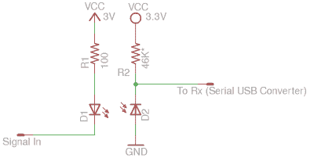

# 黑掉你的万用表

> 原文：<https://hackaday.com/2016/04/02/hack-your-multimeter/>

一个好的万用表(或其中的几个)是任何人的电子工作台必不可少的一部分。唯一比万用表更有用的是可以记录一段时间的测井万用表。唯一比这更有用的是能把数据传输回你的电脑进行分析。但是昂贵的仪表通常要花一点钱。

[Kerry Wong]决定自己动手，在他相对便宜的万用表上黑进一个串行输出端口,这样他就能每秒钟记录三次电表能测量到的任何东西，直到他用完硬盘空间。

我们从电表微处理器的数据手册开始。[Kerry]然后接上几根电线，转储、修改并刷新校准和配置 EEPROM。通过 EEPROM 中的一次位翻转，他实现了串行输出。再用几个，他让背景灯亮得更久，禁用自动关机，基本上按他想要的方式定制了仪表。

 然而，从仪表中获取数据却是一大妙招。不想让他连接到血糖仪的计算机冒险，[Kerry]知道他需要血糖仪和 USART 之间的光隔离。他采用了一个非常简单的解决方案——简单地将仪表的串行输出连接到一个红外 LED 上。通常，通过红外传输数据是通过用 38 kHz 载波调制信号来实现抗噪性的。[Kerry]无论如何都要将接收器正对着发射器，所以他在 PC 端使用了普通的红外光电二极管。sigrok 负责数据记录和显示。

为我们的测量平台增加更多的自动化已经在我们的任务清单上很长时间了，而[Kerry]的 hack 提供了一种廉价而有趣的开始方式。它是电脑控制供应的完美伴侣。(或者[两个！](http://hackaday.com/2015/07/15/hackaday-prize-entry-a-better-bench-power-supply/)。)