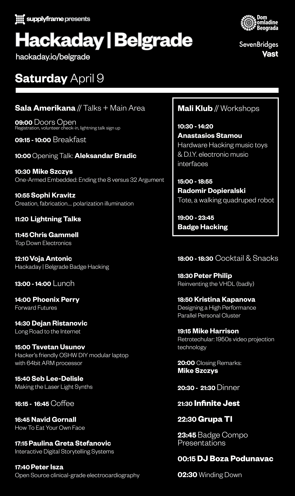

# 周六将直播贝尔格莱德会谈

> 原文：<https://hackaday.com/2016/04/04/hackaday-belgrade-talks-will-live-stream-saturday/>

4 月 9 日星期六，在塞尔维亚的贝尔格莱德，我们有一个令人惊讶的会谈阵容。几周前，讲座的门票就已经售完了。如果你在附近，你仍然可以[买到当晚音乐会的门票。不管怎样，今天早上的大新闻是我们将直播所有的谈话！](https://www.eventbrite.com/e/hackaday-belgrade-tickets-21409115240)

一旦我们得到直播链接，它们将会被发布在会议页面上。你也应该在[的 Hackaday | Belgrade 项目页面](https://hackaday.io/project/8672-hackaday-belgrade)上加入聊天。只需点击右上角的“请求加入这个项目”按钮。现在就做。

有很多优秀的演讲者，看看下面的海报。我很高兴听到 Mike Harrison([mikeselectricstyf](https://www.google.com/url?sa=t&rct=j&q=&esrc=s&source=web&cd=1&cad=rja&uact=8&ved=0ahUKEwjNytCvuu7LAhWCs4MKHSUSCGwQFggcMAA&url=https%3A%2F%2Fwww.youtube.com%2Fuser%2Fmikeselectricstuff&usg=AFQjCNFo8upFQGtaiJk2Pt1aNJ-sT5qrjw&bvm=bv.118443451,d.amc))讲述他在视频投影技术的兔子洞中的旅程，Phoenix Perry 关于未来的演讲，Voja Anotic 关于硬件徽章的演讲，Peter Philip 关于重新发明 VHDL 的演讲，以及几乎所有其他的演讲！在 Hackaday 的工作人员中，你可以观看 Sophi Kravitz 关于她的快门玻璃项目的演讲，Chris Gammell 将谈论自上而下的电子学，我将彻底结束 8 对 32 的争论(是的，没错！).

当你在听演讲的时候，为什么不试试你的徽章黑客技术呢？你不需要任何硬件，你现在就可以在你自己的电脑上使用模拟器来测试你被黑的代码。我们将为最佳参赛作品发奖，目前只有少数几个。

你不会想错过这些讲座的！如果你不相信我，看看去年 11 月 SuperCon 的演讲，你会被说服——hack aday 大会提供了硬件演讲的最佳集合。

