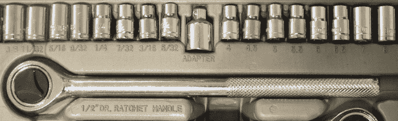

# 哈卡代字典:密耳、英寸和米

> 原文：<https://hackaday.com/2016/08/05/hackaday-dictionary-mils-and-inches-and-meters-oh-my/>

测量长度是一件痛苦的事，这都是英制测量的错。某些行业已经围绕英制或公制进行了标准化，这意味着从事跨多个行业的项目通常会导致至少一次转换。对于帝国单位的最后堡垒之外的每个人，这里有一个关于我们如何在疯狂的土地上做它的初级读本。

## 定义

英制单位中长度测量的基本单位是英寸。十二英寸构成一英尺，三英尺构成一码，5280 英尺(或 1760 码)构成一英里。很好记，对吧？

具有讽刺意味的是，一英寸在公制中被定义为 25.4 毫米。你可以计算剩下的精确长度，但一般来说，三英尺不到一米，一英里大约是一公里半。通常在英制中你会看到很多混合单位，比如一个人的身高是 6 英尺 2 英寸(这是 6 英尺 2 英寸的简写。)但是不一致，是英文；唯一的一致性是它总是打破自己的规则。你不会说三码，两英尺，六英寸；你会说 11.5 英尺。如果是三码，一英尺，六英寸，你会说三又二分之一码。除了尽可能多地使用好的分数之外，没有什么好的规则。

英制单位的用户喜欢分数，尤其是涉及到一英寸或一英里的部分时。你会经常发现几分之一英寸的钻头，当你试图在你的头脑中做数学计算，并计算出 17/64 英寸的钻头是否大于 1/4 英寸的钻头(提示，是的，它是 1/64 英寸大)时，这是非常令人沮丧的。

A socket wrench set in Imperial fractions on the left and metric on the right. Metric is so much easier.

如果这还不够难的话，还有千分之一英寸。随着机器时代变得越来越好，零件变得越来越小，越来越精确，需要比 1/64 英寸更精确的测量。开发合适的工具来测量如此高的分辨率也是至关重要的。你可以称 1/8 英寸的钻头为 0.125 英寸的钻头，这意味着千分之 125 英寸。然而，人们不喜欢把整个单词用嘴巴包住，所以它被简化为“你”其他人用拉丁语词根“千”表示“百万”总而言之，一密耳相当于一千，也就是一英寸的千分之一。它不应该和一毫米混淆。制造一毫米大约需要 40 密耳。同样，mil 的复数形式是 mils，而 you 的复数形式是 you。

## 工具

![Outside calipers for measuring the outer dimensionBy Glenn McKechnie (Own work) [GFDL, CC-BY-SA-3.0 or CC BY-SA 2.5-2.0-1.0], via Wikimedia Commons](img/0804aeef62568c0fd06b564fafef4cfa.png)

外卡尺测量外尺寸由格伦·麦肯尼(自己的作品)[ [GFDL](http://www.gnu.org/copyleft/fdl.html) ， [CC-BY-SA-3.0](http://creativecommons.org/licenses/by-sa/3.0/) 或 [CC BY-SA 2.5-2.0-1.0](http://creativecommons.org/licenses/by-sa/2.5-2.0-1.0) ，[通过维基共享资源](https://commons.wikimedia.org/wiki/File%3AOutsideCalipers.jpg)

测量长度是用各种工具完成的，从长距离的 GPS，到英尺/米的卷尺，以及英寸/厘米的尺子。当进行非常小的测量时，卡尺是首选工具。这是那种应该放在每个人工具箱里的工具。最初，它是从内卡尺和外卡尺开始的，它们是用来测量长度的独立工具。游标卡尺将两者结合起来，增加了深度计和一些其他方便的功能，给机械师一个全面有用的测量工具。然而，就像计算尺一样，一旦数字选项变得可用，它们就接管了。数字卡尺通常可以在十进制英寸、分数英寸和公制之间切换模式。

此外，虽然有点跑题，但如果你还没有看过这个关于[充分利用卷尺](https://youtu.be/TkoCWUJt10w)的视频，这几分钟还是很值得的。

## 使用

每个行业都选择了不同的惯例。塑料片通常以密耳为单位来测量，任何大于 1/32 英寸的东西都以毫米或几分之一英寸来测量。电路板以各种可以想象的方式组合单位，有时结合密耳表示走线宽度，公制表示电路板尺寸，铜的厚度以盎司表示。(那连长度单位都算不上！它代表一平方英尺面积中的铜含量，1 盎司相当于 1.4 毫升。)大多数时候，在美国以外设计的产品采用公制单位，而美国产品则采用公制单位。然而，当结合不同的行业时，标准的差异变得非常令人讨厌。例如，订购 1/8″的有机玻璃，你可能会得到 3 毫米的有机玻璃。当然，差异只有 0.175 毫米(7000 英镑)，但这种差异可能会给压配合的零件或在盒子上制作指接接头带来大问题，因此，在采购组件时，不仅要验证单位，还要验证它是否是该行业的正常单位，而不仅仅是四舍五入，这一点很重要。

通常情况下，只需几次卡尺测量，你就能知道产品是用什么主要单位设计的。找到一个维度，看看它是否是一个很好的公制整数。如果不是，就切换到英制，看看它多快就能捕捉到一个好数字。

## 走向

尽可能使用公制。世界上绝大多数人都这样做。当你把设计送到海外生产时，他们会转换成公制(尽管他们已经习惯了两种标准)。适应它确实需要时间(特别是当你处理千分之一的时候)，但是当你的设计没有撞上火星的时候(或者更现实地说，当你不需要拔出 Dremel 和 blade 来把你的部件装配在一起的时候)，你暂时的不适将会减轻。