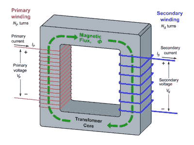
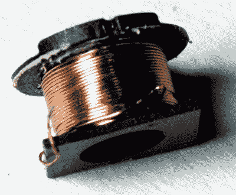

# 黑客字典:变形金刚

> 原文：<https://hackaday.com/2016/05/06/hackaday-dictionary-transformers/>

有趣的东西，电。这都是关于电压和电流，以及控制这两个因素。大多数时候，进入你的设备的电流比你需要的电压要高，所以你必须把它转换成更有用的电压。最简单的方法是用变压器。

电源中的变压器从电源获得高电压，然后将其转换成较低的电压，为您的设备供电。你会在所有的电源中找到一个，从给你的手机供电的微型 USB 版本到挂在电线杆上驱动你家主电源的大电源。虽然这些变压器大小不同，但它们的基本设计是相同的。

Diagram of a trasformer, by [BillC at the English language Wikipedia, CC BY-SA 3.0](https://commons.wikimedia.org/w/index.php?curid=27407689),

基本的变压器是两个缠绕在金属芯上的线圈。交流电被施加到这些线圈中的一个(称为初级线圈)，这在金属芯中产生磁场。这个磁场反过来在第二个线圈中产生电流，称为次级线圈。这两个电流之间的关系很重要，它由每个线圈的长度比决定，通常定义为每个线圈的匝数。如果两个线圈的匝数相同，则流入初级线圈和流出次级线圈的电流几乎相同。如果次级线圈的匝数增加一倍，电压几乎会增加一倍。如果次级线圈有一半的匝数，电压将几乎减半。这有助于解释变压器的命名:升压和降压。升压型产生更高的电压(例如在这个雅各布斯阶梯 中使用的 [)，而降压型降低电压。](http://hackaday.com/2014/08/21/jacobs-ladder-using-a-10kv-oil-transformer/)

要使变压器正常工作，必须使用交流电。交流电产生变化的磁场(称为磁通量),在次级线圈中感应出电流。如果没有变化的磁场，就不会有感应电流。如果您需要 DC 输出，电源中的序列将从变压器开始，将来自墙壁插座的交流电降压至较低水平，然后该较低电压的交流电将被转换为电源输出的 DC。

The transformer from an iPhone power supply. [From Righto.com](http://www.righto.com/2012/05/apple-iphone-charger-teardown-quality.html)

有很多因素会影响变压器的工作方式。这些包括磁心的构成:金属会影响磁场的流动。磁场中的一些能量在次级线圈中产生电流之前也不可避免地损失了，称为涡流损耗。

所有这些都会影响变压器的性能，因此大多数变压器都是为特定用途定制设计的。 [变压器设计](http://hackaday.com/2015/02/24/retrotechtacular-step-up-and-get-your-transformer-training/) 是一门复杂的艺术，需要考虑很多因素。一个好的开始是一个设计指南 [就像这个来自 Wurth](http://www.digikey.com/en/pdf/w/wurth-elektronik/cookbook-transformer-design) 的设计指南，他制造变压器组件和套件。

还有几种不同类型的变压器，包括用于高压设计的 [反激式](http://hackaday.com/2014/02/14/an-easy-way-to-power-flyback-transformers/) ，如阴极射线管(CRT)[包含磁场的环形](http://hackaday.com/2013/02/13/toroid-winding-cheat/) ，可以处理不同输入电压同时仍然产生固定输出电压的自耦变压器， [空心变压器](http://www.allaboutcircuits.com/textbook/alternating-current/chpt-9/special-transformers-applications/) ，它们没有金属芯，体积较小，以及

然而，你不需要一套工具来试验变形金刚。一个变压器可以像 [一样简单，像几根金属丝缠绕几片钢](http://www.allaboutcircuits.com/textbook/experiments/chpt-4/build-a-transformer/) ，或者 [两根金属丝缠绕一个金属环](http://hackaday.com/2009/06/20/homemade-toroid-winder/)，这样就很容易自己进行实验了。