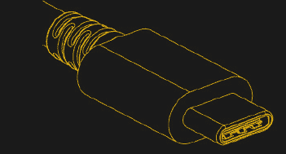
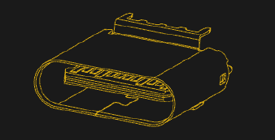
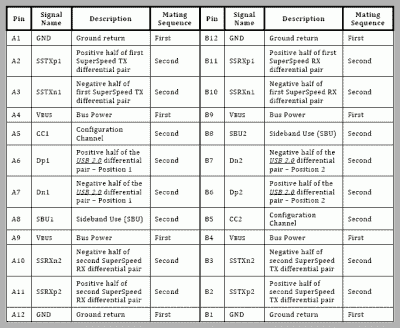
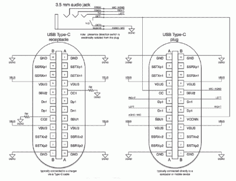

# 黑客字典:USB 类型 C

> 原文：<https://hackaday.com/2016/04/22/hackaday-dictionary-usb-type-c/>

USB 线？多痛苦啊。当你需要一个连接器时，你总是找不到正确的类型，或者当你插入电缆时，你不知道哪一个是向上的。不过，随着古老的 USB 连接的最新版本:USB Type C 的出现，这些问题可能会成为过去。这一新标准在两端使用单一类型的插头，因此您可以使用任何一种电缆。插头也可以双向使用，所以你可以闭着眼睛插上插头。我们来看看 USB type C 连接器是什么意思。

新的 USB type C 连接器于 2014 年首次发布，是 [USB 3.1 标准](http://www.usb.org/developers/docs/)的一部分。这个新标准是对大多数当代设备使用的 USB 3.0 标准的更新，它增加了一种新型连接器:USB type C。

Schematic diagram of a USB type C plug.

这种新连接器比旧版本更小、更薄、更灵活，但仍支持相同的数据和电源连接，并增加了多种设备相互通信的方式。它主要通过将插头和插座之间的连接数量从 USB 3 的 10 个和 USB 2.0 的 4 个或 5 个增加到 24 个来实现这一点。这些额外的连接意味着两端的设备有更多的方式通过电缆传输能量和数据。

这种单一的连接器也意味着电缆可以以任何方式使用，也可以向上使用。不再有成堆的不同端的 USB 电缆或在 PC 后面摸索着找出 USB 插头应该走哪条路:用一句老生常谈的话来说，它会工作，不管它是哪条路，也不管插头的方向如何。

它这样做是因为连接器实际上是二合一的，在插头内部的中心板的两侧有 12 个连接。因此，无论它以何种方式进入，连接都将被恰当地建立，因为它们存在于两边。

## 力量

其中四个连接被指定为 VBUS 连接，用于为连接的设备充电和操作。此外，两个引脚用于接地，一个引脚用于两个器件之间的信号传输，以确定应发送多少功率。在 USB 标准 5 V 下运行，VBUS 电缆可以提供高达 3 安培的电流，比 USB 3 电缆的 2 安培有了很大的提高，也比 USB 2 高得多。

一些设备通过使用 [USB 电源设备标准](http://www.usb.org/developers/powerdelivery/)来解决这个问题，这允许它们提供更高的电压和更大的电流。然而，大多数笔记本电脑和其他便携式设备不支持这一点，限制了它们提供的充电电流。提高 USB type C 设备可以提供的功率限制意味着更快，例如，从笔记本电脑给手机充电，这对旅行的极客来说是一个巨大的福音，因为这意味着更少的充电器和电缆。

## 数据

其余引脚用于发送数据。USB 3.1 旨在向后兼容旧的 USB 标准，因此您可以使用适当的电缆将带有 USB type C 端口的设备连接到仅支持 USB 2 或 USB 3 的旧设备。

Schematic of a USB type C port.

为了实现这一点，C 型电缆中的连接包括 USB 2 和 3 中使用的所有连接。对于 USB 2 标准，这包括一对导线上的单个连接，而 USB 3.0 在六条导线上使用多达三个连接。每个连接都使用差分信号传输，提供 480 Mbit/s (USB 2)或 5 Gbit/s (USB 3.0)的总带宽。

USB 3.1 type C 连接没有增加任何额外的速度，但它确实增加了一些连接。配置信道(CC)连接允许两个设备交换它们支持(和不支持)哪些功能的信息，边带使用连接(SBU)允许设备交换信息，而不中断主连接上的数据流。USB 3.1 标准中尚未使用 SBU 连接。相反，它是为将来的扩展(可能是 USB 4)而保留的，并且在 USB 3.1 type C 连接支持的一些替代模式中使用。

Description of the pins of a USB type C connection. From the USB 3.1 standards documents

USB 3.1 的创造者希望建立一个包罗万象的标准，同时允许使用其他数据传输方法。特别是，他们希望包括从 USB 类型 C 端口使用的[雷电 3](https://thunderbolttechnology.net/blog/thunderbolt-3-usb-c-does-it-all) 和[显示端口](http://www.displayport.org/displayport-over-usb-c/)连接。他们通过创建备用模式来实现这一点，其中连接可以通过支持这些模式的控制器有效地重新布线，成为雷电 3 或 DisplayPort 连接，而不是 USB 3.1 连接。雷电 3 是一种新标准，它使用非常高速的串行数据来连接硬盘和显卡等设备，而 DisplayPort 主要用于向显示器输出视频。

乍一看，这似乎是一个奇怪的想法，但从长远来看，这是有意义的。通过添加这些备用模式，计算机可以使用单个端口来连接 USB 3.1、雷电 3 或 DisplayPort 设备，从而减少所需的端口数量。对于像轻薄笔记本电脑这样端口空间非常宝贵的设备，这意味着一个端口可以完成三个端口的工作。对于用户来说，这意味着他们不需要那么多电缆，可以在同一个端口上使用 USB 3.1、雷电 3 和 DisplayPort 设备。

## 物理连接

不过，USB type C 连接在物理上不是向后兼容的:你不能将两端都有 USB type C 连接器的电缆与旧的 USB 2 或 3.0 端口一起使用。这引起了用户的一些不满:当我最近买了一部带有 USB type C 电缆的 Nexus 5X 手机时，我沮丧地发现它只有一根 type C 电缆。为了将它连接到我的笔记本电脑或台式电脑(两者都有 USB 3 端口)，我需要购买一个额外的适配器或另一根电缆，一端是 C 型连接，另一端是 USB 3 A 型连接。

这是一个痛苦的例子，但以后会有收获。通过改变物理端口和插头以提供更大的灵活性并支持其他数据模式，USB type C 可以使我在地下室里的 USB、Firewire、HDMI、DisplayPort 和其他电缆的巨大盒子变得无关紧要:只需一根电缆，我就可以将任何东西连接到任何东西。至少理论上是这样:这个梦想如何转化为现实还有待观察。

## 直接音频

另一个有趣的未来暗示是该标准包含的音频适配器模式。

这里，模拟音频输出(如耳机)和输入(如麦克风)可以直接连接到 USB type C 插座，无需外部放大器、DAC 和 ADC。换句话说:你可以用一个简单的适配器添加一个耳机插座，只需要几个电阻。电阻器将所连接的设备识别为耳机，然后 USB 主机设备向其馈送模拟音频并接收模拟音频。

这是否意味着智能手机没有耳机插孔？理论上，正如标准文件所指出的:

> “模拟音频适配器可以是只有 3.5 毫米插孔的非常基本的 USB Type-C 适配器，也可以是具有 3.5 毫米插孔和 USB Type-C 插座的模拟音频适配器，以支持充电。耳机不得使用 USB Type-C 插头代替 3.5 mm 插头。”

粗略地翻译一下，这意味着只配备 USB type C 的智能手机是允许的，但耳机上不会只有 USB type C 插头:你需要一个适配器。