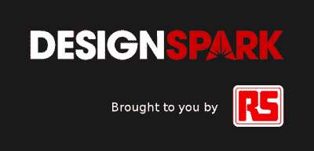

# 黑客日都柏林会议:拿起你的票！

> 原文：<https://hackaday.com/2018/02/18/hackaday-dublin-unconference-needs-you/>

Hackaday 将于 4 月 7 日在爱尔兰举行，我们希望你能出席。[立即获得免费入场券](https://www.eventbrite.com/e/hackaday-dublin-unconference-tickets-43179374672)参加黑客日都柏林大会！

一个非会议是最好的方式，让你的手指抓住硬件世界正在发生的事情的脉搏。每个与会者都应该准备好站起来发表一个 7 分钟的演讲，谈论一些让他们现在就感到兴奋的事情——这指的是你。最简单的方法就是从书架上拿起你最新的黑客作品，然后谈论它。

谈话可能是关于你家里、工作单位或大学里正在开发的原型、项目或产品。也可能是你正在探索的想法、概念或技能。关键是要在一个友好的展示环境中引导你的兴奋，并将其传递给其他人，当你的故事展开时，每个人都会欢呼。

早在 9 月份，Hackaday 在伦敦举办了一场精彩的非正式会议(Unconference ),会场座无虚席，有几十场精彩的演讲，涉及广泛的主题。我们听说了自行车转向灯、激光增强 NES 闪光器、讲述宜家起源故事的远程呈现机器人、微小间距 LED 矩阵设计、驱动翻转点显示器、不信任硬件双因素等等。

那次活动的所有门票在几个小时内就被抢购一空，随之而来的是一个庞大的等候名单。不要等着[抢你的票](https://www.eventbrite.com/e/hackaday-dublin-unconference-tickets-43179374672)！

 我们很高兴与 [DesignSpark](https://www.rs-online.com/designspark/home) 合作，这是 Hackaday Dublin Unconference 的独家赞助商。 [DesignSpark](https://www.rs-online.com/designspark/home) 是 RS Components 的创新部门，将会有一些员工出席会议。他们和我们一样，对聚集整个欧洲的黑客社区感到兴奋。正是在他们的支持下，我们才能够预订一个令人难以置信的场地，并免费向所有与会者提供入场券。黑客日活动很快就会满员，所以[现在就买票吧](https://www.eventbrite.com/e/hackaday-dublin-unconference-tickets-43179374672)在活动结束之前。

这个会议在项目艺术中心举行，它位于都柏林市中心的圣殿酒吧区的中心。表演艺术空间有舒适的座位，非常适合我们的展示形式。我们 13 点开始。整个下午将供应茶、咖啡和小吃，我们还将提供晚餐。当我们 21:00 关门时，任何还站着的人都被邀请在之后加入我们的酒吧(我们将得到第一轮)。

一如既往，Hackaday 的成功是基于组成它的黑客、设计师和工程师社区。请在您的社交媒体上分享门票的链接[，并邀请您的朋友参加。最重要的是，不要回避这个发言的机会。我们想听听你的故事，这是一个讲故事的地方。短短几周后，都柏林见！](https://www.eventbrite.com/e/hackaday-dublin-unconference-tickets-43179374672)