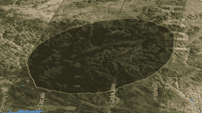

# 黑客日月食聚会

> 原文：<https://hackaday.com/2017/07/21/hackaday-eclipse-meetups/>

这次月食上到处都是黑客日。8 月 21 日，Hackaday 社区的数千名成员前往美国的一个狭窄地带，狂欢一场极其罕见、科学上可预测的生活体验:日全食。

不要孤独，聚在一起庆祝吧！查看 Hackaday Eclipse Meetups 页面,该页面显示了 Meetups 在哪里举行。并且添加您自己的很简单。这是一个和其他 Hackaday 读者见面的好日子，庆祝月亮完美地通过你和太阳之间的那一天。

你不能只盯着太阳看，你需要一些日蚀眼镜。我们打印了一些黑色的，装饰有欢乐扳手的，并发送给所有有组织的聚会，所以今天就打开你的活动页面，你就在名单上了。在 Eclipse 页面上寻找一个按钮，上面写着“主持一个会议”。

## 我太酷了，不想看日食

如果你不明白所有的喧嚣是什么，你就错过了。日全食在很多方面都是一种奇妙的生活体验。首先，它们非常罕见。自 1979 年以来，美国大陆还没有出现过日全食。大多数北美读者甚至没有机会在有生之年看到一部电影。

This eclipse shadow visualization is incredible. See the entire transit and [learn how they produced this from available data](https://www.youtube.com/watch?v=MJgXaqW3md8)

当然，它超越了仅仅是稀缺的价值。能够理解和预测日蚀传达了大量关于人类进步的信息。几千年来，日食是一种令人震惊(也许是可怕)的经历。但是通过科学的观察过程，记录保存的进步，以及无数早期天文学家的工作，我们了解到。日食和月食是挑战思维的事件，成为一些最早的科学发现。

这种进步并没有停止。甚至今年最新技术的应用也出现了。有一个例子会让你大吃一惊，那就是我们在一月份看到的阴影模拟。月球并不是一个完美的球体，它的景观和地球的景观相结合意味着月全食的外缘不会是直线，而是一条起伏的路径。这是一个小细节，由一个公民科学家以深刻的方式实现，以便我们都可以享受它。现在活着是不是绝对惊艳？

## 帮我把它浓缩一下

所以不，看一块石头投下阴影不会让你神魂颠倒。但是理解这个影子的运动不是随机的，我们并不总是理解它，并且这里有巨大的力量在起作用，这将会使你的现代大脑变得谦卑并让你敬畏。这是一个难得的机会，你可以用自己的感官观察到巨大质量的证据，这些质量是由巨大的引力在不可理解的距离上通过一个简单的影子在风景中奔跑的行为来控制的。

去那里，让它成为科学、人性和你自己生活经历的庆典。[立即分享您的 eclipse meetup](https://hackaday.io/meetup/3-total-solar-eclipse)！