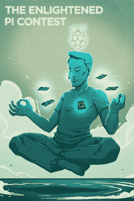

# Hackaday.io 超过 20 万注册用户

> 原文：<https://hackaday.com/2017/02/14/hackaday-io-passes-200000-registered-users/>

Hackaday.io 刚刚迎来了第 20 万注册用户！我们是世界上最大的开放硬件项目库，Hackaday.io 正在证明其作为世界上最具活力的技术社区的价值。这是你获得下一个项目灵感的地方，是你充实产品想法的地方，是你建立工程梦之队的地方，是你讲述工作台的故事的地方，无论是成功、失败还是介于两者之间的任何事情。

在过去的六个月里，随着我们从 150，000 会员里程碑发展到现在，我们的运动在这群了不起的人之间的互动越来越多。感谢你在这里花了这么多时间，让 Hackaday.io 成为每个人的好去处！

### 黑客聊天带来了许多领域的专家

T2 当你能在线观看一个会议谈话或采访时，这总是很棒的。但是如果你没有亲自到场，那么有意义的互动机会就已经错过了。考虑到这一点，我们邀请了众多领域的专家在 Hackaday.io Hack 聊天室主持现场讨论[。](https://hackaday.io/project/5373-hack-chat)

这是推进我们建立全球虚拟黑客空间目标的一个很好的方式。在 hackerspace 举行讲座和研讨会是很常见的，在那里你不仅可以向主持活动的人学习和提问，还可以结识与你有共同兴趣的人。这种情况在最近的嘉宾中一再发生，包括 Bunnie Huang，他谈到了制造和破坏硬件，一群 Adafruit 工程师讨论了他们扩展 MicroPython 库的工作，Sprite_tm，他介绍了 ESP32 支持的持续开发，等等。

本周五中午，PST Hackaday 自己的 Jenny List 将主持关于射频产品设计的黑客讨论。那里见！

### 惊人的项目

看到以 50 美元的价格组装智能手机的指南真是太神奇了。如果存在的话，它可能就在 Hackaday.io 上——到目前为止，它实际上已经有大约 80，000 次浏览了！Arsenijs 是这些地区的常客，他的 ZeroPhone 是一款基于 Raspberry Pi Zero 的 2G 通信设备，随着他从原型到生产的旅程的进展，他一直在更新这个项目。它背后有一个庞大的团队，我们迫不及待地想看看它会走向何方。

独自工作仍然是一种很好的学习方式，我们看到了各种各样的例子。Just4Fun 正在学习早期个人电脑中的黑魔法，花了 4 美元在试验板上构建 Z80 系统。

我们陶醉在看到伟大的硬件艺术变成现实的喜悦中。 [FlipFrame 就是一个很好的例子](https://hackaday.io/project/16291-flipframe)；这是一个数码相框项目，远远超出了简单的描述。它旋转整个屏幕以适应图像的布局，同时展示所有使这成为可能的硬件，而不是将其隐藏在一个盒子里。

除了我们的注册用户里程碑，我们即将通过第 20，000 个发布的项目。有如此多的项目值得庆祝并从中汲取灵感，而且这些收藏每天都在增长！

### 建筑竞赛兴起

今年冬天，我们看到人们对 Hackaday.io 上举办的构建竞赛表现出了极大的兴趣。当然，没有什么能与 [Hackaday 奖](https://hackaday.io/prize)的影响力相提并论，这是我们的全球工程倡议，旨在挑战人们*构建重要的东西*。2016 年获奖名单于 11 月公布；即便如此，人们还是被自己绊倒，为我们自那以后举办的无数比赛建造了一个项目。

值得注意的是[1 kB 挑战赛](https://hackaday.io/contest/18215-the-1kb-challenge) —这是我们自己的 Adam Fabio 设计的一个竞赛，要求参赛者构建一个编译代码小于或等于 1kb 的嵌入式项目。这是一种乐趣，潜入条目，这肯定会再次返回。

现在正在进行的是我最喜欢的构建竞赛的复兴:黑客日科幻竞赛。将你最喜欢的科幻技术带入生活——它只需要能从书本、电影或电视节目中辨认出来，并包括某种类型的电子设备。

### 在现实生活中认识你的朋友

我生活中的一些最亲密的朋友是在网上第一次遇见的。但最终，你只想呆在同一个房间里。这在 Hackaday.io 中越来越常见。11 月，我们庆祝了第二届[Hackaday super ference](https://hackaday.io/superconference/)，数百名热爱硬件创作的人聚集在洛杉矶，进行了为期两天的精彩演讲、研讨会和动手黑客挑战。这是一个很好的添加到您的日历，但门票销售一空，所以考虑一些其他的选择。

我们在洛杉矶和 T2 定期聚会。如果你去那里旅行，一定要查一下时间表，看看它是否能成为你旅行的一部分。也许最有趣的是[世界创造日](https://hackaday.io/meetups)。2016 年，我们在同一天举行了 80 个团体的全球计划聚会，以便 Hackaday 社区可以在现实生活中闲逛。我们还没有准备好分享细节，但是你应该为今年再次发生做好准备。值得期待的事情！