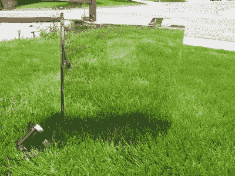

# 黑客日链接:2016 年 4 月 10 日

> 原文：<https://hackaday.com/2016/04/10/hackaday-links-april-10-2016/>

Spot the mirrored Mac

[这里是我们见过的最好的 Mac mod](https://doogielabs.com/2015/05/apple-g5-quad-fookushima/)。[Doogie]决定将苹果 G5 Quad 发挥到极致。这意味着保持液体冷却设置，添加最大内存量(16 GB)，添加 Sonnet Tempo 6.0Gb PCI-e 卡和两个三星 840 Pro 固态硬盘，以及 Nvidia Geforce 6600GT。这台 Mac 最棒的地方是什么？[Doogie]没有使用经典的阳极氧化铝，而是将表壳抛光成镜面。[这是整个建筑](https://www.youtube.com/watch?v=EF7xIHKx6As)的视频。电脑目前正在为他的网页提供服务，如果你想知道服务器负载测试进展如何，你可以点击查看[的统计页面。](http://icebox.doogielabs.com/fookushima.php)

Hackaday links 帖子是我们放置有趣的 kickstarters 和众筹项目的地方，[这个帖子靠近顶部](http://www.crowdfunder.co.uk/creative-vacuum-tubes-glassblowing-workshop)。这是一个为英国玻璃吹制车间进行的众筹活动。如果这个项目得到资助，人们可以来修理他们的科学玻璃器皿，制作新的玻璃管，或者参加玻璃吹制研讨会。这不完全是一个企业的众筹活动(也许应该是？)，但也许有人有玻璃车床可以捐赠。

几个月前， [Microchip 以 35.6 亿美元](http://hackaday.com/2016/01/20/microchip-to-acquire-atmel-for-3-56-billion/)收购了 Atmel。两家公司的产品组合有很多重叠，导致许多人想知道哪些产品将停产并退出市场。本周，[微芯片发布了一份关于收购](http://www.microchip.com/docs/default-source/announcements-documents/atmel-customer-letter-april-2016.pdf) (PDF)的声明，并阐明了对该产品线的期望。这是好消息:

> 我们知道，制造业的稳定和增长是供应基地的一个重要考虑因素，也是微芯片在 25 年多的生命周期中表现出色的关键因素之一。在这次整合活动中，我们也将尊重这一理念。我们还认识到，在任何收购中，包括此次收购，产品寿命终止可能是您的关注点之一。Microchip 有不将产品报废的实践和记录，我们的目的是继续提供两家公司的完整产品组合。

4 月 5 日，Makerbot 宣布[它已经在全球售出了超过 10 万台 3D 打印机](http://www.makerbot.com/blog/2016/04/04/makerbot-reaches-milestone-100000-3d-printers-sold-worldwide)。听起来是个不小的成就，对吧？不对。从 2014 年 12 月 31 日到 2016 年 4 月 5 日——15 个月——Makerbot 仅售出 20，094 台打印机。销售数字很难得到(我正在努力)，但是 Lulzbot 的销量超过了 Makerbot [，因为他们的最新新闻稿之一](https://www.lulzbot.com/learn/announcements/lulzbot-3d-printer-prints-one-millionth-3d-printer-part)和基本数学。在 Stratasys 发布 2015 年年度报告(5 月 9 日)后，将会有更多关于这方面的消息，但我称之为 Makerbot 末日的开始。

这里有一个激光切割机的 Kickstarter。获得激光切割机的第一个奖励是€1.300，“一个特殊的早期鸟类 Kickstarter 估计零售价的 50%折扣。”这意味着这是一个 3000 美元的激光切割机。这对你有什么好处？一个 5 瓦的“短波”激光器，20×16 英寸的工作区域，以及一个看起来相当不错的软件界面。