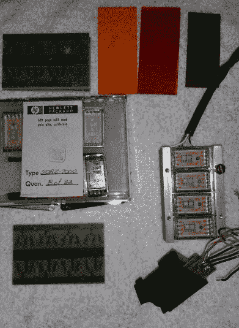
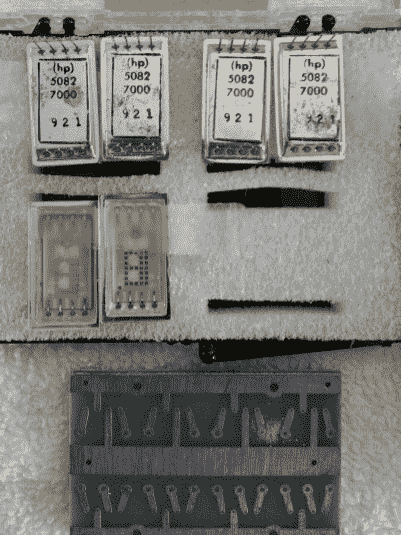

# 黑客日链接:2017 年 5 月 21 日

> 原文：<https://hackaday.com/2017/05/21/hackaday-links-may-21-2017/>

是时候谈谈对所有 Hackaday 读者来说至关重要的事情了。新《星际迷航》系列的第一部预告片已经发布。一些初步的想法:生产价值是通过屋顶，其中一些是在约旦拍摄的(为此感谢国王)。编剧们在这部预告片中加入了一些明显的经典《星际迷航》的参考(将宇航服带入一个巨大的外星*事物* a la TMP)。有几个新的物种，尽管这是发生在*等一秒钟之前大约 10 年，那些是克林贡人？*

其他新闻，[塞思·麦克法兰]正在做一件看起来像惊爆银河系系列的事情。我们只能希望它有惊爆银河系系列的一半好。

代顿会议本应在本周举行，但它不会再发生了。Hara Arena 是非洲大陆最大的业余无线电比赛的传统场地(谢天谢地),今年关闭了。去年它看起来又老又累。今年，Hamvention 搬到了俄亥俄州的 Xenia，看起来[我们仍然会得到这个星球上最好的火腿交易会](https://photos.google.com/share/AF1QipN8yxNAjqjnw5ENAMLhEeyYGlSBq-FkHPoWm7YQplX4cfRTsymHLh5HMYVDU7izYQ?key=cEVkOE9OWlFUZE1LTzhGbHpTbmE3NXFBaDZaQW1B)。记住:如果你开车去汉默文特，空军博物馆*很值得一游。今年他们开放了第四个机库，里面装满了太空飞船。*

上周，我们看到了用于悬浮滑板、电动独轮车和其他自平衡交通工具的开源固件。这套装备的幕后主脑【Casainho】，最近收到了一个来自中国的 eBike 控制器。正如你所料，它与这些悬浮滑板和独轮车基于相同的硬件。这意味着[现在有了用于自行车](https://www.google.com/url?q=https%3A%2F%2Fendless-sphere.com%2Fforums%2Fviewtopic.php%3Ff%3D2%26t%3D87870%26p%3D1289180%23p1289180&sa=D&sntz=1&usg=AFQjCNGPmoVwwL-MbIHQkniZIwJtoLx7fw)的开源固件。

去年，[思科] [造了一个可爱的小步行机器人](http://hackaday.com/2016/12/04/otto-bot-is-bobs-grandson/)。[现在它出现在 Kickstarter](https://www.kickstarter.com/projects/acrobotic/otto-diy-build-your-own-robot) 上。

本周，人们看到了售价不到 200 美元的备受期待的 3D 打印机的发布。出于这样或那样的原因，本周我在易贝[巡游，发现了这个](http://www.ebay.com/itm/Makerbot-Replicator-Mini-/272649622278?hash=item3f7b2f1306:g:2QwAAOSwdjNZA6yM)。他们说昨天的垃圾是明天的收藏家的物品，你知道…

[新的 Tek 范围将在未来几周内公布](http://info.tek.com/www-a-new-era.html)。有哪些很酷的地方？它有一个大触摸屏。我们知道的大概就这些了。

ESP32 是下一个伟大的神奇芯片，已经有一段时间了。ESP32 还有一个 CAN 外设塞在那里的某个地方，这意味着 WiFi 和蓝牙汽车。[托马斯]一直在努力让一个驱动程序运行起来。在 [ESP32 论坛](https://esp32.com/viewtopic.php?f=12&t=380&p=8922#p8922)上有一个帖子，一个 [Hackaday.io 页面](https://hackaday.io/project/20204-esp32-can-driver)，一个 [GitHub 页面](https://github.com/ThomasBarth/ESP32-CAN-Driver)。

当你有一个漂亮的旧真空荧光显示器，并想显示一些来自你的电脑的统计数据时，你会怎么做？你做了一个看起来像是从收银机里拿走的东西。这是一个来自[Micah Scott]的项目，它拥有一切:电子 3D 建模、磁铁、打印平滑、创建卡扣部件和漂亮的旧显示器。

这里有一些随机出现在我们的提示行中的东西[。[Mark]最近在一批电子元件中发现了一些未使用的 HP 5082-7000 段显示器(下图)。根据](http://hackaday.com/submit-a-tip/)[一些相关文献](http://oldpulsars.com/HP%205082-7000.htm)，这是*有史以来*第一个可用的 LED 显示屏封装。它们发行于 1969 年，是 BCD，显然非常昂贵。[Mark]想知道实际生产了多少，我们都对这些东西的实际价值感兴趣。如果有人知道这些只是原型，或者它们是否已经投入生产(以及它们的用途)，请在评论中留言。

   