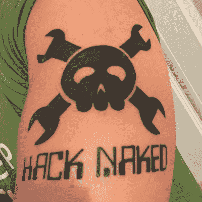

# 黑客日链接:2015 年 10 月 4 日

> 原文：<https://hackaday.com/2015/10/04/hackaday-links-october-4-2015/>

[【菲利普】纹了一个哈卡代骷髅头扳手](https://hackaday.com/wp-content/uploads/2015/10/tattoo.jpg)的纹身。他的工作主要是穿长袖的办公室工作，所以一切都很好。最初的徽标是由 Adafruit 的[Phil Torrone]用 Flash 绘制的，并由[Elliot]重新制作成稍微现代一些的文件格式。是的，骷髅头和扳手是[摩托车手的标志](https://www.google.com/search?q=stenskull&source=lnms&tbm=isch&sa=X)，可以在一些军师的徽章上找到(大部分是装甲支援)。Hackaday 标志是迄今为止所有这些快乐扳手中最卡通化的。

说到在东西上涂写 Hackaday 标志，上周六晚上，[Rodrick] [很无聊，需要分散注意力](https://hackaday.com/wp-content/uploads/2015/10/hp.jpg)。

我们在 Kickstarter 上看到过永动机，也看到过实际上可能有一些现实基础的项目。我们见过 12 岁的孩子为一台新的游戏电脑在 Kickstarter 上注册，我们也见过在某个陌生人的地下室建酒吧的活动。只有一个项目我们没有在 Kickstarter 上看到，直到现在:[一个建立另一个众筹平台的活动](https://www.kickstarter.com/projects/1072118685/up-next-the-community-based-funding-platform)。这是缩短的方式。

你想失败吗？这是一次失败。[Chris]正在开发一款将熟悉的 Arduino 引脚排列与 CAN 收发器相结合的设备。这是个好主意，但如果你要制作 PCB，你就需要走线。[克里斯]把他的文件送到我们最喜欢的紫色板房，拿回来一张上面有孔的铜层压板。这是一个很好的提醒，在送走你的 Gerbers 之前检查一下。

住在丹佛附近？科罗拉多州布鲁姆菲尔德有一家黑客空间正在寻找新的空间。他们有一个 Kickstarter 租赁平台，他们正在寻找一些人来填补他们的空间。

你们这些拥有专业工具和逻辑的孩子不知道自己有多棒。过去，音频是用被称为多轨录音机的精密机械设备录制在磁带上的。[弗兰]从储藏室里拿出她的[奥塔里 8 声道录音机](https://www.youtube.com/watch?v=7mqLX-Q5Yvw)，这是一个美丽的东西。此外，存储是一个 300 磅+板混响。