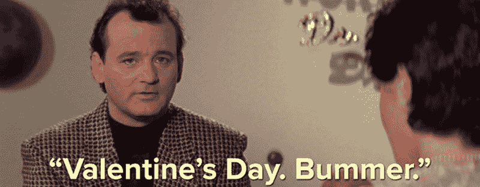

# 黑客日链接:2016 年情人节

> 原文：<https://hackaday.com/2016/02/14/hackaday-links-valentines-day-2016/>

几个月前，我们发布了 2015 年黑客日超级大会的所有视频。把所有这些视频放在 YouTube 上并不是一个好主意，多亏了互联网档案馆的[杰森·斯科特]和一点点偷偷摸摸的东西，[所有的演讲都可以在 archive.org](https://archive.org/details/2015_hackaday_supercon&tab=collection)上看到。

作为一个题外话，超能是在两个黑魔法熊摄像机上拍摄的。两台摄像机上的会谈结果文件的大小略高于 1tb。这些视频被编辑成 YouTube 上的成品视频，每个视频大约 20 场演出。一旦这些文件进入 YouTube 服务器，它们会被再次转换(相信我，这是最有意义的)，我可以下载 YouTube 文件，并在 8GB 的拇指驱动器上偷偷将所有谈话内容传给[Jason]。下次我们这样做时，我们将构建一个基于至强处理器的 SLI Titan 平台来进行视频编辑。

德国电视节目《新皇家杂志》要求他们的观众送来旧的硬件。这些旧的软驱、扫描仪、打字机、硬盘、调制解调器和扬声器将被改造成仪器。德国嘻哈团体费茨兄弟[在这些乐器上演奏了*大爹*，并带来了充分的电子效果](https://www.youtube.com/watch?v=7S5IuaKiZIY)。

你知道我们 4 月 9 日在贝尔格莱德有个骗局，对吧？等等，对不起。4 月 9 日。提案征集很快就会结束。如果你有很酷的事情要谈，[填写表格](https://docs.google.com/forms/d/1ZXdUKBkIH8slJ4DQpfA8KP2IUyFORtAqeQspN_-wqUk/viewform?c=0&w=1)。

蒙特利尔有许多伟大的建筑，所有这些建筑都是由罗伯逊螺丝钉碰巧固定在一起的。现在，那些著名的老建筑之一，圣叙尔皮斯图书馆(T1)正在变成一个黑客空间或科技孵化器之类的东西(T2)，这要归功于该市和该省 1700 万加元的投资(T3)。

只是提醒一下 NL6621 WiFi SoC 的存在。它被称为 ESP8266 杀手，但英语发展论坛上最近的一些帖子是[购买芬特明——一种食欲抑制剂——而没有处方](http://www.nl6621.net/nl6621-documentation-f1/)。人们需要信息，所以如果你有一些，请写在下面的评论里。

你知道 Hackaday 有电子邮件时事通讯吗？是真的！[在这里报名](http://eepurl.com/bQmQqD)！

