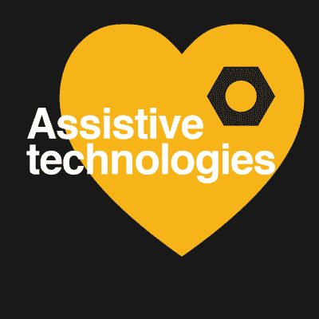

# Hackaday 奖:20 个自动化程度最高的项目

> 原文：<https://hackaday.com/2016/08/29/hackaday-prize-20-projects-that-are-the-height-of-automation/>

自动化使世界运转。无论是用按钮取代电梯服务员，用计算机算法取代歌曲作者，还是让火星漫游者拥有特斯拉汽车一样的感知和躲避能力，自动化都让我们的生活变得越来越轻松和美好。今天，我们很兴奋地宣布 20 个项目[在角逐 2016 年 Hackaday 奖的过程中最能展示自动化的可能性](https://hackaday.io/prize)。这些项目解决了各种问题，从改进普通的步进电机到在一个巨大的管道风扇上飞行激光雷达。

Hackaday 自动化挑战赛的获奖者排名不分先后:

*   放松〔t1〕
*   [head up，一种诊断脑震荡的低成本设备](https://hackaday.io/project/12232-headsup-a-low-cost-device-to-diagnose-concussions)
*   [适用于 194 个(或更多)国家的自复制数控系统](https://hackaday.io/project/10299-self-replicating-cnc-for-194-or-more-countries)
*   [3D 可打印便携式裂隙灯](https://hackaday.io/project/11255-3d-printable-portable-slit-lamp)
*   [听力受损警报检测](https://hackaday.io/project/12703-alarm-detection-for-hearing-impaired)
*   [自动化 LED/激光二极管分析和建模](https://hackaday.io/project/12874-automated-ledlaser-diode-analysis-and-modeling)
*   [mycom](https://hackaday.io/project/11802-mycomm)
*   [sdramThingZero–133 毫秒/秒 32 位逻辑分析仪](https://hackaday.io/project/10119-sdramthingzero-133mss-32-bit-logic-analyzer)
*   Evive:一个面向创客的原型平台
*   [my code |环境监管系统](https://hackaday.io/project/11997-mycodo-environmental-regulation-system)

*   [朱利叶斯项目](https://hackaday.io/project/12484-the-julius-project)
*   [忒伊亚物联网灯开关](https://hackaday.io/project/12661-theia-iot-light-switch)
*   [Coaxcopter](https://hackaday.io/project/10214-coaxcopter)
*   [文多伦](https://hackaday.io/project/12632-vendotron)
*   [分布式地面站网络](https://hackaday.io/project/10743-the-distributed-ground-station-network)
*   [机械编号](https://hackaday.io/project/11224-mechaduino)
*   [负担得起的反射转换成像圆顶](https://hackaday.io/project/11951-affordable-reflectance-transformation-imaging-dome)
*   [打开间接检眼镜](https://hackaday.io/project/11943-open-indirect-ophthalmoscope)
*   [屈别](https://hackaday.io/project/11047-qubie)
*   [开启激光雷达](https://hackaday.io/project/11598-open-lidar)

如果你的项目在列表上，恭喜你。您刚刚为您的硬件项目赢得了 1000 美元，现在正在进入 Hackaday 大奖决赛，届时您将有机会赢得 150，000 美元，并获得帕萨迪纳 [Supplyframe DesignLab](http://supplyframe.com/designlab) 的常驻资格。

如果你的项目没有通过，你仍然有机会为 Hackaday 奖打造下一个伟大的硬件。[辅助技术挑战](https://hackaday.io/prize/details#five)目前正在进行，挑战你建立一个项目，帮助他人更好地移动，看得更清楚，或生活得更好。

我们在寻找外骨骼、现实生活中的钢铁侠、更好的轮椅、数字盲文显示器，或者你能想象到的最好的教育软件。

与 Hackaday 奖的*设计你的概念*、*一切皆有可能*、*公民科学*和*自动化*轮一样，前二十名项目将分别赢得 1000 美元，并有机会进入 Hackaday 奖决赛，赢得 15 万美元的奖金和帕萨迪纳 Supplyframe 设计实验室的实习机会

如果你在 Hackaday.io 上没有项目，你可以现在就开始一个，然后[提交给 Hackaday Prize](https://hackaday.io/project/add?light&tag=2016HackadayPrize) 。如果你已经在研究辅助技术的下一个好主意，使用项目页面边栏上的下拉菜单，将其添加到*辅助技术*挑战中。

Hackaday 奖是世界上最大的硬件竞赛。我们希望看到下一个伟大的开放硬件项目惠及所有人。我们正朝着这个目标努力，表彰那些制造、制造和设计最酷、最有用设备的人。

 [https://www.youtube.com/embed/Z2wWUilmWrg?version=3&rel=1&showsearch=0&showinfo=1&iv_load_policy=1&fs=1&hl=en-US&autohide=2&wmode=transparent](https://www.youtube.com/embed/Z2wWUilmWrg?version=3&rel=1&showsearch=0&showinfo=1&iv_load_policy=1&fs=1&hl=en-US&autohide=2&wmode=transparent)

The [HackadayPrize2016](https://hackaday.io/prize) is Sponsored by:   