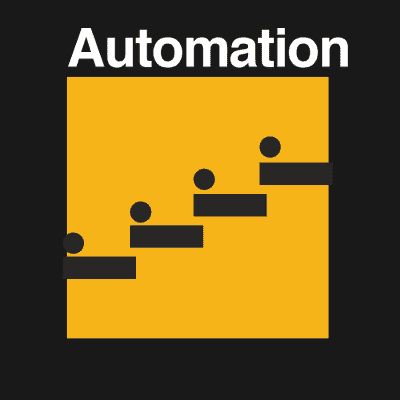

# Hackaday 奖:让我们都成为公民科学家的 20 个项目

> 原文：<https://hackaday.com/2016/07/18/hackaday-prize-20-projects-that-make-us-all-citizen-scientists/>

我们生活在一个前所未有的技术时代，这有能力让每个人的生活变得更好。今天，我们很高兴地宣布 20 个壮观的建筑，它们利用技术将科学探索推进到所有人都能达到的范围。这些是 2016 年黑客日奖 [*公民科学家*](https://hackaday.io/prize/details#three) 挑战赛的获奖者。这一轮的主题包括血糖监测、用于分析脚步的鞋垫感应、自动显微镜等实验室设备、测量我们周围世界的传感器等等。

Hackaday 奖*公民科学家*部分的获奖者排名不分先后:

*   [mycom](http://hackaday.io/project/11802-mycomm)
*   [开源 Arduino 血糖仪屏蔽](http://hackaday.io/project/11719-open-source-arduino-blood-glucose-meter-shield)
*   [红色代码](http://hackaday.io/project/12499-code-red)
*   [蚱蜢跳跃的神经科学](http://hackaday.io/project/12342-neuroscience-of-grasshopper-jumps)
*   [Flypi–廉价显微镜/实验装置](http://hackaday.io/project/5059-flypi-cheap-microscopeexperimental-setup)
*   [分光光度计](http://hackaday.io/project/12491-spectrophotometer)
*   [步态分析](http://hackaday.io/project/11154-alli-gait-or-analysis)
*   [物联网显微镜](http://hackaday.io/project/11429-internet-of-things-microscope)
*   [脉冲:仿形水下光传感器](http://hackaday.io/project/12125-pulse-profiling-underwater-light-sensor)
*   [平价反射转换成像无人机](http://hackaday.io/project/11951-affordable-reflectance-transformation-imaging-dome)

*   [SunLeaf](http://hackaday.io/project/10457-sunleaf)
*   [通用血糖仪](http://hackaday.io/project/10865-universal-glucometer)
*   我的天。流量
*   [机器人任务](http://hackaday.io/project/10584-robot-missions)
*   [CierzScience 隧道](http://hackaday.io/project/12080-cierzscience-tunnel)
*   [打开间接检眼镜](http://hackaday.io/project/11943-open-indirect-ophthalmoscope)
*   [blu beam——扫描激光显微镜](http://hackaday.io/project/9205-blubeam-a-scanning-laser-microscope)
*   [自动数字显微镜](http://hackaday.io/project/10188-automatic-digital-microscope)
*   [Arduino、EEG 和自由意志](http://hackaday.io/project/12318-arduino-eeg-and-free-will)
*   穆尔根

Hackaday 奖是世界上最大的硬件竞赛。我们希望看到下一个伟大的开放硬件项目惠及所有人。我们正朝着这个目标努力，表彰那些制造、制造和设计最酷、最有用设备的人。

这 20 个项目刚刚赢得了 1000 美元，现在将进入 Hackaday 奖的最后阶段，由我们的 14 位名人评委进行评判。厉害！现在开始工作:在 10 月份的最终评审之前，这些项目背后的黑客需要做很多事情，他们将争夺 15 万美元的大奖和其他四个最高奖项。

如果你的项目没有通过，你仍然有机会为 Hackaday 奖打造下一个伟大的硬件。自动化挑战正在进行中。它鼓励每个人制造能让你的生活更轻松的设备。

自动化你的生活；制作一个为你做早餐的设备，一个为你修剪草坪的机器人，或者一个为你报税的软件。建造一个自动跟踪洗衣液的设备，自动洗碗，或者一个服从每一个命令的机器人。

像*设计你的概念，一切皆有可能*和*公民科学*轮 Hackaday 奖一样，前二十名项目将分别赢得 1000 美元，并进入 Hackaday 奖决赛，有机会赢得 15 万美元和帕萨迪纳[供应商框架设计实验室](http://supplyframe.com/designlab)的驻地资格。

如果你在 Hackaday.io 上还没有项目，你可以现在就开始一个，然后提交给 Hackaday Prize。如果你已经在做下一个很棒的硬件设计，使用项目页面边栏上的下拉菜单将其添加到*自动化*挑战中。

 [https://www.youtube.com/embed/Z2wWUilmWrg?version=3&rel=1&showsearch=0&showinfo=1&iv_load_policy=1&fs=1&hl=en-US&autohide=2&wmode=transparent](https://www.youtube.com/embed/Z2wWUilmWrg?version=3&rel=1&showsearch=0&showinfo=1&iv_load_policy=1&fs=1&hl=en-US&autohide=2&wmode=transparent)

The [HackadayPrize2016](https://hackaday.io/prize) is Sponsored by:   