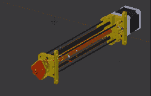

# Hackaday 奖参赛作品:3D 打印线性致动器可做 2 公斤以上

> 原文：<https://hackaday.com/2017/06/20/hackaday-prize-entry-3d-printed-linear-actuator-does-2kg/>

[chiprobot]的 [NEMA17 3D 打印线性致动器](https://hackaday.io/project/21883)中的功能和巧妙设计的兔子洞相当深。它不仅可以轻松举起 2 公斤以上的重量，而且大部分是 3D 打印的，并使用普通的硬件，如 NEMA 17 步进电机和斜坡板进行运动控制。

主要的 3D 打印丝杠使用插头插座设计，因此该组件可以轻松扩展到任何所需的长度，而无需将丝杠打印为单件。致动器的尖端甚至集成了一个由导电泡沫制成的力传感器，当它被压缩时会改变电阻，从而允许致动器进行某种程度的反馈。力传感器由浸透了导电墨水的 3M 泡沫耳塞制成。[chiprobot]没有详细介绍他的具体方法，但使用导电泡沫作为力传感器是一种相当知名和有效的方法。最重要的是，[chiprobot]增加了一个通过 WiFi 和 ESP32 提供的网络 GUI。在下面嵌入的视频中观看整个过程。

 [https://www.youtube.com/embed/G30edgY6RIA?version=3&rel=1&showsearch=0&showinfo=1&iv_load_policy=1&fs=1&hl=en-US&autohide=2&wmode=transparent](https://www.youtube.com/embed/G30edgY6RIA?version=3&rel=1&showsearch=0&showinfo=1&iv_load_policy=1&fs=1&hl=en-US&autohide=2&wmode=transparent)

[chiprobot]对 DIY 线性致动器并不陌生，你可以在 Thingiverse 上看到他的[齿轮马达版本](https://www.thingiverse.com/thing:317192)和[步进器版本](https://www.thingiverse.com/thing:308576)。通过这次 Hackaday Prize 的参赛，他无疑在力量和规模方面更上一层楼。

The [HackadayPrize2017](https://hackaday.io/prize) is Sponsored by:   