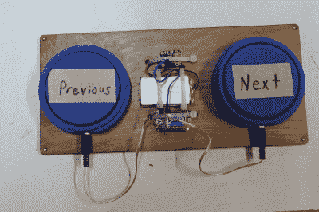

# Hackaday 奖参赛作品:旧车按钮增强可访问性

> 原文：<https://hackaday.com/2017/10/05/hackaday-prize-entry-clunke-button-powers-accessibility/>

AT 按钮是一种帮助各种身体残疾的人与他们的世界互动的设备。没有太多东西，只有一个连接到 3.5 毫米单声道插头或插孔的开关，但开关安装在一个易于操作的大按钮外壳中。

这些按钮可用于任何适于单声道输入的设备或玩具。它们是一项简单的技术，却能创造出一个与众不同的世界，但出于某种原因，它们的价格约为 65 美元。正因为如此，人们自己制作简单的开关，但这些开关通常不坚固或不耐用。[【Christopher】认为他们的成本应该比这低得多，并开始用大约 10 美元的材料制作纽扣](http://hackaday.io/project/13288-clunke-button)。除了印刷文件，你真正需要做一个旧车按钮的是一个你最喜欢的蓝色，蓝色或蓝色的樱桃 MX，以及一个 3.5 毫米单声道插孔或插头，这取决于偏好。

【Christopher】和他的团队与当地联合脑瘫分会合作设计了“旧车换现金”按钮，作为他们高级设计项目的一部分。到了展示项目的时候，他们想找到一种方法，能够在观众中传递一个旧车按钮，并让它在被按下时做一些事情。他们通过添加 ESP-01 和电池制作了一个交互式滚动条。[Christopher]从那时起接手了这个项目，并随着他在决赛中的进步继续改进设计。股票代码的代码可以在 GitHub 上找到，按钮 STL 文件在 Thingiverse 上。

The [HackadayPrize2017](https://hackaday.io/prize) is Sponsored by:   