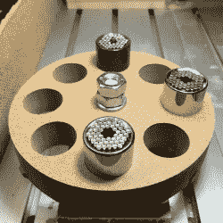

# Hackaday 奖参赛作品:DIY 自动工具更换器

> 原文：<https://hackaday.com/2016/06/20/hackaday-prize-entry-diy-automatic-tool-changer/>

在数控机床上手动更换端铣刀片和投资昂贵的自动化解决方案之间做出选择？不是因为[弗兰克·赫尔曼]，他发明了 [XATC，一种极其简单的自动化刀具更换器](https://hackaday.io/project/12308-xatc-extreme-simple-automatic-tool-changer)。[Frank 的]巧妙的破解实现了与工业刀具更换器相同的功能，只使用了车间里可能有的廉价标准硬件。

 和许多 ATC 一样，这款也有一个工具转盘。非机动的转盘将每个铣刀存放在 Gator Grip 扳手工具的中心孔中。要更换工具，叉式扳手，由钢筋混凝土伺服驱动，阻止主轴，就像你会做手动更换工具。然后，机器将当前钻头定位在转盘上的空鳄鱼夹中，并通过绕转盘执行圆形“魔法移动”来松开夹头。这种移动利用转盘作为扳手来拧松夹头。纺锤的一个短的反向旋转照顾其余的。然后它从转盘上拿起另一个工具，反过来做同样的动作。

伺服系统通过 WiFi 连接的 NodeMCU 板控制，该板通过 HTTP 接受来自 CNC 控制器的命令。定制的刀具更换序列由为 chilipeppr.com 上的 [TinyG 工作空间编写的几个 JavaScript 宏提供，这是一个基于浏览器的 g 代码主机。请欣赏[Frank Herrmann]解释他的体型的视频！](http://chilipeppr.com/tinyg)

 [https://www.youtube.com/embed/sQgfjYIQCZs?version=3&rel=1&showsearch=0&showinfo=1&iv_load_policy=1&fs=1&hl=en-US&autohide=2&wmode=transparent](https://www.youtube.com/embed/sQgfjYIQCZs?version=3&rel=1&showsearch=0&showinfo=1&iv_load_policy=1&fs=1&hl=en-US&autohide=2&wmode=transparent)

感谢 [Smoothieboard](https://github.com/Smoothieware/Smoothieboard) 的创造者【亚瑟·沃尔夫】，他目前正在为[的类似项目](https://plus.google.com/+ArthurWolf/posts/gnmWckMWJck)工作。

The [HackadayPrize2016](http://hackaday.io/prize) is Sponsored by:       