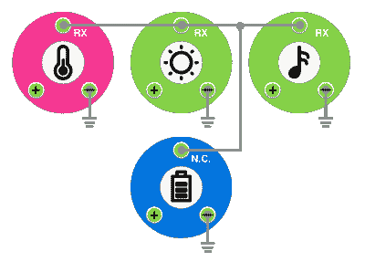

# Hackaday 奖参赛作品:带 SnapBloks 的模块化电路

> 原文：<https://hackaday.com/2017/06/25/hackaday-prize-entry-modular-circuits-with-snapbloks/>

[Ekawahyu Susilo]的模块化电路套件，SnapBloks 帮助您通过在三个磁性触点的帮助下[将组件堆叠在彼此之上](https://hackaday.io/project/20554-snapbloks)来创建电路，这三个磁性触点不仅可以将模块粘在一起，还可以将电源、接地和数据传输到每个部分。

【Ekawahyu】设想它是一个原型工具包，用来快速组合一个想法，没有很多麻烦。它也可以是一种教育辅助工具，用于教授 Arduino 编码，同时跳过混乱的布线。你可以在电源模块上叠加一个声音模块来制作一个蜂鸣器，或者给一个轮子模块加电来制作一个机器人。

在该项目的第二版中,[Ekawahyu]用彩色编码的外壳更新了外观，粉红色表示输入块，绿色表示输出，橙色表示通信，蓝色表示功率。每个 Blok 内部都有一个 Arduino 芯片——一个 [STM32](https://hackaday.com/2017/03/30/the-2-32-bit-arduino-with-debugging/) ，Hackaday 在三月份回顾了它。对于第三版，他希望利用 ESP8266 制作一个支持 WiFi 的 Blok。[Ekawahyu]的想法是在每个模块中都有一个廉价的 SMD Arduino，这似乎是一个简化模块创建的聪明方法——不需要“控制器块”!

The [HackadayPrize2017](https://hackaday.io/prize) is Sponsored by:   