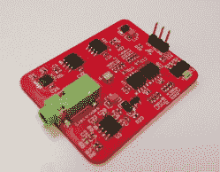

# Hackaday 奖参赛作品:开源肌电假手

> 原文：<https://hackaday.com/2016/05/26/hackaday-prize-entry-open-source-myoelectric-hand-prosthesis/>

手可以抓取东西，建造东西，交流，我们只需要一个想法就可以直观地控制它们。对于那些失去一只手的人来说，假肢可以成为完成日常任务的改变生活的工具。我们很高兴地看到[Alvaro Villoslada]凭借他对先进假肢技术的贡献加入了 Hackaday 奖: [Dextra，开源肌电假手](https://hackaday.io/project/9890-dextra)。

 Dextra 是一种先进的机器人手，拥有 4 个独立驱动的手指和一个具有额外自由度的拇指。因为 Dextra 被设计成一个独立的单元，所有的致动器都必须嵌入到手中。[阿尔瓦罗]用五个微型绞盘实现了必要的小型化水平，由微型齿轮马达驱动。他们中的每一个人都会拉动一根肌腱来驱动相应的手指。电机轴上的磁性编码器向 Teensy 3.1 提供位置反馈，后者协调所有手指。拇指的旋转轴由一个小型遥控伺服系统驱动。

 除了机器人手，【Alvaro】正在开发自己的肌电图(EMG)接口 Mumai，用户可以通过残肢的微小肌肉收缩来控制机器人假肢。就像 Dextra 一样，Mumai 是开源的。它由一对皮肤电极和一个采集板组成。电极附着在肌肉上，采集板将肌肉的电活动转化为模拟电压。然后，该原始 EMG 信号由微控制器(如 ESP8266)进行采样和分析。微控制器然后基于模式识别来确定用户的意图。最终，这些控制数据被用来控制机器人假肢，如 Dextra。这两个项目目前的进展令人印象深刻。你可以看看下面 Dextra 的视频。

 [https://www.youtube.com/embed/L_VyQa0jCiI?version=3&rel=1&showsearch=0&showinfo=1&iv_load_policy=1&fs=1&hl=en-US&autohide=2&wmode=transparent](https://www.youtube.com/embed/L_VyQa0jCiI?version=3&rel=1&showsearch=0&showinfo=1&iv_load_policy=1&fs=1&hl=en-US&autohide=2&wmode=transparent)

我们很高兴看到开源社区已经成为先进的机器人假肢发展的驱动力。正是像[开放手项目](http://www.openhandproject.org/)、[开放仿生](http://www.openbionics.com/)、[这样的项目使未来成为可能](http://enablingthefuture.org/)，以及现在的 Dextra 和 Mumai，为可负担和可获得的机器人假肢铺平了道路。

The [HackadayPrize2016](http://hackaday.io/prize) is Sponsored by:       