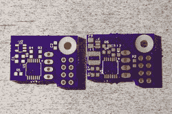
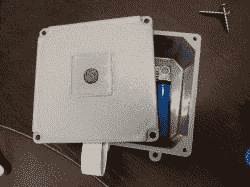

# Hackaday 奖参赛作品:用电池给 Pi 供电

> 原文：<https://hackaday.com/2016/05/11/hackaday-prize-entry-powering-a-pi-from-a-battery/>

在许多低功耗应用中，将微控制器置于睡眠模式并根据需要或间隔唤醒是常见的做法，使器件能够依靠单个纽扣电池工作数年。因为有很多应用程序你可能想用 Raspberry Pi 做类似的事情，[Patrick Van Oosterwijck]创建了 [LiFePO4wered/Pi](https://hackaday.io/project/9461) 。该模块卡在 Pi 的八个 GPIO 引脚上，通过长寿命 LiFePO4 电池、充电调节器和适当的电源管理对其进行扩展。显然，这也使一个伟大的 UPS。

【Patrick】通过一个低功耗 MSP430G2131 微控制器和一个负载开关扩展他已经[可用的](https://www.tindie.com/products/xorbit/lifepo4weredusb/)和同样有用的[life po 4 weered/USB](https://hackaday.io/project/7312)充电调节器模块，实现了这个项目。Raspberry Pi 上的[守护进程](https://github.com/xorbit/LiFePO4wered-Pi)通过 I2C 与模块对话，允许你安排唤醒定时器，让你的 Pi 在断电后自动启动，或者通过命令行工具读取当前电池电压。一旦 Pi 安全关断，微控制器也将进入睡眠状态，导致整个系统的待机电流为 8 uA。加上 500 毫安时的磷酸铁锂电池，理论上足够让你沉睡 7 年。

不过，life po 4 weered/Pi 不仅有助于睡眠。[Patrick 的] [运行时间测试](https://hackaday.io/project/9461-lifepo4weredpi/log/33110-run-time-numbers)显示，500 mAh 电池将为 Raspberry Pi Zero 和 WiFi 加密狗供电约两小时。因为当 VBUS 上只有 3.2 V 时，Raspberry Pi 和许多 USB 外设不会抱怨，所以[Patrick]能够通过在设计中取消升压转换器并直接从电池电压驱动 Pi 来挤出更多的运行时间。如果这让你担心，你可以[阅读关于为什么它工作得这么好的详细解释](https://hackaday.io/project/9461-lifepo4weredpi/log/32161-3v-or-5v-thats-the-question)，或者只是看看更兼容的 [5 V 版本](https://hackaday.io/project/9461-lifepo4weredpi/log/32161-3v-or-5v-thats-the-question)。

 最终，【帕特里克】用他的模块创造了一个[树莓派延时相机](https://hackaday.io/project/9461-lifepo4weredpi/log/31625-time-lapse-box)。一个小脚本让 Pi 在启动时拍照，设置一个唤醒定时器，然后再次进入睡眠状态。该相机被安全地封装在防水电箱中，并被部署到野外，一次充电可拍摄 120 张照片。

我们确信这个模块将会进入许多很酷的项目，我们正在数着时间，直到我们能在[【Patrick’s】tindie store](https://www.tindie.com/stores/xorbit/)买到一个。在此之前，请欣赏延时视频:

 [https://www.youtube.com/embed/nZQmG-QEIRk?version=3&rel=1&showsearch=0&showinfo=1&iv_load_policy=1&fs=1&hl=en-US&autohide=2&wmode=transparent](https://www.youtube.com/embed/nZQmG-QEIRk?version=3&rel=1&showsearch=0&showinfo=1&iv_load_policy=1&fs=1&hl=en-US&autohide=2&wmode=transparent)

The [HackadayPrize2016](http://hackaday.io/prize) is Sponsored by:       