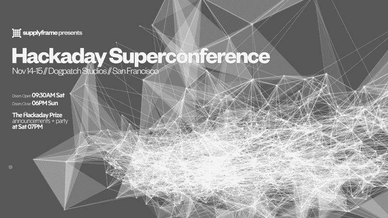

# 这周六在超级会议上的 Hackaday 颁奖晚会

> 原文：<https://hackaday.com/2015/11/09/hackaday-prize-party-this-saturday-at-the-superconference/>

去年是有史以来第一个 Hackaday 奖，我们向你发出挑战，要求你建造一个如此引人注目的联网设备，以至于我们可以把你送上太空。在德国慕尼黑举行的为期一天的多赛道黑客马拉松之后，我们在一个派对上颁发了奖项。大家都玩得很开心。

今年，Hackaday 奖本身更大，挑战更加雄心勃勃，庆祝活动也将更加盛大。所以，本周六来旧金山参加我们颁发的 2015 年 Hackaday 奖，并举办一个(免费)的颁奖晚会来庆祝吧！

该奖项将是首届超级黑客大会的一部分。我们汇集了硬件黑客领域最优秀的人才，总有一个地方适合您。大会将充满硬件研讨会、会谈、食物和乐趣。(不要拖延——在价格翻倍之前，你还有三天时间[购买超级会议门票](https://docs.google.com/forms/d/1Y3wFEfdWQC9lWL4VK5JBti0CfIC4wt64dyY0JZsN6Bs/viewform)。)刚刚公布了[超级充电的赛事安排](https://hackaday.io/superconference/schedule)。

超级大会结束后，我们将在下午 5:30 向所有人开放——无论你是否参加大会——参加颁奖仪式，然后是 Hackaday 颁奖晚会。我们的许多评委将到场颁奖并随后进行社交活动:Elecia White、Lenore Edman、Windell Oskay、Ben Krasnow 和 Peter Dokter。[立即获得您的免费颁奖典礼门票](https://www.eventbrite.com/e/hackaday-superconference-2015-tickets-19174295835?discount=2015THP)！

如你所知，大奖是为最有可能帮助我们解决一些最困难的挑战的项目提供一次太空之旅。来为你的最爱加油吧！

因为我们去年有如此多的优秀项目，我们还在 2015 年扩大了 Hackaday 奖，以包括最佳产品奖。10 名决赛选手中的 7 名将现场揭晓谁将获得 10 万美元现金和帕萨迪纳 Supplyframe 设计实验室的实习机会。这将是一个激动人心的夜晚。

晚餐包含在这个免费活动中，将有一个现金酒吧，音乐和庆祝活动将持续到晚上 10:30。请[回复](https://www.eventbrite.com/e/hackaday-superconference-2015-tickets-19174295835?discount=2015THP)帮助我们计划晚餐安排。周六见！

#### 2015 年[黑客日奖](http://hackaday.io/prize)由以下机构赞助:

