# Hackaday 的开放硬件峰会体验

> 原文：<https://hackaday.com/2017/10/12/hackadays-open-hardware-summit-experience/>

上周在科罗拉多州丹佛市举行了开放式硬件峰会。这个一年一度的聚会聚集了将开放硬件视为鼓励、发展和赖以生存的理想的个人和企业。有一个前一天晚上的聚会，峰会本身是一个充满会谈的日子，今年参观了该地区几家非常熟悉的开放式硬件公司。

我认为今年的会议非常令人愉快，我很高兴与大家分享一些亮点。

## 我喜欢的演讲:纺织品和密码案例法

 [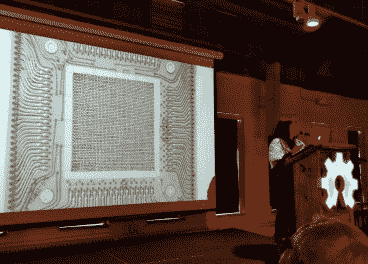](https://hackaday.com/2017/10/12/hackadays-open-hardware-summit-experience/talk-core-memory/) Core memory slide during Pamela Liou’s talk  Stephanie Lacambra on password case law

我真的很喜欢开启峰会的主题演讲。Pamela Liou 讲述了她开发开源台式提花织机 [Doti](http://pamelaliou.com/doti.html) 的工作。问问你自己，你对纺织品了解多少？你知道你身上穿的布料是如何织成的吗？是用什么类型的机器织成的？帕梅拉清楚地认识到，曾经有大量在纺织行业工作的人拥有这种知识，但这种知识正在消失。这并不仅限于面料，这一知识还被应用于科技和制造业的其他领域。一个有趣的例子是在太空竞赛期间进入磁芯存储器制造的纺织技术。

我将把自己限制在两个演讲上。另一封来自斯蒂芬妮·拉坎布拉，她是电子前沿基金会的律师。诚然，这个谈话有点偏离开放硬件，但谁不想听听你是否有权拒绝向执法部门交出密码？我喜欢的不是这个问题的答案，而是斯蒂芬妮对过去判例法的深入研究有助于回答这个问题。目前有很多先例表明你的密码不受言论自由的保护。但也有一些情况，EFF 正在努力建立密码的先例，作为一种自由言论的形式，你不能被强迫交出。

有会谈的现场直播。声音有点粗糙，不幸的是在斯蒂芬妮演讲的前十分钟被切断了，但如果你真的想听，你可以重温一下在峰会上展示的内容。

### 供应商表

 [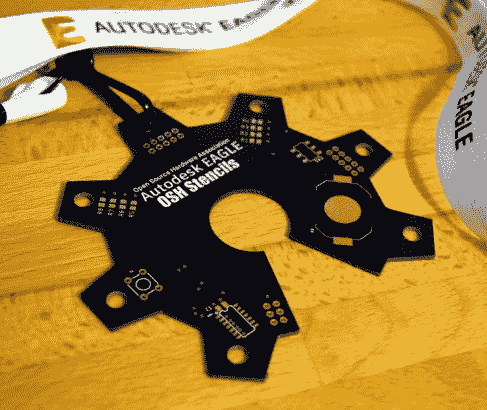](https://hackaday.com/2017/10/12/hackadays-open-hardware-summit-experience/04-ohs-badge/)  [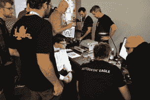](https://hackaday.com/2017/10/12/hackadays-open-hardware-summit-experience/02-badge-assembly/) Placing components [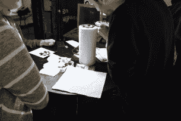](https://hackaday.com/2017/10/12/hackadays-open-hardware-summit-experience/03-badge-assembly/) Placing SMD LEDs [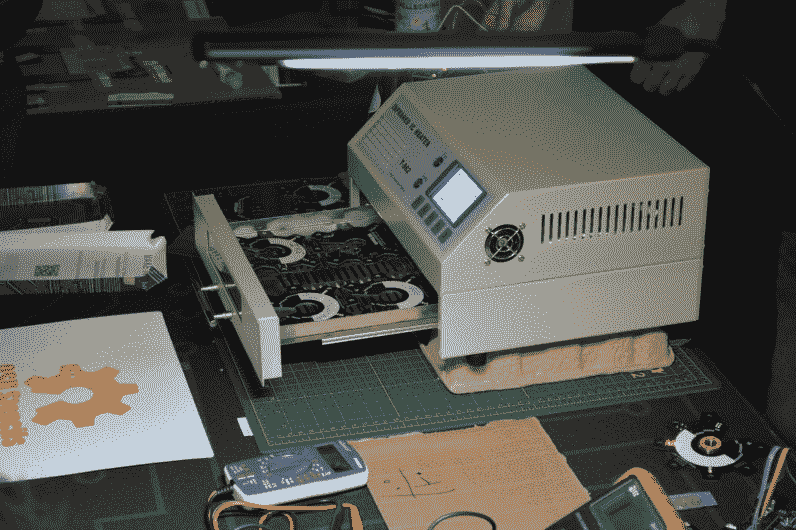](https://hackaday.com/2017/10/12/hackadays-open-hardware-summit-experience/01-badge-assembly/) Reflow oven hard at work

最拥挤的桌子可能是 Autodesk EAGLE 桌子。他们设计了开放硬件峰会的徽章，这是一个坐立不安的旋转器，形状像开放硬件标志。每个人都得到了一枚徽章，还有两叠锡膏模板可以带回家。如果你想做一些纺纱，组装取决于你。

 [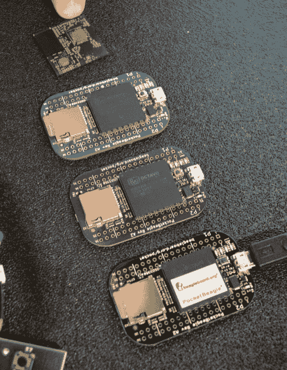](https://hackaday.com/2017/10/12/hackadays-open-hardware-summit-experience/tables-all-the-pocket-beadgle-prototypes/) All the PocketBeagle prototypes [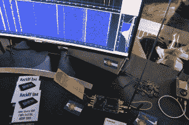](https://hackaday.com/2017/10/12/hackadays-open-hardware-summit-experience/tables-hackrf-demo/) HackRF waterfall display  SMD solder challenge boards were in goodie bags [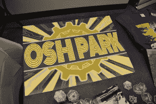](https://hackaday.com/2017/10/12/hackadays-open-hardware-summit-experience/tables-oshpark-pcb-sign/) OSH Park PCB sign [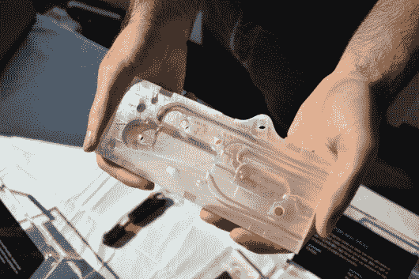](https://hackaday.com/2017/10/12/hackadays-open-hardware-summit-experience/tables-formlabs-mold-wb/) Robot finger cast 3D printed on Form2 [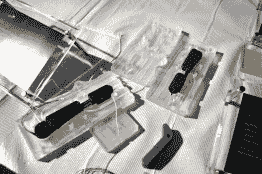](https://hackaday.com/2017/10/12/hackadays-open-hardware-summit-experience/tables-formlabs-process-wb/) Finger structure in mold [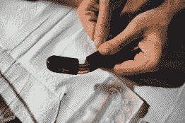](https://hackaday.com/2017/10/12/hackadays-open-hardware-summit-experience/tables-formlabs-finger-wb/) Fully cast finger bends with a pull of the wires

我们最喜欢的许多东西都在手边。Jason Kridner 展示了所有导致 PocketBeagle 的硬件原型(他在本周五主持了一个关于这个话题的黑客聊天)。迈克尔·奥斯曼与 HackRF 一起在那里，直播可以在频谱上听到的内容。他和 Dominic Spill 将在下个月的超级演唱会上做 T2 演讲。奥什公园的桌子不仅展示了作为他们标志的 PCB 面板，还展示了我们最喜欢的 [SMD 焊接挑战板](https://hackaday.io/project/25265-an-unfortunate-smd-project)。Form Labs 带来了一些 3D 打印模具，用于铸造复杂的电缆控制的机器人手指。整洁！

 [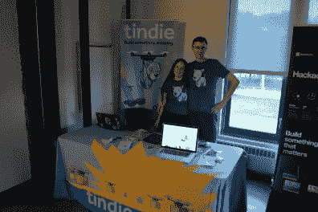](https://hackaday.com/2017/10/12/hackadays-open-hardware-summit-experience/tables-tindie/) Jasmine and Brian at the Tindie table [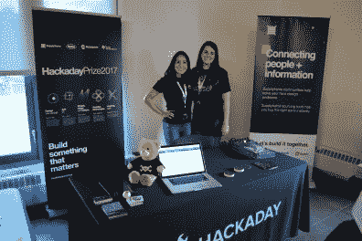](https://hackaday.com/2017/10/12/hackadays-open-hardware-summit-experience/tables-findchips/) Shulie and Katie at the FindChipsPro table

这是贾斯敏和布赖恩在餐桌旁。Tindie 的赞助商赠品是每个礼品袋中的 Tindie 硬件徽章。Supplyframe 也由 FindChipsPro 赞助。这是 Shulie 和 Katie 在那张桌子上谈论 Hackaday 奖和【FindChipsPro 为任何参加今年 Hackaday 奖的人准备的开放硬件账户。在这些照片中，索菲和我都在摄像机后面，我们六个人设法四处走动，在保持桌子活动的同时体验了峰顶。

## Sparkfun Tour

 [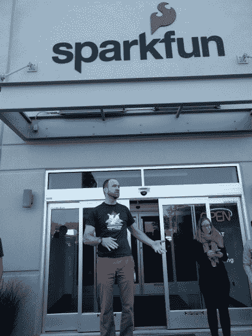](https://hackaday.com/2017/10/12/hackadays-open-hardware-summit-experience/sparkfun-tour-kickoff/) Nate Seidle welcoming the tour [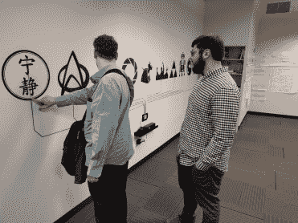](https://hackaday.com/2017/10/12/hackadays-open-hardware-summit-experience/sparkfun-touch-wall/) Conductive ink patterns played some seriously fun audio clips [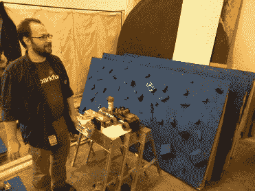](https://hackaday.com/2017/10/12/hackadays-open-hardware-summit-experience/sparkfun-building-obstacles-for-avc/) Work being done on the AVC obstacles

峰会后的第二天，Sparkfun 和 Lulzbot 组织巴士参观他们的设施。Sparkfun 之旅愉快到我都没意识到已经结束了还很难过。参观的人足够多，我们分成三组，我首先在教室区开始，使用导电涂料的壁挂式音频播放器，一个巨大的 NES 控制器和 RC 相扑机器人(没有图片)。下一步是正在制造 2017 年自动驾驶汽车竞赛障碍的商店。AVC 将是即将到来的周末丹佛创客节的一部分。

 [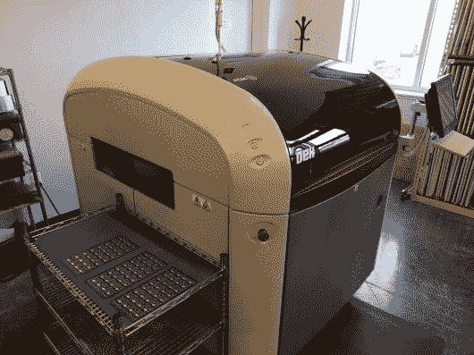](https://hackaday.com/2017/10/12/hackadays-open-hardware-summit-experience/sparkfun-paste-machine/) Solder paste machine [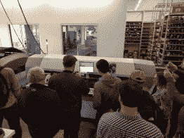](https://hackaday.com/2017/10/12/hackadays-open-hardware-summit-experience/sparkfun-ooooo-pick-and-place/) One of two very large pick and place machines [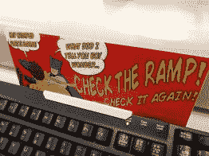](https://hackaday.com/2017/10/12/hackadays-open-hardware-summit-experience/sparkfun-solder-oven-sign/) Sign on the oven [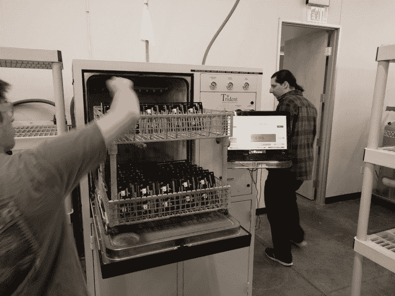](https://hackaday.com/2017/10/12/hackadays-open-hardware-summit-experience/sparkfun-washed-boards/) Boards being washed

参观生产车间真是一件乐事。Sparkfun 设置了两条线路。他们从锡膏机开始，锡膏机将锡膏印刷到印刷电路板上。人群注视着下一台巨大的取放机。然后，电路板在传送带上通过烤箱——上面可以看到，它有一个幽默的操作标志。这里没有画出用于通孔元件的选择性焊接机。几乎所有的产品都要经过洗衣机去除焊剂。

 [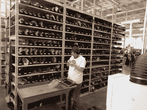](https://hackaday.com/2017/10/12/hackadays-open-hardware-summit-experience/sparkfun-inventory-all-the-reels/) Inventory of the components in reels [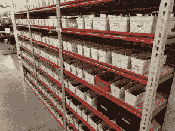](https://hackaday.com/2017/10/12/hackadays-open-hardware-summit-experience/sparkfun-test-jigs/) Shelves fo test jigs [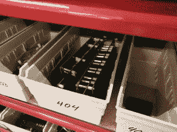](https://hackaday.com/2017/10/12/hackadays-open-hardware-summit-experience/sparkfun-test-jig-closeup/) Test jig close-up [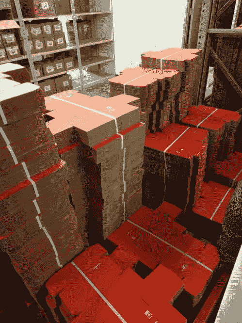](https://hackaday.com/2017/10/12/hackadays-open-hardware-summit-experience/sparkfun-familiar-boxes/) Pallets of familiar red boxes

元件卷轴的支架靠近装配线。我相信当我们在那里的时候，这位先生正在清点存货。成品板清洗后进行测试。检查上面显示的测试夹具架！测试后，产品会被储存起来，直到被订购，然后被放在一个红色的盒子里，发送给各地快乐的黑客。

## Lulzbot 旅游

 [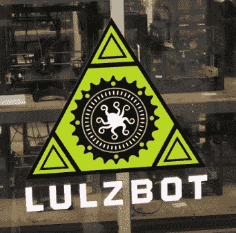](https://hackaday.com/2017/10/12/hackadays-open-hardware-summit-experience/lulzbot-logo-on-printer-nodes/) Lulzbot logo on printer node door [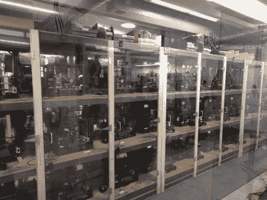](https://hackaday.com/2017/10/12/hackadays-open-hardware-summit-experience/lulzbot-printer-nodes/) 155 node 3D printer room

对我来说，Lulzbot 之旅最有趣的部分是这个 155 节点的 3D 打印机室。现在 Lulzbot 打印机上的所有塑料部件都是由这个房间里的 Lulzbot 打印机打印的。它保持在 80 度左右，每台打印机在机架上都有自己的外壳。随着新打印机的开发，它们会轮换到该集群中，这有助于测试它们的性能。

[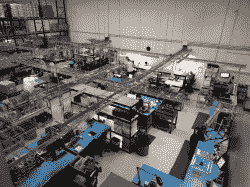](https://hackaday.com/2017/10/12/hackadays-open-hardware-summit-experience/lulzbot-the-assembly-floor/)

Assembly room from above

[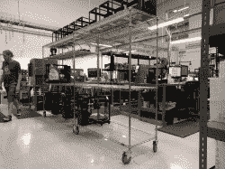](https://hackaday.com/2017/10/12/hackadays-open-hardware-summit-experience/lulzbot-on-the-printers-level/)

Racks of printers mid-assembly

[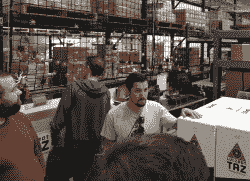](https://hackaday.com/2017/10/12/hackadays-open-hardware-summit-experience/lulzbot-inspecting-bad-test-prints/)

Brian inspects failed calibration prints

装配车间有许多处于完工状态的打印机。每完成一个，Lulzbot 章鱼的试印就完成了。如果此校准打印不符合标准，则问题得到解决，并制作另一张打印件运送给客户。在这里，你可以看到布赖恩 Benchoff 检查一些失败的章鱼打印保留，以帮助培训员工发现和补救打印问题。

 [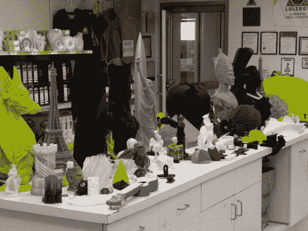](https://hackaday.com/2017/10/12/hackadays-open-hardware-summit-experience/lulzbot-prints-on-parade/) 3D prints showroom [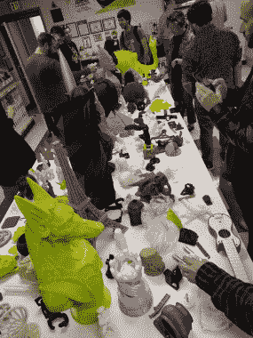](https://hackaday.com/2017/10/12/hackadays-open-hardware-summit-experience/lulzbot-prints-being-handled/) Lots of examples, large and small [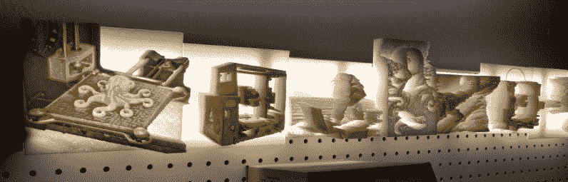](https://hackaday.com/2017/10/12/hackadays-open-hardware-summit-experience/lulzbot-light-diffusers/) Very cool art when light shines through

这次旅行带我们参观了 3D 打印陈列室，里面陈列着大量的印刷品。我的眼睛立刻被一个灯具吸引住了，这个灯具展示了一些艺术作品，这些作品看起来并不怎么样，直到光线穿过它，然后它呈现出惊人的阴影和深度。非常酷！

我确实拍了一段快速下流的视频在房间两边走来走去。这些年来，Lulzbot 制造的所有不同型号都以各种先进状态展示出来。如果你是他们设备的爱好者，你可能会觉得很有趣。

## 感谢开源硬件协会

峰会本身，以及晚上的聚会和第二天的游览，是对丹佛的一次不可思议的访问。祝贺并感谢[开源硬件协会](https://www.oshwa.org/)策划并主办了这次活动，并帮助充当开放硬件世界的管理者。