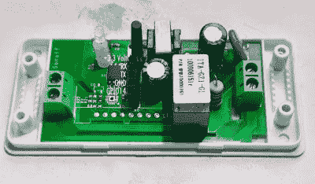

# 被黑的物联网交换机获得 I2C 超能力

> 原文：<https://hackaday.com/2017/03/27/hacked-iot-switch-gains-i2c-super-powers/>

规模经济和大规模生产给我们带来了大量廉价的东西。有时候，这些东西是可以破解的。例证:售价 5 美元的 Sonoff WiFi 智能开关内部有一个 ESP8266，但固件不是很灵活。该器件配有最低 1 MB 的 SPI 闪存。更糟糕的是，它没有~~I2C 端口~~额外的引脚暴露在外，这样你就不能连接你自己的传感器，使它们不仅仅是一个开关。但这就是为什么我们有烙铁，对不对？

 【杰克】固定他的，[记录程序](http://www.jackenhack.com/sonoff-switch-i2c/)。他首先将一个母接头焊接到电路板上，这样他就可以上传自己的固件。(当它插在墙上时不要这样做，你可能会触电。接下来，他拆下闪存，换上一个 4 MB 的大芯片，因为他可能想通过无线方式升级固件，或者只是运行一些非常非常大的代码。到目前为止，一切顺利。他有一个更好的版本。

但是，使用 ESP8266 的 I2C 引脚【ESPEasy 用于软件模拟 I2C 的引脚将这个小“开关”变成了更有用的东西——一个可爱的小包装中的墙壁供电物联网传感器节点，附有一个开关。这只是在 ESP8266 封装的极其微小的引脚上钉两根电线的问题。好消息是，I2C 引脚在包装的边缘，但你会想要你的细尖铁和一些放大不管。

就是这样。换一个更好的固件，连接上你想要的任何 I2C 设备，你只需要花几块钱就可以为你的家庭自动化家庭增加一个非常强大的功能。为了完整起见，这里再次警告:该设备使用非隔离电源，因此如果您墙壁上的零线不是零线，您可能会触电。接下来，我们将发表一篇关于无变压器电源的长篇文章，敬请关注！