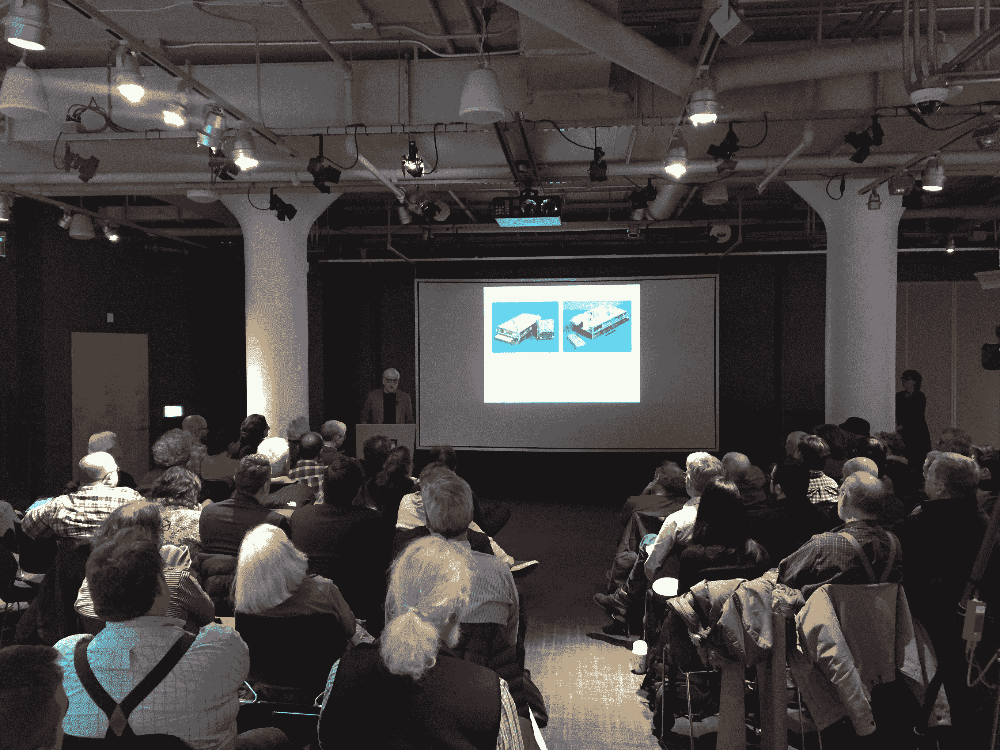
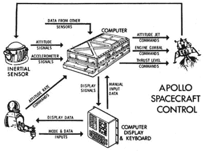
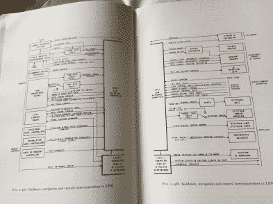
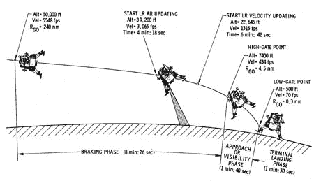
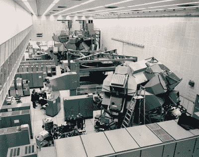
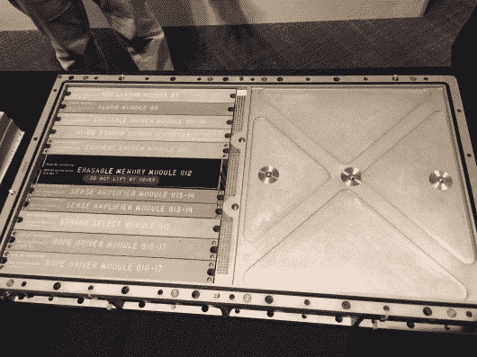
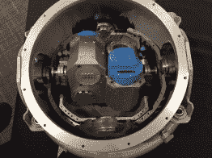
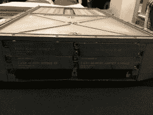
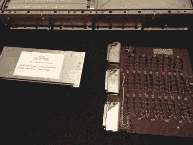
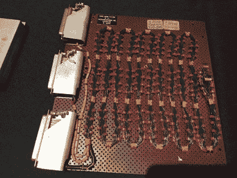

# 你应该读的书:太阳和发光体，阿波罗回忆录

> 原文：<https://hackaday.com/2018/06/15/hacker-glory-story-sunburst-and-luminary-an-apollo-memoir/>

阿波罗任务中计算最密集的部分是登月本身，需要通过一系列称为 P60 的程序对登月舱(LM)进行实时控制和导航。来自雷达、惯性导航和 LM 指挥官自己瞄准的光学数据的数据被输入到计算机中，这就是我们今天所说的“数据融合”。'

写这些代码的人是 Don Eyles，和 Don 一起出去玩的第二件事就是读他的书。唐的书读起来就像你在酒吧里坐在桌子对面听他讲述不可思议的人生故事。这是个人的，搞笑的，有压力的，迷人的，更重要的是，对于我们这些 Hackaday 的粉丝来说，这是可以理解的。

唐是 20 世纪 60 年代反主流文化的缩影。《滚石》杂志对他进行了专题报道，在一篇题为*唐·艾尔斯:号外！长相怪异的怪胎拯救了阿波罗 14 号！*。唐也是波士顿地区著名的摄影师。如果你想见他[，就去他的一个展览](https://www.doneyles.com/supersymandala.html)。

我最近在麻省理工学院博物馆的一次演讲中遇到了唐，他介绍了他的书: [*《旭日和发光体》;阿波罗回忆录*T3。](http://www.sunburstandluminary.com/SLhome.html)

MIT Museum talk on Sunburst and Luminary, an Apollo Memoir

唐的故事始于 60 年代末一名年轻的计算机工程师，在那里他做着散漫的工作，但最终在麻省理工学院的多克·德雷珀实验室找到了一份工作，为阿波罗制导计算机(AGC)编写代码。故事有意从缓慢开始，但随着阿波罗 11 号发射时间的临近，它的节奏和紧迫性迅速加快，我发现很难放下这本书。

## 第一架电传操纵飞机

对于那些不熟悉的人来说，阿波罗系统是第一个有线数字飞行系统。(关于这方面的一本有趣的书是 [*数字阿波罗*](https://mitpress.mit.edu/books/digital-apollo) 。除了实时飞行控制，计算机还负责导航。有两套阿波罗制导计算机(AGC)系统；一个在指令舱，一个在登月舱。下面你可以了解系统的设计，并看到 1965 年月球制导计算机的 IO 接口——在登月舱上发现的制导计算机。

  Simplified block diagram of the AGC IO.  Image from J. E. Miller, Space Navigation and Control, Technivision Limited, Maidenhead, England August 1966\.

赢得同事和上司的尊重唐被要求编写一些最难的软件，具体来说就是他编写了 P60 的。这些是登月程序，任务中计算最密集的部分，只留下大约 8%的 CPU 余量。航天器必须自行脱离轨道，从弹道轨道过渡到更类似于直升机的轨道，然后在月球表面软着陆。

P63=breaking phase, P64=approach phase, P66=terminal descent

当人类第一次尝试登陆另一个世界，阿波罗 11 号时，唐的代码受到了考验，事情没有按计划进行…计算机崩溃了！

唐和他的同事们带着他们的节目单(唐在他们位于马萨诸塞州剑桥的办公室里带我们参观了他的 Hackaday 名人名单。

在着陆的最后阶段，程序警报 1201 和 1202 响了，DSKY 显示器一度一片空白。每次出现程序警报时，计算机都会重新启动。尼尔·阿姆斯特朗并不高兴，你可以从他在电台广播录音中的语气中听出来。

德雷珀的团队在硬件模拟器中没有遇到过这样的问题(有三个不同的 LM 硬件模拟器，包括一个在德雷珀，一个在长岛的格鲁曼，以及[在美国宇航局的 LM 任务模拟器)](https://history.nasa.gov/computers/Ch9-2.html)这一定是计算机硬件故障，唐认为，他们应该立即中止。但令所有人惊讶的是，任务控制中心对每个程序警报都迅速做出了回应。

NASA’s LM mission simulator, green in foreground.

这是有充分理由的，Don 和他的同事创建了一个非常健壮的软件平台。在重新启动过程中，AGC 将自动删除所有不必要的工作和任务，并立即从它停止的地方启动关键任务和工作，如实时推进器控制、发动机油门控制和导航。部分归功于固态程序内存重启速度很快，机组人员几乎没有注意到。

美国国家航空航天局已经模拟了这种情况，根据经验，解决方案是继续执行任务。美国宇航局当时并不知道该系统在这种情况下为什么或如何继续工作，他们只知道在着陆的这一阶段，无论警报如何，该系统都将继续工作。

剩下的就是历史了。尼尔和巴兹走得很远，超过了他们计划在静海降落的区域，在还剩几秒钟燃料的情况下安全着陆。

事实证明唐的代码不是问题所在。对接雷达一直开着，处于触发计算机中断的状态，消耗着微薄的计算余量。这个问题在以后的任务中很容易解决。

## 穿插着技术历史的生活故事

Don 深入探讨了如何对 AGC 进行编程的细节，解释了所使用的汇编语言和符号语言。他描述了多线程操作系统是如何工作的，其中计算机同时管理多个任务和工作，就像现代计算机系统一样。关于代码如何用穿孔卡开发、如何用大型主机进行慢速模拟、如何连接到固态 rope 存储器以及如何在实时模拟器中进行严格测试的细节都是故事的一部分。唐甚至还描述了具体的功能，以及在这一引人入胜的阿波罗制导计算机的深入研究中用来计算三维矢量积的技巧。

  Top view of an Apollo Guidance Computer (AGC)  Top view of the inside of the inertial measurement unit (IMU).  Right-side view of the AGC: insert program memory modules here.  Wire rope memory module on left, prototype wire rope memory module on right.  Close-up view of prototype wire rope memory module.

如果这些听起来让你感兴趣，那么[拿一本唐的书](http://www.sunburstandluminary.com)或者从你当地的图书馆借。作为一名电气工程师，我强烈推荐这本书作为夏季读物。