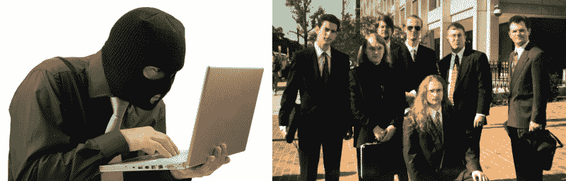
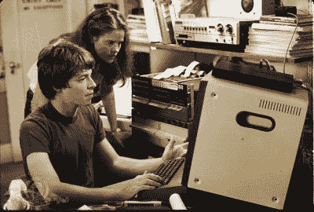
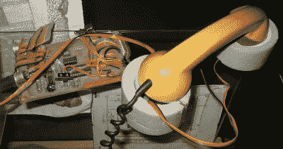
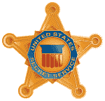

# 黑客与英雄:两个国家的故事

> 原文：<https://hackaday.com/2016/01/11/hackers-and-heroes-a-tale-of-two-countries/>

德国和美国的黑客文化在很多方面非常相似，从硬件和软件类型的相对混合，到业余无线电和闪光灯的从属关系。阅读 Hackaday，你会发现两国都有类似的项目。过去十年，这两个国家都见证了黑客空间的蓬勃发展，无论你生活在哪个城市，都可能有一两个。但是有一样东西美国黑客仍然缺乏，而德国黑客已经有一段时间了:尊重。

在不同的社交圈子里说“黑客”这个词，你永远不知道会得到什么样的回应。到底谁是“黑客”？我们说的是那些勒索你阿什利·麦迪逊账户信息的人吗？或者从塔吉特百货窃取信用卡号码？或者我们是在谈论那些乐于破坏和建造东西，并把东西拆开来看看它们是如何工作的人吗？

无论如何，按照互联网的标准，关于谁是“黑客”的讨论由来已久，而且不会在这里得到解决。但是想想你最后一次在大众媒体上听到“黑客”这个词，除了它的负面含义。如果你记不起本世纪的任何一件事，那你是生活在美国。如果你回答，“就在昨天，在国家最重要的报纸之一”，那么你住在德国。

### 黑客在社会中的地位

激发我写这篇文章的文章标题是“为什么黑客对社会如此重要”你知道为什么，我也知道为什么；因为我们把东西拆开，在基本层面上思考它们是如何工作的:从消费电子产品到加密协议。但是想象一下在美国报纸上读到这个标题。

德国黑客受到了足够的尊重，以至于德国政府经常从[混沌计算机俱乐部(CCC)](http://ccc.de/en) 的代表那里获取关于 IT 安全、电子投票机、数据自由和类似专业领域的证词。媒体，不仅仅是电脑媒体，当他们有一个故事要核实时，就会来 CCC。成立于柏林 c-base hackerspace 的海盗党实际上在 2012 年获得了足够的选票，在德国四个州议会中拥有代表席位，在欧盟议会中只有一个代表席位。虽然肯定不是每个德国人都会说“黑客”是一种好的力量，但他们的媒体形象和整体政治和社会影响比美国好几个数量级。

这是如何发生的，这对我们黑客社会意味着什么，值得思考。我并不声称拥有所有的答案；这篇文章的一部分是试图通过比较展开对话。但重要的是要思考为什么美国黑客被边缘化，或者为什么德国黑客(几乎)是社会的正常成员，特别是在公共辩论越来越需要技术专家的观点的时候。

## 电话窃听

© Metro-Goldwyn-Mayer Studios Inc. All Rights Reserved.

黑客在美国的形象是一个男人，甚至可能是一个青少年，独自长时间工作，试图闯入美国电话电报公司的系统，或者与 WOPR 玩井字游戏。在 20 世纪 80 年代早期，除了孤独这一点，这并没有错。在 T2，有一些电话黑客非法拨打免费电话。但是他们经常组成团队，共享信息，一起工作。[末日军团的](https://en.wikipedia.org/wiki/Legion_of_Doom_%28hacking%29)自己的[技术期刊](http://www.textfiles.com/magazines/LOD/)、 [Phrack](http://phrack.org/) 或 [2600](http://www.2600.com/) ，以及当时无数[BBS](https://en.wikipedia.org/wiki/Bulletin_board_system)上共享的免费信息一点也不孤立。如果你有门路的话，他们肯定很有吸引力。

注意这里发生了什么。当时，美国电话电报公司垄断了长途电话业务，而且价格极不合理。为了让一群志同道合的技术黑客聚在一起聊天，或者拨打外州的 BBSes，他们几乎*有*侵入系统。当然，电话网络是当时最有趣和最具挑战性的信息技术之一也有所帮助。但是电话交谈者之间的共同点是他们是在*沟通*，既是手段也是最终目标。

德国黑客的起源非常相似。德国也有电话垄断，但比美国的美国电话电报公司更加严格。在德国，你不仅有一个电话运营商，德意志联邦电信，而且他们是国有的，是德国最大的雇主。联邦议会可以通过法律规定你可以在电话线上安装什么样的电话设备，这包括在 20 世纪 80 年代初贵得离谱的调制解调器。CCC 最早的一些活动是反对联邦政府的电话窃听，我将把它归入绝对非法和道德上有争议的类别，但也包括制作负担得起的 DIY 调制解调器，使书呆子之间能够交流。虽然这也是非法的，但我声称这在道德上是正确的，在技术上绝对是令人敬畏的。

Photo: Johann H. Addicks / addicks@gmx.net

[“daten klo”](http://www.offiziere.ch/trust-us/habi1/097_datenklo.html)([谷歌翻译版](https://translate.google.com/translate?sl=auto&tl=en&js=y&prev=_t&hl=en&ie=UTF-8&u=http%3A%2F%2Fwww.offiziere.ch%2Ftrust-us%2Fhabi1%2F097_datenklo.html&edit-text=&act=url))是一个 DIY 的声音耦合调制解调器，运行在 300 波特。这个名字是“数据”和“厕所”的奇怪混搭，因为在设计中用来隔离手机的泡沫橡胶环很容易从管道供应部门获得，大小正好作为厕所密封件。)

但是我跑题了。20 世纪 80 年代初，美国和德国的黑客行为的特点是合法和不合法的群体行为，并围绕着对技术探索及其在数字和印刷媒体中的传播的热爱。每个人都在打电话反对电信垄断，这样他们就可以一起谈论电话系统如何在幕后工作，因为在那个时候，电话系统是最酷的系统。

这是道路开始分叉的地方。到 20 世纪 90 年代，美国黑客被边缘化，大部分被分离，而德国黑客已经形成了一个强大的全国性组织，并在许多城市设有分支机构。

## 转弯处

在美国，电话窃听的黄金时代在 1990 年结束，当时美国特勤局查封了许多运行 BBSes 的电脑，基本上宣布了对黑客的开放期。几乎所有的电话窃听都是在地下深处进行的。黑客团体被视为“帮派”，在 BBS 上交流电话系统的内部信息是共谋犯罪，而不是言论自由。数百台运行可疑 BBS 的电脑被扣押数月或数年，即使从未被起诉。与此同时，美国开始执行以前旨在保护政府电脑的法律，这些法律适用于互联网上的任何 T2 电脑。

 简而言之，美国发生了一场针对黑客的通宵突袭。黑客行为被定为犯罪，更有组织的团队被解散，极少数人甚至面临牢狱之灾。无论美国黑客界有什么样的团体，至少在一段时间内，都变得沉默或被推到了地下很远的地方。布鲁斯·斯特林的《黑客攻击》是讲述黄金时代终结的经典编年史，如果你有时间，这是一本很好的读物。

到 1990 年，1981 年《纽约时报》的一篇文章中对黑客的描述已经过时了:

> 黑客是技术专家；熟练的，通常是年轻的计算机程序员，他们几乎异想天开地探索计算机系统的防御，寻找机器的极限和可能性。尽管黑客看似具有颠覆性的作用，但他们是计算机行业公认的资产，通常受到高度重视。

公众情绪已经被推至承认黑客是异常分子或罪犯。

## L0pht 重工业公司

但是黑客不得不入侵，大规模的地理分布的集合让位于更多的本地场景。L0pht 是 20 世纪 90 年代美国最引人注目的黑客组织之一。真正的“l0pht”是典型的黑客空间:充满了垃圾(咳咳，鼓舞人心的技术原材料)和计算机，以及对上述所有东西感兴趣的聪明人。早些时候，L0pht 得到了一堆好评，[比如纽约时报上的这篇文章](http://www.nytimes.com/1999/10/03/magazine/hack-counterhack.html?scp=2&sq=l0pht%20heavy&st=cse)。

在美国黑客与政府关系的最高点，我们看到来自 L0pht [的七名成员在美国参议院面前就黑客行为与美国国家安全的相关性作证。参议员弗雷德·汤普森向他的参议员同事介绍他们是“黑客智囊团”，以减轻打击。有趣的是，L0pht 与政府的关系开始是 Mudge](https://www.youtube.com/watch?v=VVJldn_MmMY) 的[防御手段，目的是提高他们的形象，避免任何误解，也就是说不被突袭。](https://www.youtube.com/watch?v=axnWyPEly84&t=11m42s)

来自 L0pht 的人们最终会成为完全披露的早期倡导者，不管是负责任的还是其他的。在 20 世纪 90 年代，他们的建议是任何对黑客或计算机安全感兴趣的人的必读之作。虽然也许在 L0pht 发生的一切都不是严格合法的，但很明显他们的心是在正确的地方:在混乱的中立和混乱的善良之间。华盛顿邮报[最近在 L0pht](http://www.washingtonpost.com/sf/business/2015/06/22/net-of-insecurity-part-3/) 上发表了一篇好文章，也应该在你的阅读清单上。

不过，我认为 L0pht 的重要之处在于，他们成为了一个可见的群体，而且他们更愿意去修理坏掉的东西。因为他们在公众面前的高姿态，他们知道他们被监视着，并且有动力去“表现”或者至少看起来表现得很好。他们因为“背叛”而受到黑帽黑客社区的抨击，也因为是流氓而受到软件行业的抨击——这表明他们找到了平衡。此外，他们有一个目的，他们是有组织的。

然后 L0pht 不再是一个黑客空间，进入了安全行业，其成员因业务差异而分裂。在某种程度上，L0pht 的终结与美国各地黑客活动的商业化——或安全行业的增长——这取决于你的观点。在 20 世纪 90 年代后的美国，“黑客”在董事会中并不畅销，白帽黑客(咳咳，“安全研究人员”)和黑帽黑客之间的二分法变得非常明显。一边是高工资，另一边是不断变化的法律环境，像 L0pht 这样介于两者之间的人已经没有多少空间了。这是美国黑客文化中的一个危险漏洞，尤其是对于那些还没到穿上西装的年龄，但喜欢玩电脑的年轻人来说。它们在哪里？

## 今天是美国，明天是德国

美国的黑客经历了一条漫长而曲折的道路，从开放和社区驱动，到完全转入地下，公众眼中只有少数例外的团体。明天，我将回到 20 世纪 80 年代，从德国的角度重演另一段历史，并认为美国黑客场景可以从这种比较中学到一些东西。如果你相信这种说法，那么美国黑客空间还有很多工作要做。敬请期待！