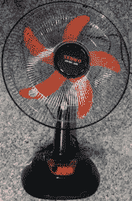
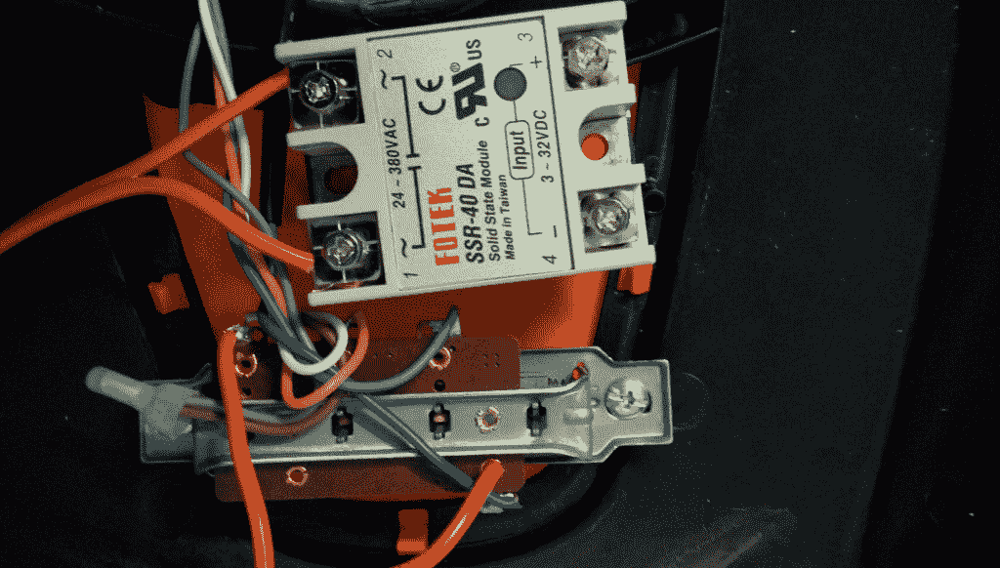

# 黑客大战霉菌:制造恒湿器风扇

> 原文：<https://hackaday.com/2017/11/21/hackers-vs-mold-building-a-humidistat-fan/>

家里有霉菌问题是很可怕的，尤其是如果你对它过敏的话。它可能有毒，加重哮喘，并损坏您的财产。但是说实话，在你讨论这些问题之前，你住的地方有霉菌感觉很恶心。

你可以定期使用漂白剂等令人不快的化学物质来清洁它，尽管效果有限。因此，我并不特别高兴发现厨房墙上长了霉菌，并决定对它进行科学研究。令人高兴的是，我设法用一点黑客的聪明才智解决了我的模具问题。

### 什么程度的湿度会导致发霉？

我对这个问题的潜在原因做了一些研究。我们知道霉菌喜欢潮湿，但问题的具体根源似乎是周围空气的相对湿度较高。

在给定的温度下，空气中含有的水蒸气量是有限的。相对湿度是当前气温下水蒸气极限的百分比。较高的相对湿度也会使冷凝变得更糟，这是霉菌生长的另一个水分来源。需要知道的是，水分是我们的敌人，给我们提供最可靠信息的测量单位是相对湿度。


在东京进行的一项研究似乎表明，神奇的数字是相对湿度略低于 70%。在此之下，被研究的霉菌种类变少了。一项[先前的研究](http://pubmedcentralcanada.ca/pmcc/articles/PMC1056928/pdf/applmicro00290-0019.pdf) (PDF 警告)描述了霉菌生长所需的相对湿度高度依赖于相关表面；保持低于 76%的相对湿度可以防止霉菌在他们研究的大多数表面上生长。然而，日本的研究特别关注了家庭中的墙壁。美国环保署[建议低于 60%](http://www.epa.gov/mold/brief-guide-mold-moisture-and-your-home) 。

### 测量我家的相对湿度(非常高)

在东南亚，湿度低于 60%在一年中的大部分时间里并不算什么。见过包装上写着“储存在阴凉干燥处”的吗？最好不要把那些东西带到这里。

总之，在[调查物联网数据记录平台](http://hackaday.com/2017/10/31/review-iot-data-logging-services-with-mqtt/)时，我用 DHT11 组合温度/湿度传感器进行了一些快速测量。他们显示室外温度在 52%到 70%之间(目前我们正处于雨季的末期)，早上更干燥，晚上更潮湿。在任何情况下，只要有适当的通风，70%或更低的相对湿度是可以实现的。

我在房子的问题区域重复测量，记录到一致的 86%相对湿度！这显然是有问题的，所以我考虑解决方案。一直开着空调是不实际的。我们已经在那里看到了几个项目[解决除湿机的霉菌问题，](https://hackaday.com/2012/10/08/sensor-based-dehumidifier-system-for-your-home/)那些小的在这里卖 150 美元左右，但它是房子里的另一个电器。人口密度的一个影响是这里的房子很小。

### 打造智能风扇



我的解决方案很简单:增加通风。迄今为止的数据表明，将潮湿的空气转移出去就足够了。反正我家里少了一把扇子，扇子很便宜，所以如果我错了也不会受到什么惩罚。

不过，我真的不想让风扇一直开着。它可能只使用 40 瓦，但听到它就令人恼火，我有一堆从[学习使用优雅无声的固态继电器](http://hackaday.com/2017/09/26/an-introduction-to-solid-state-relays/)剩下的零件。那么为什么不给风扇加一个恒湿器呢？恒湿器就像自动调温器，但它们是根据湿度而不是温度来开关的。

你知道那些日子里所有的事情都在一起了吗？这是那些日子中的一天。风扇内部没有电子设备，只有开关将主电源直接连接到风扇内部的“其他东西”。


我尽可能避免使用焊料来做任何需要电源的事情。在这种情况下，虽然，布线只是焊接到黄铜导体已经，而且，有穿孔，完全符合我的电线。因此，我所要做的就是将固态继电器放在开关上，以获得最快的风扇速度，这样我就有了一个正常的测试系统:



我使用 DHT11 组合温度/湿度传感器来跟踪湿度，与运行 NodeMCU 的 Wemos 迷你 D1 板接口来控制继电器。一个小的电源至 5 伏模块为控制系统供电。我写了一个快速的 Lua 程序来控制风扇何时打开:

```

gpio.mode(2, gpio.OUTPUT)
gpio.mode(1, gpio.OUTPUT)
gpio.write(2, gpio.LOW)
gpio.write(1, gpio.LOW)
pin = 4
x = 'off'
function currentlyon(level)
status, temp, humi, temp_dec, humi_dec = dht.read(pin)
print(string.format(&quot;DHT Temperature:%d.%03d;Humidity:%d.%03d\r\n&quot;,
math.floor(temp),
temp_dec,
math.floor(humi),
humi_dec
))
print('Currently ON. Temp:'..temp..' ,Humidity:'..humi)
if humi &lt; 66 then
gpio.write(2, gpio.LOW)
x = 'off'
end
end

function currentlyoff(level)
status, temp, humi, temp_dec, humi_dec = dht.read(pin)
print('Currently OFF. Temp:'..temp..' ,Humidity:'..humi)
if humi &gt; 68 then
gpio.write(2, gpio.HIGH)
x = 'on'
end
end

function statuscheck()
print('Checking Status')
if x == 'on' then
currentlyon()
elseif x == 'off' then
currentlyoff()
else
print('Invalid state')
end
end

tmr.alarm(1, 20000, tmr.ALARM_AUTO, function() statuscheck() end)
```

### 一个简单的迟滞例子和振荡问题

改变风扇状态所需的湿度取决于风扇最后是从开切换到关，还是从关切换到开。这被称为滞后:系统的状态取决于它的历史，这是一种不优雅但容易避免的常见控制问题，称为“狩猎问题”。

振荡问题可能是闭环控制系统中的一个问题，在这种系统中，控制器的行为取决于耦合到您正在测量的过程的传感器的反馈。在我们的情况下，如果我们简单地将目标湿度设置为 70%，那么由于湿度的微小波动，风扇将达到该值并频繁地打开或关闭。风扇只能完全打开或关闭，这两种状态都不会导致长时间达到目标湿度。

因为在我们的例子中，可接受的湿度是一个相当宽的范围，我们设置风扇在湿度超过 68%时打开，一旦打开，在湿度低于 66%时关闭。传感器分辨率为 1%，因此开始时的 4%范围似乎是合理的。


通过向传感器吹气进行了一些快速测试，一切都如预期的那样工作。湿度问题暂时解决了，我穿上防护装备，尽我所能漂白了霉菌。从那以后，它就再也没有回来过。

### 有用！现在做得更好

后来增加了一些改进。最初，控制系统只是通过控制实际开关来响应湿度来切换风扇。这意味着它不能像普通风扇一样正常工作——它会根据湿度忽略您的速度选择！最好用固态继电器中断主电源线，并让控制系统默认风扇开启。只有当选择了除湿器功能(开关)时，控制系统才会根据需要连接或断开风扇电源。

最后，这是一个简单的更新。我从风扇开关上移除了继电器，如上所述添加了它，并添加了一个拨动开关，将 Wemos 迷你 D1 上的 GPIO D5 连接到+3.3 伏或地。然后我更新了下面的代码，把所有的东西都装进了风扇箱，它就工作了:

```

gpio.mode(2, gpio.OUTPUT)
gpio.mode(1, gpio.OUTPUT)
gpio.write(2, gpio.LOW)
gpio.write(1, gpio.LOW)
gpio.mode(5, gpio.INPUT)
pin = 4
x = 'off'
function currentlyon(level)
status, temp, humi, temp_dec, humi_dec = dht.read(pin)
print(string.format(&quot;DHT Temperature:%d.%03d;Humidity:%d.%03d\r\n&quot;,
math.floor(temp),
temp_dec,
math.floor(humi),
humi_dec
))
gpio.write(2, gpio.HIGH)
print('Currently ON. Temp:'..temp..' ,Humidity:'..humi)
if humi &lt; 66 then
x = 'off'
end
end

function currentlyoff(level)
status, temp, humi, temp_dec, humi_dec = dht.read(pin)
gpio.write(2, gpio.LOW)
print('Currently OFF. Temp:'..temp..' ,Humidity:'..humi)
if humi &gt; 68 then

x = 'on'
end
end

function statuscheck()
fanmode = gpio.read(5)
print (fanmode)
print('Checking Status')
if x == 'on' and fanmode == 1 then
currentlyon()
elseif x == 'off' and fanmode == 1 then
currentlyoff()
else
print('Humidity mode inactive. Fan always on.')
gpio.write(2, gpio.HIGH)
end
end

tmr.alarm(1, 5000, tmr.ALARM_AUTO, function() statuscheck() end)
```

最后一点，这种类型的固态继电器通常应该附有散热片，但我是在额定电流的很小一部分使用它。即使运行很长时间也不会明显变热。这个大继电器是多余的，因为有许多更小更便宜的选择更适合风扇使用的低电流，但我手头有它…所以它去了。

有很多方法可以解决我的霉菌问题。最振振有词的结果是有点令人挠头，而且很有趣。