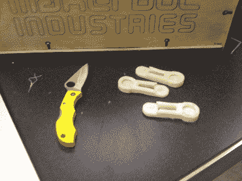
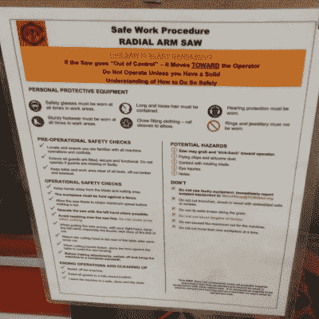

# 黑客空间很难:安全

> 原文：<https://hackaday.com/2017/10/11/hackerspaces-are-hard-safety/>

安全是那些经常引起一些工具用户不太严肃的反应的话题之一。对于这些人来说，他们认为他们的精英技能会保护他们，只要他们注意，他们永远不会受伤。这就解释了“矮胖子”这个绰号在这个群体中的流行。另一方面，安全性也是那些不太了解工具的人可能反应过度的领域之一。想象一下，当一个孩子小心翼翼地熔化一些焊料时，一桌子的孩子都戴着护目镜。你不希望焊料进入你的眼睛，但这在正常情况下是不会发生的。

然后还有一些奇怪的事故，这是一个现实。9 月 20 日，一个泄漏的丙烷罐在 67 区的新车间爆炸，克里斯·迈耶严重受伤。Chris 远非 noob，他是店里最有经验的人之一，也是该空间的联合创始人之一。他还有很长的康复之路要走，而且这些天来，他有一个 [GoFundMe 活动](https://www.gofundme.com/HelpSector67)来帮助支付他的医疗费用和帮助整修车间，这似乎是令人悲伤的必然。山麓社区的车间[最近也被夷为平地](https://hackaday.com/2017/07/28/north-carolina-hackerspace-destroyed-by-fire-members-vow-to-rebuild/)，尽管幸运的是没有人受伤。

总而言之，黑客空间似乎相当安全，特别是考虑到他们面临的挑战——或者更公平地说，与典型黑客空间的开放性相关的风险。大多数黑客空间允许任何缴纳会费的人成为会员。有各种各样的背景、能力和判断，用我该怎么说呢，一些不寻常的观点来代表，可能会阻碍规则的遵循。一旦会员有了表链或钥匙，就可以使用任何工具了，对吗？不是所有的东西都有锁。

以下是几年来出现的一些简单规则，可能有助于你的黑客空间在为可能会发生的奇怪事故做准备的同时，应对自满和麻痹恐惧的双重危险。

### 奇怪的事故时有发生

安全并不是保证不会出错。这是一系列的步骤，你采取这些步骤来改善已识别的危险，同时努力为不可预测的事故做准备，以达到可接受的风险水平。

没有人会受伤。对于每一个手指在冰袋里的新手来说，就有一个头发花白的老手在冰袋里有两个手指。你只能关注和教育你自己，但是你应该总是假设混乱会进入画面。

### 不要独自做危险的事情

……因为当混乱真的出现时，你不想在地板上摸索你的手机；你想对你的朋友大喊叫救护车。这条规则很简单:当你使用任何可能严重伤害你的工具时，不要成为空间中唯一的人。

同时，你随时都可能受伤。2011 年，我不得不去急诊，当时我试图用小刀(愚蠢地)从纸杯蛋糕的制作平台上刮下一个指纹，结果切破了手指。

你可以看到我受伤前拍的最后一张照片。我的好朋友雷·康纳斯是一名军医，碰巧在那里，他包扎了伤口，这样我就可以开车去医生的办公室。

理想情况下，你的伙伴不仅仅是把你拖到医生的办公室。如果你用错了工具，或者非常疲劳、匆忙，或者因为受伤而四处游荡，那个人应该让你知道。

很容易走得太远。什么，你不能用菜刀因为没人在家？我认为切断(对不起)可能是任何工具，可以切断肢体或切入你的身体超过皮肤，或导致你无法帮助自己。这条规则不是关于你的知识和能力。这是关于混乱，以及在最坏的情况下最小化损害的程度。

### 任命一名安全专家

招募一些人成为黑客空间的安全专家，愿意阅读代码和法规，并发现其他空间的最佳实践。找人深入了解安全和法规也有助于集体意识到不明显的安全问题，如烟雾、电磁辐射和噪音。他们还确保签署成员协议和责任豁免。在一次不幸的木材车间事故后，多伦多的 Site3 联合实验室做了一个关于加强安全的精彩演示:

 [https://www.youtube.com/embed/W0nxZ3EIA4Y?version=3&rel=1&showsearch=0&showinfo=1&iv_load_policy=1&fs=1&hl=en-US&autohide=2&wmode=transparent](https://www.youtube.com/embed/W0nxZ3EIA4Y?version=3&rel=1&showsearch=0&showinfo=1&iv_load_policy=1&fs=1&hl=en-US&autohide=2&wmode=transparent)

### 不要在安全基础设施上吝啬

如果木器店有一堆护目镜，用户更容易戴上。对于空间来说，将安全基础设施放在首位非常重要。可能是洗眼站或者别的急救箱。消防队长会告诉你是否需要防火门、洒水器和灭火器。不要成为那些因为违反规范而被关闭的人。

还有一些不明显的项目。例如，在移动电话几乎无处不在的今天，在空间中拥有一部固定电话仍然很重要，这样没有工作电话的人也可以呼叫紧急服务。

安全基础设施还包括购买更安全的工具。许多木材商店已经投资了锯台锯，这种锯台锯在锯片上有一个电容传感器，如果锯片接触皮肤或金属，它会立即停止锯片。

升级您的安全基础设施不仅仅是为了预防事故。如果你经营一个安全的商店，遵守建筑法规，安全设备到位，你也会让你的保险人高兴，这意味着更低的空间费率。

###  委部军长

董事会不可能拥有每个领域，所以招募领域专家是必要的。知道如何更换带锯刀片的人也应该熟悉与锯相关的安全问题。金属店经理需要知道如何安全地排出焊接烟雾，并保护路人免受紫外线照射。

通过让内容专家对新手进行培训并监控该区域，对每个人来说都更安全。

*   就危险工具对用户进行培训或“检查”。
*   维护工具——钝刀片和故障设备会伤人。此外，维护良好的工具与其他电动工具保持安全距离。
*   使用标牌向用户介绍这些工具。右图显示了我所在区域的一些信息标牌。

### 适当投保

这是一种必然——它将一个可以在严重事故中幸存的空间和一个可以折叠的空间区分开来。我的同事[Kristina Panos]写了一篇很棒的文章，描述了黑客空间获得保险的过程。这并不酷，也不性感，这只是必要的。

### 接受你只能做这么多

最终，就像在幼儿园一样，每个成员都必须对自己的行为负责。你所能做的就是提供合适的环境，相信成员们会像成年人一样行事，并希望不要太混乱。