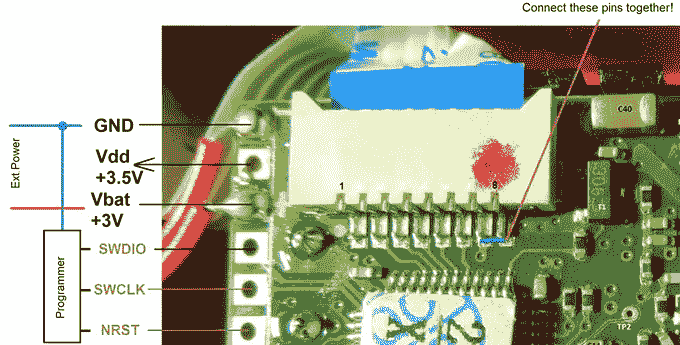

# 黑进一个便宜的激光测距仪

> 原文：<https://hackaday.com/2018/05/22/hacking-a-cheap-laser-rangefinder/>

当一项新技术问世时，其价格通常很高，除了铁杆早期采用者之外，其他人都敬而远之。但是，随着时间的推移，价格逐渐下降，越来越多的人愿意购买，这又进一步推动价格下降，直到最终规模经济真正发挥作用，东西如此便宜，几乎是一种冲动购买。Linux 单板机、蓝光激光器、3D 打印机；只要你说出它的名字，黑客社区就可能受益于这样一个事实:不再仅仅是黑客社区感兴趣了。

这正是激光测距仪开始出现的情况。曾经几乎完全是军事技术，现在你可以从正常的海外供应商那里买到不到 40 美元的基本“激光卷尺”。不幸的是，正如[伊利亚萨姆]发现的那样，它们并不特别适合其他任务。一方面，没有官方的方法来获取数据，但另一个问题是采样率低于每秒一次。相信硬件本身已经足够有前途，他着手[逆向工程，更换运行在这些廉价激光测距仪之一上的固件](https://habr.com/post/327642/) ( [谷歌翻译自俄语](http://translate.google.com/translate?sl=ru&tl=en&js=y&prev=_t&hl=en&ie=UTF-8&u=https%3A%2F%2Fhabr.com%2Fpost%2F327642%2F&edit-text=))。

 他的博客文章是关于这些设备如何操作的绝对丰富的信息，任何对逆向工程感兴趣的人都必须阅读。但简而言之，他找到了一种方法来重新编程该设备中使用的 STM32F100C8T6 微控制器，并且[开发了他自己的固件](https://github.com/iliasam/Laser_tape_reverse_engineering)，解决了这个非常有前途的小工具的可用性问题。

只需轻轻一跳，激光卷尺 PCB 就可以连接到 ST-Link 编程器，并且可以使用[iliasam]提供的固件来实现简单易用的串行接口。非常适合与 Arduino 或 Raspberry Pi 搭配使用，无需花费太多就能获得快速准确的距离数据。

你可能不会惊讶，这不是[伊利亚萨姆]第一次用激光测距仪弄得脏兮兮的。去年建造的这个令人印象深刻的建筑允许对他的房间进行令人难以置信的精确 3D 扫描，在此之前[他从头开始创造了自己的测距仪](https://hackaday.com/2016/06/05/in-soviet-russia-diy-laser-rangefinder-scan-you/)。

 [https://www.youtube.com/embed/FA4mfvgpOQQ?version=3&rel=1&showsearch=0&showinfo=1&iv_load_policy=1&fs=1&hl=en-US&autohide=2&wmode=transparent](https://www.youtube.com/embed/FA4mfvgpOQQ?version=3&rel=1&showsearch=0&showinfo=1&iv_load_policy=1&fs=1&hl=en-US&autohide=2&wmode=transparent)

