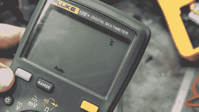

# 福禄克 12E+万用表黑客赫兹这么好

> 原文：<https://hackaday.com/2016/06/07/hacking-a-fluke-multimeter-hertz-so-good/>

看着有人用烙铁折磨一个全新的福禄克万用表有点让人心痛，即使是为了科学。为了查明他的 Fluke 12E+万用表，一个从普通来源购买的价格为 75 美元的功能丰富的设备，实际上是一个真正的 Fluke，【AvE】确实这样做了——并且[发现了一些额外的功能](https://www.youtube.com/watch?v=FUmbsBYVTQ0)。

 在一次[拆卸](https://www.youtube.com/watch?v=rJm9iCha-jM)万用表的过程中，他将万用表橡胶外壳的熔点与其他福禄克电表进行了比较，【Ave】最终证明了万用表的真实性。然而，在[AvE]将他购买的正品装回去后，表盘错位了，需要再次拆卸才能解决问题。幸运的是，[AvE]培养了一群专注的观众，一些评论者注意到 PCB 上有一些隐藏的按钮垫。他们还发现了一个小“C”，在未对准问题期间，它在 LCD 上亮了一小会儿。

这些评论导致[AvE]第三次拆卸仪表，看看是否有任何隐藏的功能可以解锁。是的，他们可以。除了用于温度测量的刻度盘位置外，[AvE]还发现其中一个隐藏的按钮触点可以进行频率和占空比测量。嗯，这太简单了，所以[AvE]继续通过将电表连接到波形发生器来检查隐藏的功能是否已经接受了 EOL 校准。显然，它读取设定频率到最后一位数。

12E+是 Fluke 万用表的一种新品种:一方面，它具有“多”万用表的大部分功能，例如测量交流和 DC 电压、电流、电容和电阻，另一方面，它的价格不到 100 美元。国际营销的魔力使这成为可能，福禄克似乎只在中国市场销售这种瘫痪软件产品。所以，在美国或者欧洲是买不到的，至少不容易买到。应该更容易获得的 12E+的近亲是 Fluke 15 b+；我们今天早些时候看到的仪表，当时[Sprite_TM] [侵入了](http://hackaday.com/2016/06/07/hacking-a-fluke-multimeter-to-serve-readings-over-wifi/) [it，通过 WiFi](http://hackaday.com/2016/06/07/hacking-a-fluke-multimeter-to-serve-readings-over-wifi/) 共享测量值。15B+在外观和功能上似乎与 12E+相同，尽管不知道这两者是否可以以相同的方式被黑客攻击。

 [https://www.youtube.com/embed/FUmbsBYVTQ0?version=3&rel=1&showsearch=0&showinfo=1&iv_load_policy=1&fs=1&hl=en-US&autohide=2&wmode=transparent](https://www.youtube.com/embed/FUmbsBYVTQ0?version=3&rel=1&showsearch=0&showinfo=1&iv_load_policy=1&fs=1&hl=en-US&autohide=2&wmode=transparent)

感谢[jacubillo]的提示！