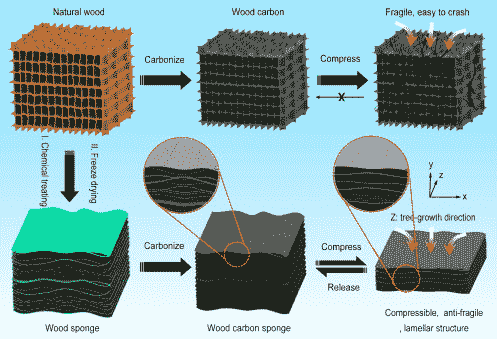

# 黑巴尔沙让它变得更强

> 原文：<https://hackaday.com/2018/03/07/hacking-balsa-to-make-it-stronger/>

轻木一直因其强度和轻质成分而备受推崇，这两种特性使其成为建造模型结构和飞机的理想材料。来自美国和中国的研究人员已经设法让巴尔沙变得更加坚固和有用。他们发现了一种改变其结构的方法，将它变成一种碳海绵，这种海绵足够坚固，可以承受反复的机械应力，但又足够轻，可以坐在一棵结籽的蒲公英上。

 科学家们使用碱液和过氧化氢等普通化学物质，燃烧构成巴尔萨木矩形细胞壁的半纤维素和木质素纤维。然后，他们在 1000 摄氏度下焚烧样品，这使细胞结构变形为螺旋弹簧和蜂窝之间的交叉。

通常情况下，碳化木材在重压下会坍塌。但是，通过首先燃烧细胞纤维，碳化过程产生的轻质碳海绵能够在变形前承受数千次压缩。研究人员使用这种新材料作为可穿戴电子设备的机械应变传感器原型的一部分，他们认为这种材料在水净化设备、超级电容器和可充电电池方面有着广阔的前景。

对于一个试图寻找更多对环境负责的方式来保持技术发展全速前进的社会来说，这是一个大新闻。巴尔沙树生长迅速，平均每年长 10 多英尺，因此这是石墨烯和碳纳米管的更可持续的替代品。我们很期待看到这种大自然的杰作。你可以在这里阅读全文[。](https://www.sciencedirect.com/science/article/pii/S2451929417305302)

即使在自然状态下，轻木也是一种有趣的材料。我们曾经看到有人利用它的保水能力制作了一个雨水激活的变形屋顶板原型。

谢谢你的提示，Gervais。