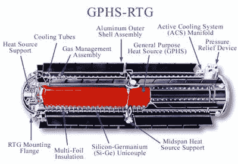
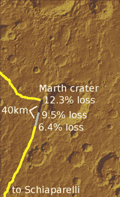

# 《火星人》中的火星黑客

> 原文：<https://hackaday.com/2017/06/30/hacking-on-mars-in-the-martian/>

自《黑客帝国》一书，安迪·威尔的[《火星人》自助出版以来，已经过去了 6 年，电影也已经上映了 2 年。在《T3》之前，我们已经简单地讨论过《T2 》,但是足够的时间过去了，我们现在可以写这本书更有趣的内容，同时小心不要泄露任何情节剧透。这本书比电影有更多的漏洞，所以我们用这本书作为来源。](http://www.andyweirauthor.com/books/the-martian-movie-tie-in-tr)

对于任何不熟悉这个故事的人来说，马克·瓦特尼是一个独自在火星上等死的宇航员。为了生存，他有一个为六个人设计的栖息地，称为 Hab，两个漫游者，他们到达的火星登月舱(MDV ),以及火星登月舱(MAV)的底部，顶部是他的五名宇航员离开时乘坐的火箭，当时他们把他一个人留在了这个荒凉的沙漠星球上。如果你还没有读完，用一个漫长的周末很容易读完。帮你自己一个忙，今天下班后去拿。

## 制造水

瓦特尼主要关心的是食物。他们送来了一些土豆，目的是让它们的眼睛长出根来。为了种土豆，他需要水。

珍贵的氢分子的一个成分当然是氧。微型飞行器的底部不产生氧气，但它从火星大气中收集二氧化碳并以液态形式储存起来。这是生产火箭燃料的一个步骤，之后用于从地表发射。

对瓦特来说，从二氧化碳中获取氧气是很容易的。在 Hab 中有一种叫做充氧器的装置，它的作用是吸入人类呼出的二氧化碳并提取氧气。接下来，他需要氢，也就是 T4 中的氢，这就需要一个化学黑客。

#### 入侵燃烧系统


Fueling the [MESSENGER space probe](https://en.wikipedia.org/wiki/MESSENGER) with anhydrous hydrazine

在机组人员降落在 MDV 的过程中，他们没有用完所有的燃料，其中包括[肼、N[2]H[4]。将 N [2] (氮气)从 H [4] 中分离出来很容易，他只需用铱催化剂就可以了，MDV 也有这种催化剂。该反应的一个副作用是释放一些剩余的氨，NH [3] ，但这是顺便提及的一个麻烦。](https://en.wikipedia.org/wiki/Hydrazine#Rocket_fuel)

```
3 N2H4 → 4 NH3 + N2
N2H4 → N2 + 2 H2
4 NH3 + N2H4 → 3 N2 + 8 H2
```

钻机的其余部分是整洁的。他用宇航服的空气软管制作了一个烟囱，并对其进行排列，使氢气(反应产生的热量)上升。烟囱里的火焰燃烧上升的 H [2] ，与空气中的氧气燃烧，留下水:H [2] O

它实际上留下的是潮湿的空气，Hab 的水回收器将这些空气转化为液态水。火焰本身来自从一个已故宇航员的宗教十字架上砍下的木头碎片。沃特尼在少量氧气的存在下用电火花点燃了碎片。

#### 欺骗生命维持系统

然而，他的努力并非一帆风顺。他没有注意到一些氢气通过了烟囱里的火焰，积聚在空气中。意识到这一点后，他测量出空气中含有 64%的氢，这是一个在氧气中极易爆炸的量。

所以他决定将氧气减少到 1%，然后一次烧掉一点氢气。问题是，Hab 的空气调节器决定空气中允许多少氧气，不会让它低于 15%。为了欺骗它，他将一个充满氧气的袋子绑在调节器的一个传感器上，此时它认为空气中的氧气比实际多得多，并继续允许氧气下降到所需的 1%。

## 用放射性作弊

[](https://hackaday.com/wp-content/uploads/2017/06/cutdrawing_of_an_gphs-rtg.jpg)

[GPHS-RTG](https://en.wikipedia.org/wiki/GPHS-RTG) used in the [Cassini probe](https://en.wikipedia.org/wiki/Cassini%E2%80%93Huygens)

MAV 配备了一个[放射性同位素热电发电机(RTG)](https://en.wikipedia.org/wiki/Radioisotope_thermoelectric_generator) ，一个包含 2.6 公斤(5.7 磅)钚-238 的发电机。这释放出将近 1500 瓦的热量，然后用来产生 100 瓦的电力。当然，它含有丰富的辐射屏蔽。它的目的是发电，为回程生产燃料。瓦特尼几次利用这种简单的能源。用瓦特尼自己的话来说，“就像生活中的大多数问题一样，这个问题可以通过一盒纯辐射来解决”(来自日志条目:sol 199)。

他第一次使用它是在一次探险中帮助热漫游者 2 号寻找[探路者](https://en.wikipedia.org/wiki/Mars_Pathfinder)，这是一个美国宇航局的火星着陆器，其任务于 1997 年结束，载有火星上第一个 bug 的[。事实证明，将 RTG 用作加热器几乎就像把它放在火星车里一样简单。然而，它产生了太多的热量，所以瓦特尼用锤子从火星车的壁上移除塑料部分和固体泡沫绝缘材料，让一些热量逸出。](http://hackaday.com/2016/12/25/the-first-bug-on-mars/)


RTG heating return cold air

随着故事的进展，瓦特尼需要进行一次更长的旅程去[斯基帕雷利陨石坑](https://en.wikipedia.org/wiki/Schiaparelli_(Martian_crater))，还是在漫游者 2 中，为了有足够的可呼吸空气，瓦特尼必须带上 Hab 的空气调节器。如上所述，空气调节器分析空气并控制氧气 [2] 和一氧化碳 [2] 的含量。为此，它首先进行光谱分析，然后通过过冷来分离气体。幸运的是，火星通常足够冷，这种冷却可以通过简单地将气体输送到位于户外的隔间来完成。问题是冷空气必须被重新加热才能被呼吸。对于他在漫游车中的长途旅行来说，那会消耗太多的能量。

进入 RTG，那个看似无限的热源。瓦特尼将调节器的冷空气输出软管放入一个塑料盒中，在那里他将它卷起来，并在上面戳一些小洞。然后，他把盒子装满水，把 RTG 浸没在水中。当冷空气通过软管进入时，RTG 加热水。然后它通过小孔离开软管，在水中冒泡，同时被加热。

## 用太阳能电池板绘制沙尘暴地图



Mapping the dust storm

在乘漫游者 2 号前往斯基帕雷利陨石坑的旅途中，沃特尼遇到了一场沙尘暴。他需要弄清楚风暴向哪个方向移动，以及风暴的形状，这样他就不会在风暴越来越厚的地方驶入风暴。

由于他从太阳能电池板获得电力，他立即查看前一天的发电量，发现其为最佳值的 97%。太阳能是从阳光中产生的，而灰尘显然阻挡了阳光。这让他知道如何判断风暴的形状。他将在风暴中的不同地点同时进行太阳能发电测量。

为此，他会放下一块太阳能电池板，向南行驶 40 公里，放下另一块，然后再向南行驶 40 公里，放下另一块。在同一时间内各自产生的电量将告诉他哪里的风暴更厚(更高的效率损失)和更薄(更低的效率损失)。

为了同时进行测量，他小心翼翼地从随身携带的额外 EVA 宇航服上取下相机。他的电子设备包括大量的功率计，所以每台相机都会拍摄其中一个。相机会在每张照片的左下角插入一个时间戳。所有这些都放在一个密封的容器里，为了在火星的夜晚保持温暖，他让一些能量通过电阻，电阻会变热。所有这些都是由太阳能电池板和一些备用电池供电的，这些电池也是从舱外航天服中取出的。

准备这一切需要时间，之后他测量他的常规太阳能电池板产生了多少电力。发电量从之前读数的 97%降至最佳值的 92.5%。这告诉他风暴移动的方向，西方。

他走了 40 公里的台阶放下电池板，然后折回来，他发现最北端的效率损失为 12.3%，中间的效率损失为 9.5%，最南端的效率损失为 6.4%。这意味着风暴的形状是这样的，最厚的部分在他的北面。因此，他向南行驶，然后像以前一样继续向东行驶。

## 十六世纪的全球定位


A sextant in use

在瓦特尼乘坐漫游车的漫长旅程中，他必须在没有地标的情况下计算出自己的经纬度。火星的轴线指向天津四。知道了这一点后，瓦特尼用一个六分仪计算出了他的纬度，这个六分仪是由一个用来观察的空心管、一根绳子、一个砝码和一些标有度数的东西制成的。

然而，经度在历史上一直是一项更艰巨的任务，需要发明一种精确的计时器，如果你想要一种在海洋上摇摆的船上工作的计时器，这可不是一件容易的事。幸运的是，瓦特尼有足够多的计算机来告诉他当前的时间，他还有卫星火卫一，它绕火星运行的时间不到一个火星日。为了得到经度，他只需观察火卫一何时下降到地平线以下，然后将时间代入他计算出的复杂公式中。

## 离开火星

这本书里我最喜欢的一点可能是巧妙利用太阳能电池板来测量沙尘暴中灰尘的厚度。我们之前并不是没有看到太阳能电池的巧妙用途，这个[球平衡轮](http://hackaday.com/2015/02/19/balancing-a-ball-with-a-solar-cell/)就是这样一个例子。从书中或电影中，你认为最聪明的，或者是你自己做过的，是什么？也许我们漏掉了一个。请在评论中告诉我们，请尽量不要剧透评论，或者至少先给我们一个警告。