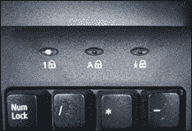
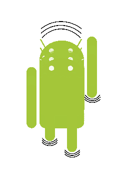
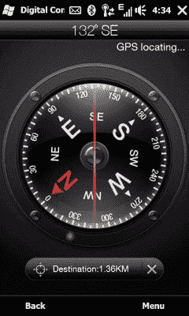
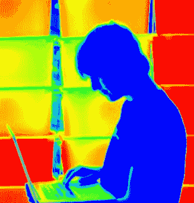

# 黑客攻击以太:数据如何穿越空气间隙

> 原文：<https://hackaday.com/2017/02/02/hacking-the-aether/>

非常有趣的是，计算机系统中有多少部分能够以难以想象的方式泄露数据。保护高度敏感位置的一部分包括保护这些设施中使用的计算机和网络，以防止这种情况发生。随着恶意行为者越来越多地将重要基础设施作为目标，这些 IT 安全策略和实践多年来一直在不断发展和收紧。

有时，当在一个重要的计算机系统上实施强有力的安全措施时，会使用一种叫做空气间隙的技术。**空气间隙**是一种或一组措施，用于确保安全的计算机与不安全的网络(如公共互联网或不安全的局域网)在物理上隔离开来。有时只是为了确保电脑不联网。但这可能意味着彻底隔离电脑:移除 WiFi 卡、摄像头、麦克风、扬声器、光盘驱动器、USB 端口或任何可用于交换数据的东西。在这篇文章中，我将深入研究气隙计算机、气隙隐蔽信道，以及攻击者如何能够从这种孤立的系统中窃取信息。

这里介绍的许多技术(但不是全部)要求以前的入侵已经危害了孤立的机器(通常在此过程中安装某种恶意软件)。这可能是通过社会工程攻击、监守自盗、秘密特别行动或任何你想到的詹姆斯·邦德场景发生的，对于当前的文章范围并不重要。尽管恶意软件的传递机制引发了一个有趣的问题和讨论，但本文的范围是如何在数据遭到破坏后(如果确实需要破坏的话)泄漏数据。

## 什么是气隙隐蔽信道？

气隙隐蔽信道可以被定义为用于在物理上隔离的系统之间发送和/或接收数据的任何无意的信道，并且根据策略，这些系统未被授权彼此通信，其中在发射器、接收器或两者处采取气隙措施。非故意是指通道最初不是设计用作数据通道，例如调制解调器 led。尽管在目标系统上可能需要一些额外的软件(恶意软件)来使特定的隐蔽通道可行，但是在这样的系统上没有安装额外的硬件。然而，在某些情况下，攻击者端可能有特定的硬件。

也就是说，也有一些方法可以在没有任何干预的情况下远程监控系统。过去已经表明，监测 CRT 显示器甚至 LCD 发出的辐射是可能的。你们中的一些人可能听说过这种形式的计算机监控，通常被称为 Van Eck phreaking 或 TEMPEST(尽管 TEMPEST 比这种形式的监控要广泛得多)。可以监听计算机键盘，每个键被按下时会发出稍微不同的噪音，因此可以记录击键，而实际上不需要记录软件。即使是 CPU 发出的高频噪声也可能包含有关正在执行的指令的信息。

有各种各样的气隙秘密通道，自然组织它们的一种方式是通过它们用来实现目标的物理通道。目前，研究人员已经能够使用不同的介质实现这样的通道，例如:

*   物理媒体
*   听觉的
*   光
*   地震的
*   有吸引力的
*   热的
*   电磁的

为了便于解释，当发送方/目标方没有任何修改，并且接收方/攻击者实质上正在进行资源的远程嗅探时，我将使用通道作为被动通道。相比之下，当需要某种软件在发射器/接收器上运行时，我将使用术语*主动*，通常是通过先前的攻击。

## 物理媒体

通过物理媒体传播恶意软件已经是旧闻了。在不太遥远的过去，当电脑用户交换盗版游戏 T2 的重要信息时，软盘差不多就是病毒传播的方式。CD-ROM 速度变慢，几乎扼杀了这种现象，但 USB 驱动器又把它带了回来。

Stuxnet、Fanny 和 Gauss 是一个计算机蠕虫家族，它们使用 USB 驱动器作为载体，通过在 raw FAT 结构中创建的隐藏存储区域向运营商发送/接收请求，从而弥合空气间隙。每当 USB 驱动器连接到具有互联网连接的受感染计算机时，它就会连接到 C&C 服务器，并将附加组件和命令部署到隐藏存储。当它被插回一个有气隙的系统时，它会再次运行命令并收集情报。

## 听觉的

说到声学隐蔽信道，已经做了很多研究。这可能有两个原因:计算机(发射器)以几种不同的方式发出声音或可以被驱动发出声音，接收器通常是普通的麦克风。

### 被动声学

![This guy is very inconspiculous[Source: EndoAcustica Parabolic Mic]](img/a3240dd433ee649b08d01c2462c88ee6.png)

这家伙很不显眼
【来源:[endocustica 抛物 Mic](http://www.endoacustica.com/microphone-dish.htm)

电脑发出噪音，很大的噪音。打印机发出噪音，键盘发出噪音，鼠标，冷却风扇，甚至主板上的电容器都发出超声波噪音。2004 年，Dmitri Asonov 和 Rakesh Agrawal 使用一种神经网络来分析电话和自动柜员机(ATM)上使用的计算机键盘和小键盘产生的声音，以识别按键。

同样在 2004 年，阿迪·萨莫尔、埃兰·特罗默和丹尼尔·根金证明，通过分析计算机主板上的电容器和电感器发出的超声波噪声，可以对执行加密操作的 CPU 进行定时攻击，并在运行 GnuPG 的笔记本电脑上成功实现了对 RSA 的攻击。

### 主动声学

据报道，安全顾问 Dragos Ruiu 在 2010 年发现了一种名为 BadBios 的恶意软件，它使用人耳听不到的高音来进行交流。这种恶意软件的存在是有争议的，但所谓的通信方法是可行的。

在 2013 年，Michael Hanspach 和 Michael Goetz 使用计算机扬声器和麦克风构建了一个利用近超声频率范围(17kHz-20kHz)上的音频调制/解调的隐蔽通道，并演示了如何通过超声音频通信构想一个隐蔽的声学网状网络。Fansmitter 是一种恶意软件，即使在没有音频硬件和扬声器的情况下，它也可以通过声音从有空隙的计算机中泄漏数据，因为它利用了 CPU 和机箱风扇发出的噪音。DiskFiltration 是另一种能够过滤数据的软件，但它使用硬盘驱动器发出的声音信号，通过操纵硬盘驱动器执行器的移动，使用寻道操作，使其以特定的方式移动，从而产生声音。

## 光

光也可以用于数据渗透。电脑上常见的发光设备(也称为显示器)可能是直接的选择，但还有其他设备，如键盘 led。具有 led 或显示器的其他设备也可以用于实现这种隐蔽通道的目的，例如打印机或调制解调器。在输入方面，来自智能手机甚至扫描仪的光读取传感器已经被用来演示如何将数据发送到被入侵的设备。

### 无源光

2002 年，M.G. Kuhn 等人证明，通过分析显示器从墙壁漫反射的光强，可以重建 CRT 屏幕的内容。这是可能的，因为 CRT 绘制的最后几千个像素的光强度泄漏了视频信号的低通滤波版本。LCD 不易受到这种攻击，但 Backes 等人发现，通过分析环境中物体(如茶壶、眼镜、瓶子、勺子和酒杯)的漫反射，也可以重建液晶显示器(LCD)屏幕的内容。使用望远镜镜头，它可以在 30 米外工作。

同样在 2002 年，J. Loughry 和 D. A. Umphress 证明了数据通信设备上的 LED 状态指示器显示出携带与设备正在处理的信息显著相关的调制光信号。许多不同种类的设备，包括调制解调器和路由器，都被发现易受攻击。窃听者可以通过测量发光二极管的光强度来推断通过这些设备发送/接收的信息。

### 活动灯

Blinking Scroll Lock

Hasan 等人表明，移动电话的环境光传感器(ALS 用于自动亮度和其他功能)来记录屏幕(LCD/TV)发出的光的变化，并证明了可以用屏幕作为发射器(例如，笔记本电脑屏幕)和当今许多智能手机中存在的具有 ALS 的移动电话作为接收器来实现低比特率渗漏通道。

J.Loughry 和 D. A. Umphress 实现了通过以 50 位/秒的速率用串行数据调制 Caps Lock LED 来传输 ASCII 数据的软件。他们表明，在足够高的速率下，普通用户不会注意到闪烁的 LED。使用红外(IR)光的传输也在某种程度上被研究过，但是由于大多数现代计算机不再包括 IR 硬件，人们失去了兴趣。

在 2014 年的黑帽欧洲会议上，阿迪·萨莫尔、尤瓦尔·艾洛维奇和默蒂·古丽展示了在空气间隙网络中感染了恶意软件的计算机如何通过计算机连接的多功能打印机的扫描仪接收和发送攻击命令。为了传输数据，攻击者需要在扫描过程中向扫描仪所在的房间照射可见光或红外线。扫描文档中略有不同的白色阴影代表发出的命令的二进制代码。

## 地震的

地震或振动通信是通过机械振动交换信息的过程。在某些情况下，通过电脑扬声器引发振动是可能的。几乎所有的手机和智能手机都能够使用振动器产生地震波。

### 被动地震

Marquardt 等人能够演示侧信道攻击，以重建键盘上的击键，该键盘位于配备加速度计的手机附近(最大几英寸)。仅使用振动而不是按键的声音来检测击键。

在 2009 年的 CanSecWest 大会上，研究人员展示了他们如何使用指向笔记本电脑背面的激光来推断击键。击键会导致笔记本电脑振动，他们可以用激光监听设备检测到这种振动，然后使用类似于语音识别的技术来确定正在键入的句子。

### 主动地震

Hasan 等人设计了一种方法来探索扬声器发出的低频声音，以诱导周围的振动。请注意，这不是使用声音本身作为媒介(尽管声音是一种机械波)，而是使用声音使某物振动。这种振动可以被加速度计检测到。带有超重低音扬声器的系统使这变得更加容易，因为它们能够产生更大的低频声音，从而产生更强的振动。

Deshotels 展示了相互联系的 Android 设备可以使用持续时间短至 1 毫秒的振动信号进行交流，并且振动不会被人类察觉。Halevi 和 Saxena 演示了移动电话的振动产生的声音信号可以被 3 英尺外的普通麦克风拾取，这是地震和声音通道的混合。

## 有吸引力的

Digital compass app

如今很难找到没有指南针的智能手机。具有磁力计功能的芯片负责测量磁场和检测磁北的位置。但这是一个和我们见过的任何其他传感器一样的传感器，只要有一点想象力，它也可以被滥用为一个通信渠道。

Hasan 等人探索了恶意软件通过磁力计(例如，电子罗盘应用程序)接收命令的假设。使用定制的电磁体来调制要传输到设备的信号，以引起磁力计的检测磁场的变化。他们设法证明了在 3.5 英寸的距离内无差错通信是可能的，但如果使用更强的电磁体，更远的距离也是可能的。在任何情况下，实现长距离都是有挑战的，因为磁场的强度与距离源的距离的立方成反比。

## 热的

*           Thermal imaging*

所有的电子器件都会产生过多的热量，需要热量管理来提高可靠性和防止过早失效。电脑也不例外。这通常是用风扇来完成的，我们已经看到了它们是如何被滥用来提供一个出口渠道的。温度的变化被证明是一个有效的数据通道，尽管速度非常慢。

Mirsky 等人演示了攻击者如何远程控制互联网连接的空调系统，使用单向热隐蔽通道向空气间隙系统上的恶意软件发送命令。Mordechai Guri、Matan Monitz、Yisroel Mirski、Yuval Elovici 创建了 BitWhisper，这是一款能够通过使用相邻被入侵计算机的热辐射和内置热传感器来创建隐蔽的双向通信通道(高达 8 位/小时)来弥合相邻被入侵计算机之间的空气间隙(高达 40 厘米)的软件。

## 电磁

也许最广为人知的秘密渠道是通过无线电频率(RF ),正因为如此，它可能是研究最多的。贝尔实验室最初注意到这个漏洞是在二战期间，当时贝尔电话公司向军方提供了一种名为 131-B2 的加密设备。他们有一台机器在实验室工作，偶然有人注意到机器每走一步，实验室远处的示波器上就会出现一个尖峰信号。他们更仔细地研究了这些尖峰信号，发现它们可以阅读被机器加密的信息的纯文本。这可能是风暴计划的灵感来源之一。

几乎所有的电子设备中都存在边带电磁辐射，尤其是在没有屏蔽的情况下。

### 无源射频

流行的 Van Eck phreaking 以荷兰计算机研究人员 Wim van Eck 的名字命名，他在 1985 年发表了一篇关于它的论文，允许窃听者通过远程检测 CRT 显示器的电磁(EM)发射来克隆其内容。在未屏蔽的 CRT 监视器中，成功地从 1 公里的距离以及 200 米的距离对屏蔽监视器进行了测试。此外，在 2005 年，库恩证明了液晶显示屏也容易受到类似的攻击。

无线键盘嗅探广为人知，但有线键盘嗅探…没那么多。Martin Vuagnoux 和 Sylvain Pasini 演示了从有线 USB 和 PS/2 键盘发出的电磁辐射可以被记录下来，并且可以从 5 米的距离解码击键。展示他们如何使用指向笔记本电脑背面的激光来记录动作和恢复按键的同一批人还设计了一种方法，通过监控 50 英尺外插座上的地线来从 PS/2 键盘上嗅出字符。去年，包括 Daniel Genkin、Lev Pachmanov、Itamar Pipman 和 Eran Tromer 在内的一个研究小组成功地在笔记本电脑使用椭圆曲线加密(ECC)解密密文时，在特定频率上监测到了笔记本电脑的电磁泄漏。该信号包含关于在 ECC 操作中使用的操作数的信息，足以恢复密钥。

### 有源射频

视频卡泄漏了大量的电磁辐射，事实证明它可以被操纵以选定的频率传输。AirHopper 是一个软件，它可以将计算机的视频卡转换为调频发射机，可以被标准的调频收音机捕获，甚至是智能手机内置的调频收音机。William Entriken 创造了一个系统总线无线电——一个 C 库，它可以让计算机发射无线电波，即使该设备不包括任何无线电传输硬件。

2015 年，Mordechai Guri、Assaf Kachlon、Ofer Hasson、Gabi Kedma、Yisroel Mirsky 和 Yuval Elovici 通过调用特定的存储器相关指令并利用多通道存储器架构将传输放大至 30 米，设法通过 GSM 从计算机中泄漏数据。他们使用带有 GSM 网络的基本低端手机，通过修改固件来接收数据。去年，Mordechai Guri、Matan Monitz、Yuval Elovici 发表了一篇论文，展示了软件如何能够有意地从 USB 2.0/3.0 连接器的数据总线产生受控的电磁辐射，这种辐射可以用 SDR 加密狗检测到。

## 其他渠道

空气间隙秘密通道的话题很吸引人。它不断表明，有时现实可能比间谍电影情节更有趣，所有那些不可能的小工具。当你把一个看似不可能的问题、难以置信的想象力和打破常规的思维放在一起，并达成一个可行的解决方案时，这说明了黑客行为的本质。质疑一切，接受没有边界或限制，并对一个系统是什么有一个整体的看法，而不是你被告知的系统是什么，这很可能是找到其他渠道或方法来弥合空气间隙的关键。

这篇文章无意助长读者的偏执。您的计算机仍然可以是安全的，只是不要去把您在停车场找到的 USB 笔插入您的地下，隔音，随机冷藏，磁屏蔽，法拉第笼，关闭计算机…

## 资源:

*   [http://www.jocm.us/index.php?m=content&c =索引&a =显示& catid=124 & id=600](http://www.jocm.us/index.php?m=content&c=index&a=show&catid=124&id=600)
*   [http://www.ruor.uottawa.ca/handle/10393/35103](http://www.ruor.uottawa.ca/handle/10393/35103)
*   [https://arxiv.org/ftp/arxiv/papers/1606/1606.05915.pdf](https://arxiv.org/ftp/arxiv/papers/1606/1606.05915.pdf)
*   [https://pdfs . semantic scholar . org/bb6a/dddfa 1 af 8 B3 a 006725 c 06d 8 cc 95 c 414 de 31d . pdf](https://pdfs.semanticscholar.org/bb6a/dddfa1af8b3a006725c06d8cc95c414de31d.pdf)
*   [http://applied-math.org/acm_optical_tempest.pdf](http://applied-math.org/acm_optical_tempest.pdf)
*   [https://www . usenix . org/legacy/events/sec 09/tech/full _ papers/vuagnoux . pdf](https://www.usenix.org/legacy/events/sec09/tech/full_papers/vuagnoux.pdf)
*   [https://www . usenix . org/system/files/conference/usenix security 15/sec 15-paper-guri-update . pdf](https://www.usenix.org/system/files/conference/usenixsecurity15/sec15-paper-guri-update.pdf)
*   [http://cyber . bgu . AC . il/content/how-leak-sensitive-data-isolated-computer-air-gap-near-mobile-phone-air hopper](http://cyber.bgu.ac.il/content/how-leak-sensitive-data-isolated-computer-air-gap-near-mobile-phone-airhopper)
*   [http://cyber.bgu.ac.il/blog/bitwhisper-heat-air-gap](http://cyber.bgu.ac.il/blog/bitwhisper-heat-air-gap)
*   [https://www . wired . com/2015/03/steering-data-computers-using-heat/](https://www.wired.com/2015/03/stealing-data-computers-using-heat/)
*   [http://cyber.bgu.ac.il/t/USBee.pdf](http://cyber.bgu.ac.il/t/USBee.pdf)
*   [https://www . Symantec . com/connect/blogs/mind-gap-are-air-gap-systems-safe-breakions](https://www.symantec.com/connect/blogs/mind-gap-are-air-gapped-systems-safe-breaches)
*   [http://www . computer world . com/article/2834634/all-in-one-printers-can-use-to-control-air-gap-systems . html](http://www.computerworld.com/article/2834634/all-in-one-printers-can-be-used-to-control-air-gapped-systems.html)
*   [https://github.com/fulldecent/system-bus-radio](https://github.com/fulldecent/system-bus-radio)
*   [http://news . softpedia . com/news/emitting-radio-waves-from-a-computer-with-no-radio-transmitting-hardware-501260 . shtml # sgal _ 0](http://news.softpedia.com/news/emitting-radio-waves-from-a-computer-with-no-radio-transmitting-hardware-501260.shtml#sgal_0)
*   [http://news . softpedia . com/news/experiment-gets-encryption-key-from-computer-in-another-room-through-the-wall-500701 . shtml](http://news.softpedia.com/news/experiment-gets-encryption-key-from-computer-in-another-room-through-the-wall-500701.shtml)
*   [http://security affairs . co/WordPress/35298/hacking/bit whisper-air-gap-PCs . html](http://securityaffairs.co/wordpress/35298/hacking/bitwhisper-air-gapped-pcs.html)
*   [https://arxiv.org/abs/1503.07919](https://arxiv.org/abs/1503.07919)
*   [https://securelist . com/blog/research/68787/a-fanny-equation-I-am-your-father-stu xnet/](https://securelist.com/blog/research/68787/a-fanny-equation-i-am-your-father-stuxnet/)