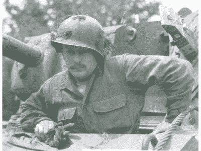
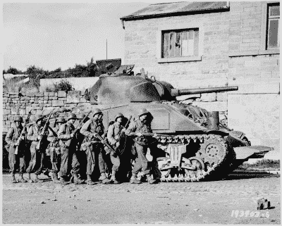

# 黑客当它算数:美国大兵的独创性

> 原文：<https://hackaday.com/2015/09/25/hacking-when-it-counts-gi-ingenuity/>

对我们大多数人来说，黑客是一种爱好，一种从现实中愉快地转移的方式。是的，我们很多人都在从事有可能改变世界的项目——看看 2015 年[黑客日奖半决赛名单](http://hackaday.com/2015/08/24/100-semifinalists-for-the-2015-hackaday-prize/)就知道了。但总的来说，我们中的几乎任何人都可以在任何时候离开商店，而不会产生可怕的后果。事实上，这就是为什么我们的工作台上到处都是项目，这些项目开始的初衷是好的，但由于缺乏资金、缺乏兴趣或缺乏时间而没有完成。我们可以自由地或多或少地愿意搁置一个项目，并在我们高兴的时候回来，或者根本不回来。

但不是每个人都有这种奢侈。对一些人来说，黑客不仅仅是一种爱好，而是一种生存手段。有时，人们会陷入这样的境地，他们不得不用手边的任何东西草草解决眼前的问题，而失败的代价远高于凌乱的长椅和受伤的自尊。我已经报道过一个这样的案例，生物破解胰岛素在二战中拯救了被占领的上海的数百条生命。

在这个不定期的系列中，我将探索黑客真正重要的历史案例；在绝望的条件下，黑客拯救或改善生命的案例。

### 树篱中的忙乱

不出所料，战争为在恶劣环境下的现场应急解决方案提供了大量机会，战场条件可能是黑客攻击最极端的例子。

在第二次世界大战诺曼底登陆的早期，盟军在处理法国北部的博卡奇地形时遇到了困难。牧场和林地的混合物，诺曼底海滩是盟军坦克的天然杀戮场，因为林地是灌木树篱的形式——顶部覆盖着浓密灌木丛的土堤。灌木树篱分隔了牧场，控制了牲畜，但也让步兵和机械化骑兵的日子不好过。爬上陡峭的树篱使脆弱的坦克底部暴露在敌人的炮火下，等待工程师用炸药拆除树篱使他们成为德国炮兵的活靶子。盟军的前进受到了灌木树篱的严重阻碍，人员和物资都从德军固定的阵地上被筛选下来，这些阵地是专门为了利用波卡奇地形而选择的。

Sgt. Curtis G. Culin (source: [Cranford (NJ) Patch](http://patch.com/new-jersey/cranford/cranford-soldier-invented-world-war-ii-tank-tusks))

柯蒂斯·格拉布·库林三世中士出场。库林中士自己也是一名坦克兵，他敏锐地意识到自己在谢尔曼 M4 中是多么脆弱。树篱是问题所在，盟军司令部显然在入侵前就知道这个问题，但却没有为此做好准备。按照历史上每场战斗都有士兵冲锋在前的传统，库林中士和他的坦克伙伴们不得不临时想出一个解决方案。

在讨论想法的时候，其中一个人建议在坦克前部设置锯齿，以切断树篱。他后来把这个评论归因于“一个叫罗伯茨的田纳西乡巴佬”，这个评论遭到了这群人的普遍嘲笑，认为这是一个异想天开的计划。但库林中士看到了这个想法的潜力，并开始将其开发成原型。

Rhino-equipped tank (source: [Wikipedia](https://en.wikipedia.org/wiki/Rhino_tank))

他的原型的原材料并不难获得。捷克刺猬，由交叉钢梁制成的巨大反坦克屏障，仍然散落在诺曼底海滩上。失败的德国防御是用切割火炬收集的，并焊接到坦克的底部，在铁轨之间的船体上形成一系列“象牙”。装备了这些獠牙，坦克现在可以在灌木丛生的灌木堤坝上炸开。

当展示给奥马尔·布拉德利将军看时，他被深深地打动了，于是订购了大量的坦克。最终，原型变成了工程产品(被称为“库林犀牛装置”)，在从英国运来之前，它被安装在许多坦克上。装备犀牛的坦克横扫诺曼底，粉碎了德国的作战计划，该计划认为树篱将引导盟军通过重兵防守的咽喉要道。

如果没有库林中士的《战地黑客》和一个被历史遗忘的名叫罗伯茨的乡巴佬给他的灵感，入侵欧洲可能会走上一条完全不同的道路。事实上，他是在受到攻击的情况下进行黑客攻击的，这让人印象更加深刻，是黑客攻击的一个完美例子。

知道更多的黑客攻击的例子吗？[给我们发送一个提示](mailto:tips@hackaday.com?Subject=[When It Counts])，以便在将来*黑客攻击时使用*文章。

【Jesse CC-BY-SA 3.0 拍摄的捷克刺猬主图】