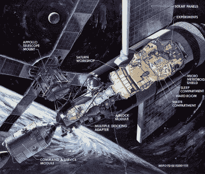
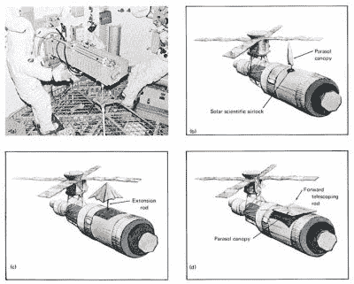
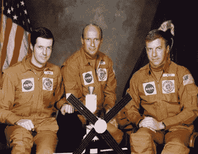
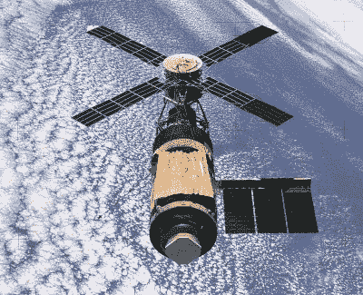

# 重要的时候黑客入侵:许多空间站黑客拯救了天空实验室

> 原文：<https://hackaday.com/2015/10/14/hacking-when-it-counts-much-space-station-hacking-saved-skylab/>

多亏了霍华德和汉克斯以及其他人的开创性工作，这个世界非常熟悉或许是有史以来最伟大的黑客行动背后的故事，拯救了瘫痪的阿波罗 13 号任务。但是阿波罗 13 号远不是英雄太空黑客的唯一故事。从修理失明的哈勃太空望远镜到危险的冷却系统和国际空间站上的[其他修理](http://hackaday.com/2014/01/17/the-pioneering-lifestyle-in-low-earth-orbit/)，载人和无人航天都可以被视为一系列的黑客攻击和修理。

然而，远在国际空间站之前，美国第一个载人空间站“天空实验室”几乎从未实现。由于在发射过程中受损，电力和热能都瘫痪了，在第一批宇航员到达之前，整个项目几乎被废弃了。这是一个关于天空实验室如何形成的故事，一个团队如何团结起来解决一系列问题，以及天空实验室如何在一开始就处于不利地位的情况下取得成功。

### 入侵空间站

America’s first space station

当美国宇航局在 20 世纪 60 年代设计其载人航天计划时，它知道如果他们成功实现肯尼迪总统在 1970 年将人送上月球的目标，它将需要一个安可。因此，即使当双子座和阿波罗仍在排练登上月球所需的动作时，最终将作为美国第一个载人空间站飞向太空的设计正在定稿。

利用运载火箭废弃的上面级作为空间站基础的想法至少可以追溯到 20 世纪 40 年代，当时韦纳·冯·布劳恩推测在他有生之年将人类送上月球需要什么。在 60 年代，该设计的各种迭代不断出现，包括将空间站的整个生活和工作区放在上级火箭的活动液氢燃料箱内的设计；到达轨道后，多余的氢气将被清除，燃料箱将由氧氮气氛加压。

“湿车间”的设计最终输给了“干车间”的想法，装备齐全的实验室和栖息地建在一个 [S-IVB](https://en.wikipedia.org/wiki/S-IVB) 级内，该级通常作为完整的[土星 V](https://en.wikipedia.org/wiki/Saturn_V) 栈的第三级。命名为“天空实验室”的空间站为三名宇航员提供了实验室和生活空间，执行为期一至三个月的任务。天空实验室的一端配备了一个太阳天文台和阿波罗指挥服务模块(CSM)的对接适配器，其任务是研究地球和太阳，并在整个实验室内进行空间医学和其他微重力实验。

### 陷入困境的任务

1973 年 5 月 14 日，天空实验室作为一项无人驾驶任务发射升空。天空实验室安装在土星 V 第三级通常会进入的地方，坐落在有效载荷护罩中，从一开始就遇到了麻烦。除了早期检测到的横向加速度，天空实验室 10 分钟的轨道之旅平安无事。一旦进入轨道，空间站就开始准备接受第一批宇航员，计划在他们的家园升空并运行后不久升空。天空实验室的天文台和太阳能电池板风车部署正确，但任务控制人员很快开始发现异常。遥测技术告诉他们，微流星体防护罩还没有展开，车间内的温度已经接近危险水平。更重要的是，天空实验室的电力生产严重低于规格。

随着控制人员仔细研究遥测技术，一幅 460 公里高空的画面开始浮现。发射过程中的横向加速是由微流星体防护罩的结构故障造成的，该防护罩旨在保护乘员免受空间碎片的穿透，并遮挡工作间始终面向太阳的一侧。当它被撕裂时，护盾将安装在车间一侧的两个太阳能电池板中的一个完全撕裂，同时剩余的电池板被碎片堵塞，使其无法完全展开。

天空实验室原本是阿波罗计划成功的后续项目，现在已经进入轨道，但完全无法使用。

拯救天空实验室的第一步是操纵航天器控制内部的热量积累。第一批宇航员在太空中一个月所需的一切——食物、燃料、仪器、胶片——都在高达 77 摄氏度的温度下缓慢烘烤。在没有隔热罩的情况下，唯一的选择是调整天空实验室的方向，使尽可能小的表面直接暴露在阳光下。虽然这使温度保持合理，但它消耗了宝贵的姿态控制燃料，加上它使剩余的太阳能电池阵列在大部分时间里处于黑暗中，导致了电力问题。尽管如此，演习成功地平衡了电力生产和温度控制，并赢得了足够的时间来解决这个问题。

### 五月的十一天

很明显，除非第一批工作人员能够安装隔热罩来替换丢失的隔热罩，否则整个 22 亿美元的天空实验室任务将在开始前结束。其次是解决部分展开的太阳能电池阵列的问题，这样天空实验室就有足够的电力来运行所有预定的科学项目。工程师和机组人员现在推迟发射，因为他们仍在隔离中，戴着医用口罩，开始并行解决这两个问题，进行了马拉松式的头脑风暴和设计-建造会议，后来被称为“五月的十一天”

Don’t forget to pack your umbrella.

如果没有太空行走，隔热罩的问题似乎是无法克服的，但是美国国家航空航天局不愿意在没有适当的地面预演的情况下进行太空行走。幸运的是，天空实验室在车间里设计了一个小气闸，允许在真空的太空中进行实验。更幸运的是，气闸位于飞船向阳的一侧，因此是开发遮阳的天然港口。几个设计被反复讨论，但获胜的设计基本上是一个聚酯薄膜阳伞，带有一个可折叠的激波管框架，可以通过小气闸展开。在天空实验室中性浮力模拟器中进行的测试完善了设计，最终产品被运送到好望角进行发射。

解决电力问题将被证明是一个更为棘手的问题。遥测显示幸存的阵列被碎片堵塞，于是计划通过 CSM 舱口进行“直立 EVA”以清除堵塞。但是工具是需要的，而 NASA 的工具库里没有一样东西符合这个要求。为了寻找灵感，马歇尔航天中心的工程师们搜查了当地的一家五金店，发现了一个杆上安装的树木修枝剪。给当地制造商打了一系列电话，结果从一家为电力行业制造工具的公司选择了一个电缆切割器和一个撬具，讽刺的是。这些工具很快被改装，安装在一根可折叠的 3 米长的杆子上，然后运到好望角。

### 有点旧房子

The Fix-It Guys: Kerwin, Conrad, and Weitz

1973 年 5 月 25 日,“天空实验室 2 号”的机组人员皮特·康拉德、约瑟夫·科文和保罗·韦茨终于抵达他们的家，准备在那里呆一个月。他们发现这个地方和广告宣传的差不多，在进行了一次侦察飞行后，他们打开舱门，开始着手处理被卡住的阵列。尽管他们做出了努力，并且通过开放频道稳定的 NSFW 语流产生了功率放大效应，但阵列仍然卡得很紧，所以船员们放弃了，与他们的新家对接。

阳伞通过气闸展开，温度迅速下降。后来的全舱外航天服将使卡住的太阳能电池阵列展开，加上 7 千瓦的电力预算和现在合理的内部温度，天空实验室最终启动并运行。

Parting shot as Skylab 4 leaves

天空实验室最终让三组三人飞行了总共 171 天。天空实验室 4 号在太空停留了 84 天，保持了多年来在太空停留时间最长的记录。虽然它从未打算成为一个永久的空间站，但让新的航天飞机访问空间站并提升其轨道的计划从未实现，在经过近 35，000 次轨道运行后，天空实验室终于在 1979 年 7 月在澳大利亚内陆上空返回地球。对于一台在雨伞和一些五金店物品的帮助下战胜了困难的机器来说，这是一个悲伤而不光彩的结局，也是一个团队在问题解决之前不会放弃黑客攻击的奉献精神。

知道更多的黑客攻击的例子吗？[给我们发送一个提示](mailto:tips@hackaday.com?Subject=[When%20It%20Counts])，以便在将来*黑客攻击时使用*文章。

[所有图片由美国宇航局提供]