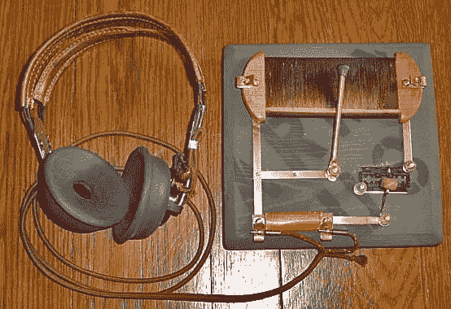
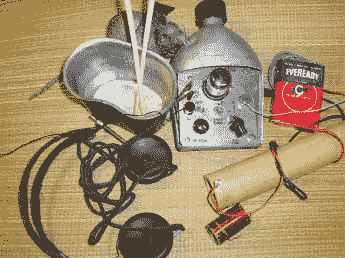
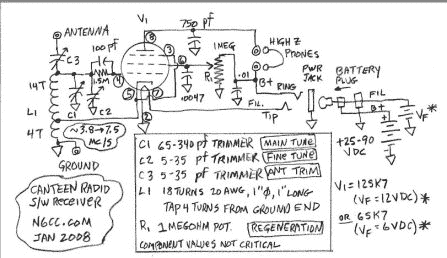

# 重要的时候黑客入侵:战俘食堂无线电

> 原文：<https://hackaday.com/2016/04/21/hacking-when-it-counts-pow-canteen-radios/>

在所有降临在战士身上的恐惧中，被敌人俘虏可能是最糟糕的。随着战斗中的死亡，痛苦结束了，但随着在战俘营的拘留，说不尽的痛苦可能等待着。酷刑、饥饿、奴役和教化的故事在某种程度上伴随着每个国家战俘营的历史，甚至在不久前受到海牙和日内瓦公约所谓的文明化影响的时候也是如此。

但是，即使是最人道的对待战俘普遍遭受一件事:缺乏信息。在你不在的时候不知道战争是如何进行的，这本身就是一种折磨，战俘们会想尽一切办法获取信息。从第二次世界大战开始，熟悉电子新领域的被囚禁的士兵和水手们开始利用他们能找到的任何材料和充足的时间，拼凑出一个基本问题的解决方案，“战争进行得如何？”这是一个关于一些战俘在看似不可能的条件下设法组装救生无线电的故事。

### 散兵坑里没有无神论者

许多动力无线电是散兵坑无线电的延伸，散兵坑无线电是二战中士兵们的常见消遣。一个生活在战场上的足智多谋的士兵可能会搜刮或抢劫一台完整的收音机，或者至少可以收集一些零件来制作一个像样的再生接收器，用于战场上的新闻和娱乐。但是即使是这样一个普通接收机的本地振荡器也可能被敌人探测到，所以晶体收音机是首选。除了一个调谐电路和一个由安全别针和剃刀片拼凑而成的整流器，水晶散兵坑无线电无法被探测到，可以用来调谐商业广播和军事传输。

A replica foxhole crystal set. Photo credit: [J.G. Jackson](http://s203.photobucket.com/user/jgj6331/media/DSC01629.jpg.html)

散兵坑无线电很容易在战俘营中复制，而且在某种程度上可能比在战场上操作得更好。战俘们经常利用集中营围栏里长长的带刺铁丝网作为天线，而集中营产生的废物给了他们大量的机会去偷零件。

考虑到这一点，许多 POW 黑客想方设法改进他们的散兵坑无线电。最明显的改进是在线圈中添加一个电容，以创建一个合适的 LC 电路，而不是依赖于天线的杂散电容。获得一个可变电容器来调谐收音机是一个更大的妙招。

### 生死黑客

从散兵坑式水晶装置升级而来的是一个简单的再生接收器。在战俘营中更丰富的搜寻和更大的找到电源或电池能量的可能性导致了这些接收器，从一个隐藏它们的常见方式被归类在食堂收音机的总标题下。

一个特别有据可查的建筑是美国业余无线电操作员拉塞尔·哈奇森上尉的建筑。当被日本人关押在菲律宾的 Cabanutuan 集中营时，他在一个标准的 GI 食堂里建造了一个相当复杂的单管再生接收器。

  N6CC’s working replica of Hutchison’s canteen radio. [Source.](http://www.n6cc.com/canteen-radio-receiver)  

哈奇森相对幸运，被选为营地的修理工；甚至日本人也依靠他来修理他们的装备。被日本士兵抢劫的收音机被送到和记黄埔修理，被偷的零件开始堆积。最终，哈奇森船长有了足够的零件来制造他的收音机，这种收音机足够灵敏，可以用织在晾衣绳上的隐蔽天线复制远在旧金山的短波信号。

从不止一个方面来说，哈奇森的无线电是生死攸关的事情。最紧迫的问题是被发现与设置，这将导致即决处决。为了避免这种命运，哈奇森采取了食堂以外的复杂措施，以确保尽可能少的人知道他的黑客行为。

尽管几次有惊无险，无线电始终没有被发现，哈奇森最终活着离开了营地。但是无线电扮演了另一个生死攸关的角色。无线电远不仅仅是打发空闲时间的一种娱乐，它还被用来监视入侵日本的进程。这些战俘实际上害怕一旦盟军的靴子踏上日本本土岛屿，他们的捕获者就会处决他们并销毁他们暴行的证据；无线电让战俘们领先一步，这样他们可以在子弹开始飞舞之前设法逃跑。

### 从无到有

尽管和记黄埔的技术令人印象深刻，但至少他制造出了可以使用的组件。还有其他 POW 黑客没有这么幸运，但仍然需要无线电提供的与外界的连接。在同样的生死攸关的情况下，这些黑客几乎从零开始制造无线电。以 R.G. Wells 中校为例，他是一名英国军官，被关押在婆罗洲的日本集中营。1942 年，他用发现的物体创造了超外差接收器的几乎所有部件。电容器是由茶叶盒的箔衬和几份珍贵的报纸碎片制成的，这些报纸不是用来在厕所里轮流使用的。电阻器是浸有烧焦的肉桂皮的细绳。裸线的绝缘方法是把从垃圾堆里捡来的面粉揉进棕榈油，然后粘在电线上。一个铬酸湿电池由 camp 药房捐赠的重铬酸钾和锌裤扣制成。当这被证明不足以给无线电供电时，威尔斯建造了一个化学电池，既可以整流营地的交流电源，又可以将电压降至可用水平。

威尔斯唯一不能凭空变出的部件是真空管和耳机。威尔斯的详细口述历史没有说太多关于电子管来自哪里，但它确实记录了耳机被走私到营地。如果有足够的时间，足智多谋的威尔斯上校无疑可以制造出耳机；事实上，一个名叫理查德·卢卡斯的越南战俘为他的散兵坑无线电建造了耳机，他使用了一个用蜡绝缘线包裹的钉子芯，放在一个竹制共鸣器中，用一个锡罐盖作为振膜。他报告说，这种耳机可以很好地听到几个电台，但如果有磁铁来偏置线圈，效果会更好。

尽管这些黑客令人印象深刻，但更令人惊讶的是，所有这些都是凭记忆完成的。这些战俘带着他们的狗牌和衣服来到营地，有时甚至没有衣服。没有参考书或小抄。这些人在不可能的条件下建造的电路，通常只有最原始的材料，可能是从战前几年的日日夜夜的实验中记忆的。他们的爱好在很大程度上得到了回报，并让他们度过了一个比我们任何人都可能想象的更困难的时期。