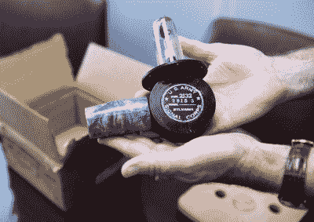

# 重要的时候黑客入侵:磁控管开战

> 原文：<https://hackaday.com/2018/06/11/hacking-when-it-counts-the-magnetron-goes-to-war/>

1940 年，英国处于危险的困境。近两年来，纳粹战争机器席卷了欧洲，占领了从挪威到法国的新月形地区的国家，切断了这个岛屿与欧洲大陆的联系。不列颠之战在英吉利海峡和该国南部海岸上空激烈进行，而闪电战则用每夜的炸弹和恐怖雨蹂躏伦敦。整个国家被动员起来，准备迎接希特勒不可避免的入侵部队横扫英吉利海峡，并声称另一个受害者。

我们之前已经看到，没有任何可能有助于扭转局势的想法被认为是太冒险或太疯狂而不能冒险。事实上，英国发明家丰富而绝望的头脑中产生的许多想法以他们从未预料到的方式影响了战争的进程。但有一项发明不仅影响了战争，而且有充分的理由成为其关键发明，如果没有这项发明，战争的结果几乎肯定会糟糕得多，这项发明将成为战后时代的关键技术，直接导致通信、材料科学等领域的创新。开发这个想法所冒的风险，空腔磁控管，以及基于它的现场可用系统，在范围和大胆程度上都是惊人的。这就是磁控管如何开战的。

## 简短但有力

在无线电早期的大部分时间里，大多数创新都是为了提供远距离通信。无论是无线电报、无线电话，甚至是无线电广播，距离都是驱动力。单个发射机能够到达的距离越远，在任意两点之间进行通信所需的链路就越少，广播能够到达的观众就越多。由于无线电频率传播的物理特性，这就把所有的行动都放在了更长的波长上，这个空间在光谱上的波长大约在 10 米到 100 米左右。

一些研究人员在光谱上看得更远，发现用厘米测量波长更好。这些频率对于长途通信或广播没有太大用处，但它们需要被探索和利用，因此生产它们所需的工具和技术必须得到发展。

其中一个用来产生短波无线电波的设备几乎是一个偶然的发现，就像许多伟大的想法一样，它开始是为了绕过别人伟大想法的专利保护。1917 年的情况就是如此，当时美国通用电气公司的研究员艾伯特·赫尔正在研究控制真空管中电子流的方法，而又不与李·德福瑞斯特的三极管专利相冲突。DeForest 的电子管使用电场来控制电子流，因此 Hull 用磁场来做同样的实验。赫尔将他的发明命名为“磁控管”他的雇主购买了三极管专利，这使得磁控管的进一步发展被搁置，但在此之前，赫尔发现，通过小心地将磁场控制在一个临界值，电子管可以发射比当时任何其他东西都短得多的无线电频率波，波长不到一米。

与此同时，世界各地的物理学家正在研究类似的技术，以产生更短的波长。德国和捷克科学家使用改进的三极管制造了第一个真正的微波(1 GHz 及以上)振荡器，后来以八木天线闻名的日本科学家 Hidetsugu Yagi 开发了自己的磁控管设计，产生的波长短至 5.6 厘米。荷兰、法国和英国的研究人员也参与进来，通过改变磁控管的设计，降低波长，同时增加辐射功率。

## 靴子和兰德尔

Cavity magnetron by [Mrjohncummings](https://commons.wikimedia.org/wiki/File:Original_cavity_magnetron,_1940_(9663811280).jpg) CC-BY-SA 2.0

随着战争一触即发，他们中很少有人会忽略这样一个事实，即强大的短波无线电波将对飞机的远程探测和无数其他用途非常有用。国家之间争夺微波霸权的竞争非常激烈——从 1920 年到 1945 年战争结束，全世界至少有 2000 项专利申请。同时发明的过程是一种人工选择的过程，在这个过程中，好的想法被迅速地识别出来并用于改进设计。这一过程产生了空腔磁控管，这是一种带有圆柱形中心空腔的设计，空腔周围有类似的孔，这些孔通过窄槽与空腔相连。在使用中，中心阴极发射电子，这些电子在强磁场的影响下围绕中心腔旋转，扫过槽并在共振腔内感应出强微波场。

正确设计的空腔磁控管可以产生强大的微波。对英国人来说，将空腔磁控管转变成工作装置的任务落在了伯明翰大学物理学家约翰·蓝道尔和哈里·布特身上。他们有一个简单而崇高的目标:建造一个波长为 10 厘米、功率为 1000 瓦的微波源，专门用于机载雷达，可以用来对抗德国人及其近乎夜间的轰炸袭击。

这将被证明是不平凡的壮举，因为在那个时候，启动和兰德尔甚至没有听说过空腔磁控管。但是他们做了功课，在几周内就造出了一个原型，能够在 9.9 厘米的波长下产生 400 瓦的功率。这一成功迅速导致了改进；一周后，他们实现了 1 千瓦的性能目标，在随后的几周内，10 千瓦甚至 25 千瓦的磁控管被制造出来。多亏了 Boot 和 Randall，磁控管几乎可以投入战斗了。

## 在大西洋彼岸

不幸的是，英国人遇到了一个问题。英格兰被敌人包围，在动员对抗即将到来的入侵时，几乎与外界隔绝，没有资源将靴子和兰德尔的磁控管变成可用的武器。他们面临着一个艰难的决定:保守秘密，冒着与他们同归于尽的危险，或者分享这个秘密，以便用来对付敌人。是时候向大西洋彼岸寻求帮助了。

与美国进行技术交换的想法是航空研究委员会主席亨利·蒂扎德的主意，磁控管就是在他的主持下设计的。Tizard 提出了一个基本上是给美国人的礼物，一包英国人所有的主要秘密。这一批技术宝藏不仅包括靴子和兰德尔磁控管，还包括近炸引信、塑料炸药、自封式燃料箱、火箭、增压器、瞄准器的设计，甚至详细说明核裂变炸弹可行性的论文。在丘吉尔的批准下，几乎每一个英国来之不易的秘密都将被交付给美国佬，没有任何附加条件，唯一的希望是两国之间不寻常的纽带和当时中立的美国的孤立和工业力量将导致一些有助于战争的努力。

Cavity magnetron built in the 1940’s being [unboxed in 2015 by the US Office of Naval](https://www.youtube.com/watch?v=veJ7Glm_Qhg) Research

六个人，大部分来自军队，组成了所谓的“提扎德任务”他们伴随着这个秘密储藏，其中包括一个 Boot-Randal 磁控管的工作原型，踏上了穿越北大西洋 U 型潜艇出没水域的几乎不可思议的冒险旅程。不知何故，蒂扎德使团安全抵达新斯科舍省的哈利法克斯，然后被迅速送往华盛顿 DC 开会。

几周之内，磁控管的原型被移交给新泽西州的贝尔实验室，在那里制造了最终将在美国生产的 100 万个样品中的前 30 个。磁控管最终将变得足够小和轻，以用于机载雷达设备，而更大、更强大的版本将变成舰载和陆基设备。磁控管已经被武器化，毫无疑问，它影响了战争的进行。

历史学家詹姆斯·菲尼·巴克斯特(James Phinney Baxter)说，Tizard 任务带给美国的空腔磁控管是“带到我们海岸的最有价值的货物”尽管考虑到微波在从通信到烹饪的一切事物中的重要性和普及性，这肯定不是一个轻描淡写的说法，但很难理解这个简单的铁盒中包含的所有宝藏对 20 世纪下半叶的影响。无论是在战争时期还是在和平时期，Tizard 任务都为战后时代奠定了许多技术基础，而空腔磁控管则处于领先地位。