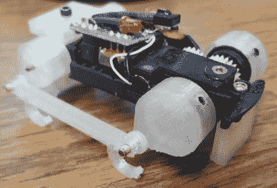

# 黑进国家航空航天局

> 原文：<https://hackaday.com/2016/12/08/hacking-your-way-through-nasa/>

上个月，2016 年黑客日超级大会在阳光明媚的加州帕萨迪纳举行。喷气推进实验室也是帕萨迪纳的家，火星漫游者在这里建造，探测器在太阳系周围导航，令人敬畏的太空事物在这里发生。

JPL 在 SuperCon 有一个很大的代表团，他们中的两个人合作发表他们的演讲:Charles Dandino 和 Lucy Du。露西是 JPL 大学的机电一体化工程师，她已经因为在 ABC 系列的最后两季中扮演战斗机器人而小有名气。查尔斯也在机电一体化领域，拥有好奇号、火星 2020 漫游车和即将到来的小行星重定向任务的经验。

在他们的谈话中，Charles 和 Lucy 揭露了一些发生在 JPL 后台的黑客行为。它们有很多，它们的影响比你想象的要深远得多。从遥控车到让太阳系另一边的宇宙飞船保持运行。

 [https://www.youtube.com/embed/i0V1uX9cXO8?version=3&rel=1&showsearch=0&showinfo=1&iv_load_policy=1&fs=1&hl=en-US&autohide=2&wmode=transparent](https://www.youtube.com/embed/i0V1uX9cXO8?version=3&rel=1&showsearch=0&showinfo=1&iv_load_policy=1&fs=1&hl=en-US&autohide=2&wmode=transparent)

就最近美国宇航局的黑客而言，在战神一号火箭的开发过程中出现了一个有趣的问题，这是被取消的星座计划的“小型”载人运载火箭。在火箭的开发过程中，工程师们注意到为第一级提供动力的巨大固体火箭助推器在乘员舱内引起了巨大的振动。从结构上来说，一切都很好，但人类是主要由水组成的脆弱的袋子，宇航员在受到这些振动时无法阅读数字显示。

解决这个问题最显而易见的方法是修复火箭的振荡。然而，这需要付出巨大的努力，就像修复飞行员模糊的视力这样简单的事情。找到了一个更好的解决方案，使用便宜的现成零件和一点代码。通过将加速计绑在乘员舱内的座位上，测量火箭振动的频率，数字显示器以相同的频率闪烁。这足以解决问题，而且它只用了很少很便宜的零件。

今天 JPL 最酷的临时工程是什么？查尔斯正在进行小行星重定向任务，这意味着找到一种方法来抓住一颗小行星，并将其拖回地球周围的某个地方。为此，该团队需要测试他们的设备，这意味着制造他们自己的一批小行星。

 我们确实没有很多关于小行星表面成分的数据。当然，美国国家航空航天局已经让“T3”着陆了,“T4”非常非常缓慢地撞上了小行星，欧洲航天局最近试图让“菲莱”着陆器在一颗彗星上着陆，但没有成功。总的来说，我们对小行星表面的感觉有一个概念，为了测试小行星重定向任务的夹钳，JPL 正在开发他们自己的泡沫混凝土混合物。它柔软、易剥落，完全不同于地球上经历了 40 亿年地质变化的任何东西。

在 JPL 的其他地方，工程师们正在为设备建造模型，他们希望这些设备能成为未来任务的一部分。这些模型从装载非常昂贵的传感器包的廉价遥控汽车到用 3D 打印零件和齿轮改装的风火轮汽车。

JPL 有悠久的实验传统。第一个火星漫游者——Sojourner，火星探路者任务中携带的小鞋盒大小的机器人——有一个新的，创新的摇臂转向架悬挂系统。当这个任务处于计划阶段时，这个悬挂系统是否可行还存在一些问题。一名工程师带来了这种新型漫游者的工作模型后，这些担心就烟消云散了。

总的来说，查尔斯和露西做了一个很棒的演讲，是什么让太空物质工作的。如果你在寻找非标准工程中最古怪、最有创意的应用，除了 NASA 和 JPL，你别无选择。