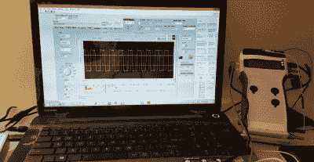
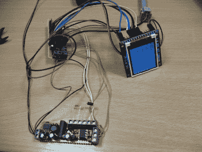
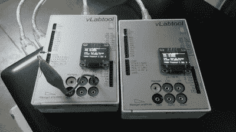
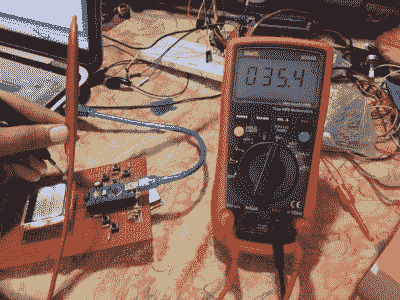

# hack let 104–测试设备项目

> 原文：<https://hackaday.com/2016/04/16/hacklet-104-test-equipment-projects/>

硬件黑客喜欢他们的测试设备。有很多论坛专门讨论万用表、示波器、信号发生器和其他常见的工作台工具。有时，我们似乎花更多的时间谈论我们的工具，而不是实际使用它们。对于一些人来说，现成的设备永远不够好。这些黑客、制造商和工程师设计并建造他们自己的测试设备。本周的 Hacklet 致力于介绍 [Hackaday.io](https://hackaday.io) 上一些最好的测试设备项目！

 我们先从【罗马】和[手持电子测试测量实验室](https://hackaday.io/project/9395)说起。[Roman]经常出差，经常需要随身携带一个实验室的工具。在经历了几次“随机”搜查后，他决定设计一个简单的工具来减少他的行李，并且不会让他被脱衣搜查。手持式实验室将万用表、低频示波器、数据记录器、波形发生器和其他几个工具集成在一个小包装中。该工具可以连接到 PC，以显示数据和更新设置。板载 PIC24 处理所有艰苦的测量工作。一些精心的模拟设计给这个工具 10 兆欧的输入阻抗。

 接下来是【雅罗米尔·苏库巴】带着 10$ [曲线追踪器](https://hackaday.io/project/595)。要想知道晶体管或二极管是否真的像数据手册显示的那样工作良好，唯一的方法就是拿出你的半导体曲线跟踪器。曲线跟踪器也非常适合为模拟合成器等项目匹配晶体管。[Jaromir]在仅仅两个晚上的过程中建造了这个快速而肮脏的追踪器。dsPIC 微控制器运行显示，通过向被测设备发送脉冲来生成 IV 曲线。一旦曲线被跟踪，PIC 在 TFT LCD 模块上显示结果。跟踪器有点受限，在 0.5 安培时最大电压为 35V。不过，据我所知，扩大范围只需要一两个晚上的工作。

 接下来我们有【Jithin】和[一个多功能的实验工具](https://hackaday.io/project/6490)。这个工具可以做你想做的任何事情——全部在一个盒子里。从示波器到频率计，从万用表到电流源，等等。就像上面的[Roman]一样，[Jithin]选择了一个微芯片 PIC24 MCU 作为他设计的处理核心。多功能 Labtool 通过 USB 连接到 PC。如果你不靠近你的电脑，一个 ESP8266 模块允许该单位通过 WiFi 连接。不过，个人电脑并不是必需的。车载有机发光二极管可随时用于快速测量。

最后，我们请来了拥有[工程师多功能工具](https://hackaday.io/project/6208)的【ZaidPirwani】，他是 2015 年 Hackaday 奖的参赛作品。[扎伊德]从流行的[晶体管测试仪](http://hackaday.com/2015/04/24/review-transistor-tester/)代码库开始。他将代码移植到自己的硬件上，一个 Arduino Nano 和诺基亚 LCD。创建端口功能所需的工作比[Zaid]预期的要多得多。他最终选择了一个新的存储库，并一次添加一点代码。一旦一切正常，[扎伊德]用一个老式的万用表验证了他的硬件设计运行正常。现在一切都正常了，[Zaid]在小 ATmega328 上的空间差不多用完了。下一站是小小的 3.2！

特别感谢[ [Jaromir Sukuba](https://hackaday.io/jaromir) ]建议将测试设备作为本周黑客攻击的主题。你可以在新的[测试设备项目列表](https://hackaday.io/list/11054-test-equipment-projects)中找到他的项目和更多内容！如果我错过了你的项目，或者你对未来的 Hacklet 主题有什么建议，不要害羞！[在 Hackaday.io 上给我留言](https://hackaday.io/adam)。这就是本周的 Hacklet。一如既往，下周见。相同的黑客时间，相同的黑客频道，带给你最精彩的 [Hackaday.io](https://hackaday.io/) ！