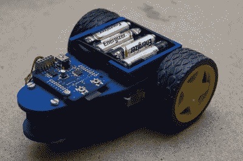
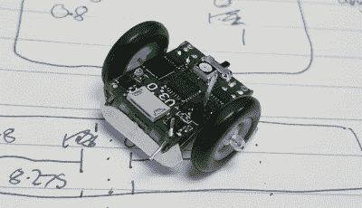
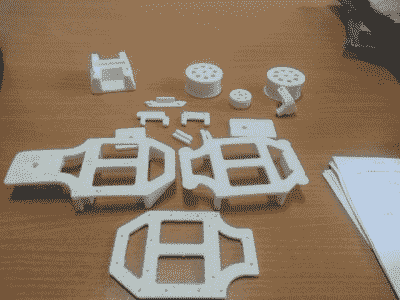

# 黑客 106——会教学的机器人

> 原文：<https://hackaday.com/2016/05/07/hacklet-106-robots-that-teach/>

教授电子学和编程的最好方法之一是实践学习。把概念从电脑屏幕上转移到现实世界。几十年来，各个年龄段的学生都在学习机器人。许多年长的 Hackaday 读者会记得海龟机器人。这些小机器人会开着车到处画用 logo 编程语言创造的图形。本周的 Hacklet 是关于下一代机器人的，这些机器人教授电子学、力学、编程，当然还有黑客技术。所以让我们来看看 [Hackaday.io](https://hackaday.io) 上一些最好的教育机器人项目吧！

 我们先从【汤姆·范登邦】 [Edubot 控制者(本尼)](https://hackaday.io/project/11544)说起。购买一两个机器人可能会很贵。装备一个装满它们的教室会让你倾家荡产。[Tom]希望通过 Edubot 让机器人变得更便宜、更容易使用，这是他参加 2016 年[黑客日奖](https://hackaday.io/prize)的参赛作品。Edubot 骑在 3D 打印的框架上，驱动系统采用低成本的齿轮电机。Edubot 的大脑是 ST micro 的一款低价 ARM 处理器 STM32F042。微型和电机驱动集成到定制板[Tom]中。他甚至已经开始创建课程计划，以便不同年龄和技能水平的学生都可以参与和学习。

 接下来是【约书亚·埃尔斯登】带着[微型教育机器人](https://hackaday.io/project/11399)。大型机器人可能会令人生畏。当崭露头角的工程师开发的硬件和软件不能按预期运行时，它们也会造成一些损害。不过，微型机器人更容易争论。[乔舒亚]可能把泰尼和这些机器人推向了极端。每个机器人不到 2 厘米见方。目标是每个产品的生产成本低于 10 英镑。这些微型机器人拥有巨大的大脑和 ATmega328P 微控制器。[约书亚]目前正试图找出一种低成本的方法来生产这些机器人的轮子。

接下来我们有【shamylmansoor】和[用于 STEM 教育的 3D 打印移动机器人](https://hackaday.io/project/2137)。机器人很贵，国际运输会让它们更贵。[Shamyl]正在拍摄一个可以在巴基斯坦当地制造的机器人。3D 打印是答案。机器人的底盘可以在任何 FDM 打印机上打印。车轮和轮胎是低成本的单位。电机是 RC 伺服系统，可连续旋转。机器人的大脑是 Arduino Mega 2560，它应该为传感器提供大量输入。[Shamyl]甚至包括一个无焊试验板，这样学生就可以在机器人的身体上制作电路和传感器的原型。

 最后我们有【鲁道夫】和 [Plobot](https://hackaday.io/project/10733) 。Plobot 是一个为最年轻的黑客设计的机器人，这些黑客年龄在 4 到 7 岁之间。[Rodolfo]设计 Plobot 用 RFID 卡编程。每张卡都包含一个命令，如前进、转弯、开始和复位。许多语言机制都受到 Scratch 编程语言的启发。Plobot 的处理器是 Sanguino，运行[Rodolfo 的]定制代码。一个 ESP8266 允许 Plobot 通过 WiFi 与外界连接。[Rodolfo]甚至为 Plobot 的固件创建了一个定制的空中更新系统。Plobot 已经在学生中进行了测试，并取得了很好的效果。我们希望[Rodolfo]和 Plobot 都能在 2016 年的[黑客日大奖](https://hackaday.io/prize)中取得好成绩！

如果你想要更多的心灵黑客的好处，看看我们全新的[教育机器人列表](https://hackaday.io/list/11587)！我错过你的项目了吗？不要害羞，[在 Hackaday.io 上给我留言就行了](https://hackaday.io/adam)。这就是本周的 Hacklet，一如既往，下周见。同样的黑客时间，同样的黑客频道，带给你最好的 [Hackaday.io](https://hackaday.io) ！