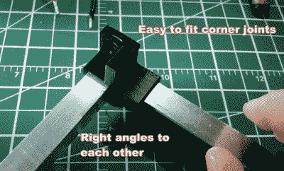
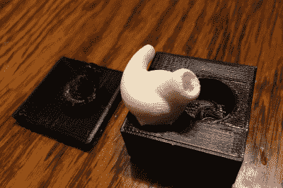
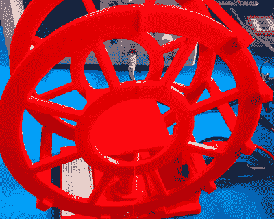
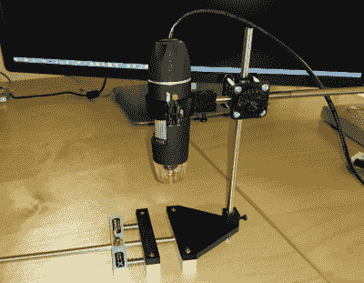

# hacklet 108–简单的功能性 3D 打印

> 原文：<https://hackaday.com/2016/05/21/hacklet-108-simple-functional-3d-prints/>

我们在上周的 Hacklet 上重点介绍了 3D 打印机项目。本周，我们来看看用这些打印机创造的一些令人惊叹的项目。试图在 Hackaday.io 上挑选伟大的 3D 打印项目有点像盯着太阳看。有太多的选择了。为了让事情变得简单一点，我把事情分成了几类。有艺术版画，复杂的机械或电子版画，还有简单的功能版画，这是我们今天的主题。简单的功能性印花是在世界范围内执行某种功能的设计。简单，我的意思是他们只有几个运动部件或电子元件。让我们开始吧！

 我们先从【斯科特】和 [L 挤压端盖](https://hackaday.io/project/9256)开始。每个家得宝，洛斯，或五金店都有挤压铝的选择。通常有几根扁钢和一些 L 形括号。l 型支架很棒，但使用起来会很痛苦。我们大多数人没有焊接铝的技能或工具，所以螺母和螺栓是唯一的办法。给了我们另一个选择。他设计了一套 3D 打印支架，可以滑动到支架的末端。支架可以快速搭建盒子、架子或任何 90 度或 45 度角的东西。

 接下来是【乔 M】用 [3D 打印模具:定制硅胶耳塞](https://hackaday.io/project/4644)。[Joe]有一套他喜欢的蓝牙耳塞，但橡胶耳塞头还有待改进。如果你手头有一台 3D 打印机，这不成问题。[Joe]测量了他的耳塞的塑料部分和他喜欢的另一套耳塞的橡胶头。一点 CAD 魔术之后，他有了一个完美的耳塞尖模型。虽然他可以直接在 NinjaFlex 这样的柔性细丝上打印笔尖，但[Joe]选择了纯硅胶笔尖。他打印了模具，然后将硅树脂填缝剂与玉米淀粉(作为催化剂)混合。由此产生的耳塞声音和感觉棒极了！

 接下来我们有【Jetty】和[高度可配置的 3D 打印亥姆霍兹线圈](https://hackaday.io/project/7409)。亥姆霍兹线圈用于产生均匀的磁场。你为什么要这么做？它可以是任何东西，从测量磁铁到抵消地球磁场对被测设备的影响。[Jetty 的]编写了一个 OpenScad 程序，允许用户输入线圈的参数。[Jetty 的]程序然后计算线圈的磁性，并输出一个可打印的。stl 文件。制作线圈就像打印和缠绕一些铜线一样简单。[Jetty]发现他的线圈在预期值的 60nT(纳特斯拉)以内。对于一点塑料和电线来说还不错！

 终于有了 [StickScope](https://hackaday.io/project/9775) ， [2016 黑客大奖](https://hackaday.io/prize)的参赛作品。像我们许多人一样，[SUF]喜欢他的[老虎钳](https://hackaday.io/project/3287)。不过，有时你需要放大一点才能看到那些微小的 0201 电阻。[SUF]手头有一个便宜的 USB 显微镜，所以他设计了 StickScope，一个专门为老虎钳设计的 USB 显微镜支架。两根 6 毫米的钢棒是设计的支柱。3D 打印夹具像微型吊杆显微镜一样将系统固定在一起。这实际上是设计的第三次修改。[SUF]发现最初的设计不能用于靠近支撑显微镜的杆的部分。一个小小的下巴延长器是完美的选择。

如果你想看到更多简单的功能性 3D 打印项目，请查看我们新的[简单功能性 3D 打印列表](https://hackaday.io/list/11793)！如果我错过了你的项目，不要害羞，只要[在 Hackaday.io](https://hackaday.io/adam) 上给我留言。这就是本周的 Hacklet。一如既往，下周见。同样的黑客时间，同样的黑客频道，带给你最好的 [Hackaday.io](https://hackaday.io/) ！

如果你想看到更多简单的功能性 3D 打印项目，请查看我们新的[简单功能性 3D 打印列表](https://hackaday.io/list/11793)！如果我错过了你的项目，不要害羞，只要[在 Hackaday.io](https://hackaday.io/adam) 上给我留言。这就是本周的 Hacklet。一如既往，下周见。同样的黑客时间，同样的黑客频道，带给你最好的 [Hackaday.io](https://hackaday.io/) ！

如果你想看到更多简单的功能性 3D 打印项目，请查看我们新的[简单功能性 3D 打印列表](https://hackaday.io/list/11793)！如果我错过了你的项目，不要害羞，只要[在 Hackaday.io](https://hackaday.io/adam) 上给我留言。这就是本周的 Hacklet。一如既往，下周见。同样的黑客时间，同样的黑客频道，带给你最好的 [Hackaday.io](https://hackaday.io/) ！