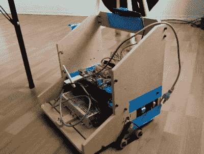
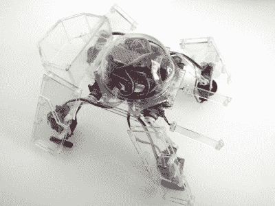

# hack let 113–新型机器人

> 原文：<https://hackaday.com/2016/06/25/hacklet-113-new-robots/>

我每天开始在 [Hackaday.io](https://hackaday.io) 上查看新的和更新的项目。每天你都可以找到各种各样的项目——从卫星到机器视觉到火箭。一种经常出现的项目是机器人——机械臂、教育机器人、自主机器人和移动机器人。本周的 Hackaday.io 有几个很棒的机器人项目出现在“新的和更新的”页面上，所以我使用 Hacklet 来仔细看看。

 我们先从【杰克乔】和[会做事的自主家庭机器人](https://hackaday.io/project/12373)说起。[杰克]正在建造一个可以在家里导航的机器人。他认识到，仅仅是在普通家庭中创造一个能自己从 A 点到 B 点的机器人就是一项艰巨的任务。为了实现这一点，他使用了同步定位和地图绘制(SLAM)算法。他正在机器人操作系统(ROS)的帮助下实现 SLAM。这个机器人最初是一只拴在笔记本电脑上的试验骡子。它演变成了一个木制底座和一个迷你 ITX 主板。测绘数据通过 Kinect V2 获得，该系统将很快升级为 Neato XV-11 激光雷达系统。

 接下来是【泰勒·斯派金斯克】和[蒂龙机器人](https://hackaday.io/project/12275)。TyroBot 是一个行走机器人，有一些崇高的目标，包括直线行走一英里而不摔倒。[Tyler]灵感来自机器人，如两足动物 Bob 和 Zowi。到目前为止，TyroBot 由 PLA 打印的腿和脚组成。[Tyler]准备为[tyro bot]的大脑使用 32 位处理器，并希望不惜任何代价避免 Arduino IDE(包括从头编写自己的 IDE)。这个项目才刚刚开始，所以请前往[项目页面](https://hackaday.io/project/12275)观看 TyroBot 的进展！

 接下来是【迈克·瑞斯比】与[的小伙伴](https://hackaday.io/project/10162)。小伙伴是一个陪伴机器人。[Mike]发现机器人给电池充电的时间比互动的时间还多。这对机器人伴侣来说是不合适的。他的解决方案是完全抛弃电池。小伙伴是超级电容供电的。8 分钟的充电可以让这个小机器人持续工作 75 分钟。一个带电机护罩的 Arduino 控制着小朋友的 DC 驱动电机，以及两只动画眼睛。如果你不知道，迈克用了一个西红柿作为他的灵感。这让小朋友远离恐怖谷，呆在可爱区。

 最后我们有了行走机器人之王【拉多米尔·多皮耶拉斯基】，有了[罗奇科马-昆](https://hackaday.io/project/7168)。对于外行人来说，Logicoma 是 Shell 系列中 Ghost 的机器人坦克(或“后勤机器人”)。[拉多米尔]决定让这些卡通坦克栩栩如生——至少是微型的。Logicoma-kun 的大部分是由仔细切割和雕刻的丙烯酸板制成的。运动是通过流行的 9 克伺服遍布互联网。[Radomir]最近写了一个更新，为 Logicoma-kun 概述了他的新大脑。Arduino Pro Mini 将处理伺服控制。主计算机将是运行 Micropython 的 ESP8266。我迫不及待地想看到这个小机器人迈出第一步。

如果你想要更多机器人的优点，看看我们的[全新移动机器人列表](https://hackaday.io/list/12380-mobile-robots)！我错过你的项目了吗？不要害羞，[在 Hackaday.io 上给我留言就行了](https://hackaday.io/adam)。这就是本周的 Hacklet，一如既往，下周见。同样的黑客时间，同样的黑客频道，带给你最好的 [Hackaday.io](https://hackaday.io/) ！