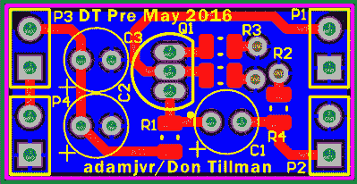
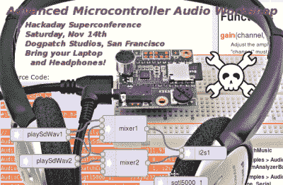
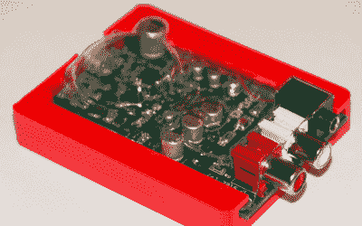

# hack let 116–音频项目

> 原文：<https://hackaday.com/2016/07/16/hacklet-116-audio-projects/>

如果黑客构建的第一个电路是 LED 闪光灯，那么第二个电路一定是某种噪声发生器。从简单的蜂鸣器到传说中的 Atari punk 控制台，从吉他效果到数字化电路，黑客、制造商和工程师几十年来一直在构建令人难以置信的音频项目。本周，Hacklet 涵盖了 [Hackaday.io](https://hackaday.io) 上一些最好的音频项目！

 我们从【李国章】和[自动音源切换](https://hackaday.io/project/12133)开始。两个音频源，一个放大器和扬声器系统；这是[李国章]面临的问题。他通过电脑和电视收听音频，但不需要同时连接电脑和电视。目前，他正在使用 DPDT 开关来改变输入。[K.C. Lee]没有手动切换开关，而是创建了这个项目来为他自动交换信号源。他使用一个 STM32F030F4 ARM 处理器作为操作的大脑。微控制器上的 ADC 监控两个源，并选择当前有效的一个。拥有如此强大的处理能力，以及一个诺基亚 LCD 作为输出，如果不添加一些很酷的功能，那将是一种犯罪。源切换器还显示频谱分析仪、VU 计、日期和时间。它甚至会减弱像网页开始爆破音频这样的大声来源。

 接下来是【亚当·瓦达拉-罗斯】[音频博客:模拟音频设计实验](https://hackaday.io/project/11663)。[Adam]有 32 个项目，而且还在 Hackaday.io 上。他的兴趣涵盖了从 led 到 3D 打印到太阳能再到水培的方方面面。Audio Blox 是他用作模拟音频项目工程师笔记本的一个项目。这是一个很好的方式来观察一个黑客找出什么可行，什么不可行。他目前的项目是大 Muff Pi 吉他踏板的 4 板模块化版本。他将这种经典的吉他效果分解为输入板、剪切板、音调控制和输出级。他的 PCB 布局，原理图和解释总是一种享受，以查看和阅读！

 接下来我们有请【保罗·斯托弗雷根】与 [Teensy 音频库](https://hackaday.io/project/2984)。对于那些不了解内情的人来说，[Paul]是 Teensy boards 家族的创始人，该家族最初是一个服用类固醇的 Arduino，现在已经演变成一个更加强大的组织。该项目记录了[Paul]为驱动 Teensy 3.1 的飞思卡尔/恩智浦 ARM 处理器创建的音频库。多个音频文件同时播放，延迟和效果，只是这个库可以做的一些事情。如果你是音频库的新手，一定要看看[Paul's]的配套项目
[微控制器音频研讨会&HaD super co 2015](https://hackaday.io/project/8292)。这个项目是[Paul]在 2015 年旧金山超级黑客日举办的研讨会的在线版本。

 最后我们有【drewrisinger】带 [DrDAC USB 音频 DAC](https://hackaday.io/project/5996) 。DrDac 是一款高质量 Dac 板，可为任何 PC 提供 USB 供电的音频输出。现在的计算机都是按价格制造的。这意味着通常使用较低质量的音频组件。再加上计算机是一个电子噪音的地方，你得到的音频质量并不理想。对大众来说足够好，但如果你想听录音室质量的音频，就不太好了。DrDAC 内置一个 PCM2706 音频 DAC 和质量支持元件，采用 3D 打印外壳。DrDAC 的灵感来源于[【钴静音的】pupDAC](http://www.diyforums.org/PupDAC/PupDACoverview.php) 。

如果你想看到更多的音频项目和技巧，请查看我们新的[音频项目列表](https://hackaday.io/list/12697-audio-projects)。看到一个我可能错过的项目？不要害羞，[在 Hackaday.io 上给我留言就行了](https://hackaday.io/adam)。这就是本周的 Hacklet，一如既往，下周见。同样的黑客时间，同样的黑客频道，带给你最好的 [Hackaday.io！](https://hackaday.io/)

如果你想看到更多的音频项目和技巧，请查看我们新的[音频项目列表](https://hackaday.io/list/12697-audio-projects)。看到一个我可能错过的项目？不要害羞，[在 Hackaday.io 上给我留言就行了](https://hackaday.io/adam)。这就是本周的 Hacklet，一如既往，下周见。同样的黑客时间，同样的黑客频道，带给你最好的 [Hackaday.io！](https://hackaday.io/)