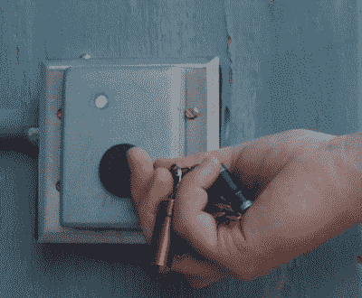
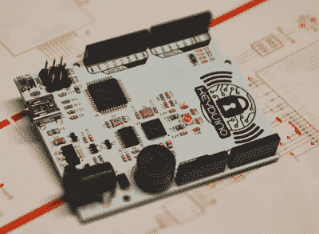
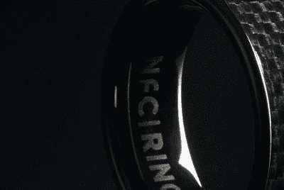
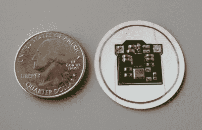

# hack let 117–NFC 项目

> 原文：<https://hackaday.com/2016/07/23/hacklet-117-nfc-projects/>

近场通信(NFC)是我们这些天想当然的东西。几乎所有的智能手机都有。我们甚至为所有我们喜欢的开发板提供了 NFC 接口。NFC 的历史可以追溯到 1997 年，当时一个早期版本被用于星球大战特别版玩具中。NFC 所基于的射频识别(RFID)甚至可以追溯到更早。专利引用线索可以追溯到 1983 年授予[查尔斯·沃尔顿]的一项专利。然而，NFC 不仅仅是 RFID。设备之间双向通信的想法为项目和黑客打开了无数的可能性。本周在 Hacklet 上，我们将在 [Hackaday.io](https://hackaday.io) 上盘点一些最好的 NFC 项目！

 我们从【帕特里克】和 [Ctrl-O](https://hackaday.io/project/6863) 开始。在黑客空间圣经的某个地方，有一个条款说“你应该建立一个电子访问控制系统”。在[Patrick 的]案例中，一个门锁变成了一个复杂的会员订阅管理数据库。付费会员可以使用 NFC 标签进入黑客空间。该系统由一个具有 NFC 接口的 Raspberry Pi 组成。继电器允许 Pi 控制门锁。Pi 可以通过 web 界面手动配置。它连接到 Paypal，以验证每个用户的会员资格实际上已经支付。当然，像这样的项目永远不会完成。我们最后一次听到[Patrick]的消息时，他正在计划未来的升级，比如多人的创业公司会员资格。

 接下来是【皮埃尔·查理尔】和[基杜伊诺](https://hackaday.io/project/8332)。KeyDuino 是 Arduino 兼容板，内置所有 NFC 硬件。该板基于 Arduino Leonardo，配有 ATmega32u4 处理器。[Pierre]一定有所发现，因为 KeyDuino 在 2015 年就有一个成功的 Kickstarter。它也是开源硬件，因此您可以随时构建自己的硬件。真正的宝石是检查[【皮埃尔的】其他项目](https://hackaday.io/MrStein)。他在 Hackaday.io 上记录了他所有的 KeyDuino 示例项目，其中包括一个 [NFC 控制的无限镜茶几](https://hackaday.io/project/8651-nfc-infinity-table)，一个[锁定木制礼品盒](https://hackaday.io/project/8667-nfc-lock-gift-box)，以及 [NFC 控制的汽车门锁](https://hackaday.io/project/9532-nfc-car-door-control)，仅举几例。

 接下来我们有【约翰·麦克利尔】带着 [2016 NFC 戒指](https://hackaday.io/project/8065-2016-nfc-ring)。[John]利用可以想象的最难的外形之一——戒指，投入到可穿戴技术中。在狭小的空间和电池的缺乏之间，你可能会认为戒指没什么用处。[John]毫不气馁，成功地将两个恩智浦 NFC 芯片及其天线放入一个标准环中。这是 2016 年升级版的戒指。在 2015 年的[黑客日超级大会](https://hackaday.io/superconference/)上，[John]很好地向黑客们提供了几百个早期的模型。一般黑客很难复制[约翰的]戒指。[肖恩·哈金斯]用他自己的项目 [DIY NFC 本特伍德戒指](https://hackaday.io/project/12792-nfc-bentwood-ring)来拯救这里。

 最后，我们有【CaptMcAllister】带 [RFID 气压传感器](https://hackaday.io/project/7077)。顾名思义，这种传感器测量气压。它可以是露天的，轮胎，甚至是新英格兰爱国者队使用的足球。当然，所有汽车都有轮胎压力监测系统(TPMS)传感器，做类似的事情。[capmcallister]的设计有一个重要的不同——它没有电池。该系统的核心是德州仪器 RF430FRL15X，它在一个芯片上集成了 NFC 无线电和低功耗 MSP430 微控制器。该系统正在收集能量，由外部读取器供电。可以想象，调谐天线对这个设计至关重要。你可以在[captmacallister 的] 24 个项目日志中读到关于它的所有内容。

如果你想看到更多的 NFC 项目和黑客，请查看我们新的[近场通信项目列表](https://hackaday.io/list/12795-near-field-communication-projects)。看到一个我可能错过的项目？不要害羞，[在 Hackaday.io 上给我留言就行了](https://hackaday.io/adam)。这就是本周的 Hacklet，一如既往，下周见。同样的黑客时间，同样的黑客频道，带给你最好的 [Hackaday.io](https://hackaday.io/) ！