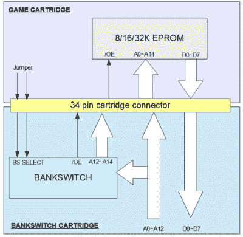
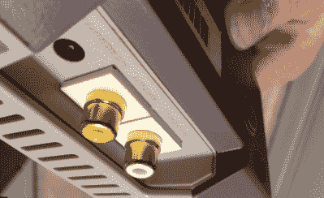
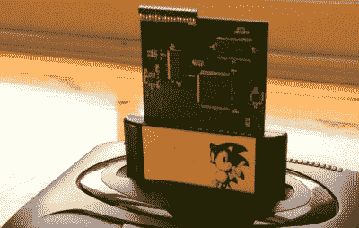

# 黑客 119-复古游戏机黑客

> 原文：<https://hackaday.com/2016/08/06/hacklet-119-retrogaming-console-hacks/>

如果你没听说过，复古游戏是个东西。40 多岁的人和刚刚发现这些经典游戏的千禧一代一起玩他们年轻时的游戏。早在任天堂娱乐系统和 Atari 2600 的时候，就有人在为游戏机开发新的自制游戏。本周在 Hacklet 上，我们将重点介绍一些最好的复古游戏控制台硬件黑客。请注意，我说的是硬件黑客。本周的焦点是在原始硬件上玩的游戏。不过，不要担心，我会在未来的小程序中给仿真项目一些帮助。

 我们先从【丹乔维奇】和[雅达利 2600 Bankswitch 卡带](https://hackaday.io/project/12961)说起。雅达利 2600 是一个传奇的系统。数百万黑客第一次接触游戏是通过它的单键操纵杆。为了使该设备价格合理，雅达利使用了 MOS 技术 6507 处理器。本质上，它是一个 28 引脚封装的 6502。这意味着几个特性被削弱了，最明显的是地址空间。6507 只能寻址 8KB 的内存。在 Atari 中，只有 4KB 可用于盒式磁带。游戏通过存储体切换绕过了 4KB 的限制——向一个神奇的地址写入一个值，存储体切换逻辑将交换到盒式 ROM 的一个完全不同的部分。这些年来使用了几种不同的银行转换方案。【Danjovic】创造了自己版本的这种银行切换逻辑，仅使用经典的 74 系列逻辑芯片。

 接下来是【雷霆号】与[顶装 NES 复合模](https://hackaday.io/project/1019)。在 NES 生命的末期，任天堂推出了一款被称为“顶部装载机”的低成本版本。这个版本有一个顶部加载的墨盒，没有 DRM 锁定芯片。不幸的是，它还取消了复合 AV 端口。唯一的办法挂钩这个 NES 到你的电视是通过射频调制输出。[ThunderSqueak]和其他一些勇敢的黑客已经解决了这个问题。它只需要一个 2N3906 PNP 晶体管和几个软糖零件。视频和音频输出在进入 RF 调制器之前从主板上拉出。一个很好的特点是干净的连接器。[ThunderSqueak]使用模块化墙内 AV 盒的连接器进行设置，看起来和实际一样好。

 接下来我们有【makestuff】带 [USB 大硬盘开发套件](https://hackaday.io/project/1507)。世嘉的 MegaDrive，或在美国被称为 Genesis，是一个开创性的控制台。它使用摩托罗拉 68000 16 位 CPU，而大多数其他系统仍然运行 Z80 或 6502。人们喜欢这款游戏机，还有很多人仍然想为它开发软件。用他的开发工具包输入[makestuff]。在一张有 40 美元材料清单的卡上，他设法安装了 SDRAM、FPGA 和 USB 接口。这是您在未经修改的控制台上加载和调试软件所需的一切。FPGA 有足够的逻辑剩余，使得[makestuff]能够通过 USB 实现连续的总线周期跟踪器。干得好！

 终于，我们有了自己的【约书亚·瓦斯奎兹】与 [R.O.B. 2.0](https://hackaday.io/project/3810) 。最初的 NES 是一个豪华版本，里面有一个特殊的包装——一个机器人。机器人操作伙伴，简称 ROB，会和玩家一起玩游戏。不幸的是，罗布有点失败。它只适用于两个游戏，Gyromite 和 Stack-Up ~~Ice Climber~~ 。大多数抢劫单位最终找到了他们的方式回收箱。[约书亚]正在建立一个新版本的抢劫，与现代控制。他已经建模并 3D 打印了 ROB 的头。我迫不及待地想看到这个项目走到一起！

如果你想看到更多复古游戏的好处，请查看我们新的[复古游戏硬件黑客列表](https://hackaday.io/list/13009-retro-gaming-console-hacks)。看到一个我可能错过的项目？不要害羞，[在 Hackaday.io 上给我留言就行了](https://hackaday.io/adam)。这就是本周的 Hacklet，一如既往，下周见。同样的黑客时间，同样的黑客频道，带给你最好的 [Hackaday.io](https://hackaday.io/) ！

如果你想看到更多复古游戏的好处，请查看我们新的[复古游戏硬件黑客列表](https://hackaday.io/list/13009-retro-gaming-console-hacks)。看到一个我可能错过的项目？不要害羞，[在 Hackaday.io 上给我留言就行了](https://hackaday.io/adam)。这就是本周的 Hacklet，一如既往，下周见。同样的黑客时间，同样的黑客频道，带给你最好的 [Hackaday.io](https://hackaday.io/) ！

如果你想看到更多复古游戏的好处，请查看我们新的[复古游戏硬件黑客列表](https://hackaday.io/list/13009-retro-gaming-console-hacks)。看到一个我可能错过的项目？不要害羞，[在 Hackaday.io 上给我留言就行了](https://hackaday.io/adam)。这就是本周的 Hacklet，一如既往，下周见。同样的黑客时间，同样的黑客频道，带给你最好的 [Hackaday.io](https://hackaday.io/) ！