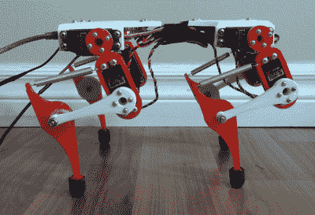
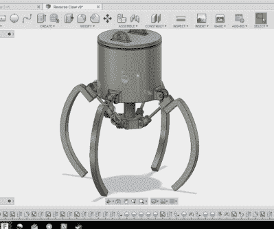

# Hacklet 124 跑步机器人和爪子

> 原文：<https://hackaday.com/2016/09/10/hacklet-124-running-robots-and-the-claw/>

当你打开 Hackaday.io 上的项目提要时，你永远不知道你会发现什么。有时候我发现一些项目看起来很酷，以至于我不得不把它们公之于众。

 本周的第一个项目就是如此，【亚历克斯·马丁】创作的[亚军](https://hackaday.io/project/8843)。Runner 先生是一个四足机器人，看起来很像。事实上，我想说它看起来已经准备好从长凳上跳下来了。像我们许多人一样，[Alex]受到了波士顿动力公司的启发，特别是他们的野猫机器人。野猫让亚历克斯在网上搜索行走机器人的设计。他在[饭田文弥博士]和[罗尔夫·费弗博士]的工作中发现了自己喜欢的东西。2000 年代中期，这两人在苏黎世大学工作。《奔跑者先生》基于他们的作品，并从[亚历克斯]那里获得了大量的设计调整。

基本设计是一个四足动物，每条腿有两个伺服系统。伺服系统位于身体和腿的上半部分。膝盖和小腿由杠杆和弹簧连接，形成一个四连杆机构。弹簧充当肌腱，吸收震动，并允许机器人运行时存储和释放来自伺服系统的能量。[亚历克斯]正在试验由电脑控制的步态。

如果没有控制这 8 个伺服系统的方法，Runner 先生就不会跑那么多。[Alex]从 Arduino 和 LynxMotion 串行伺服控制器开始。这对搭档让他在第一代奔跑者中受益匪浅。对于机器人的新版本，他正在基于 Lynxmotion 的
[BotBoarduino](http://www.lynxmotion.com/p-840-botboarduino.aspx) 滚动自己的板。葛伯的档案已经送到奥什公园了，大约一周后，朗纳先生就要去参加比赛了。

 另一个伟大的最近更新的项目是[街机爪游戏爪建立](https://hackaday.io/project/13179)由【Alex Anderson】。我年轻的时候花了太多的时间在街机上，很多时间都在玩抓人游戏。当然，他们通常是作弊，但谁没有被拉进来测试你的技能并赢得奖励的机会呢？一个朋友让[Alex]为一个游戏设计一个街机风格的爪子。作为一名经验丰富的数控和 3D 打印大师，[亚历克斯]抓起他的笔记本，开始画草图。齿条齿轮设计会工作得很好，但不符合游戏的限制。基于丝杠的设计也是可行的，但是价格昂贵。最后，[亚历克斯]选定了一个设计，并启动了他的 CAD 软件。他从两个颚系统开始来验证基本系统。一旦完成后，[亚历克斯]移动到一个 4 颚设置。

就像街机游戏一样，爪子是由中央活塞驱动的。柱塞驱动移动 4 个爪爪的连杆。纸上看起来一切都很好，但当 CAD 图纸遇到现实世界时，事情很快就变得复杂了。最初的设计依赖于一个 3D 打印零件，该零件将柱塞连接到钳口连杆。这一部分的任何溢出都会通过机械系统的其余部分被放大。3D 打印机并不完美，而且有一些溢出物——足以使零件在移动时被挤压和束缚。

[Alex]已经有了一个修改过的设计。这是一项正在进行的工作。这就是 Hackaday.io 上记录良好的项目的美妙之处——你可以看到什么是有效的，以及完成最终工作项目所经历的所有考验和磨难。坚持下去[亚历克斯]，你就快成功了！

这就是本周的 Hacklet，一如既往，下周见。同样的黑客时间，同样的黑客频道，带给你最好的 [Hackaday.io](https://hackaday.io/) ！